# คู่มือฉบับพนักงาน — สุขฤทัย ฟิตเนส

รุ่นเอกสาร **2.3** | 16 กันยายน 2569 | ใช้แทนคู่มือ 2.2 และรุ่นก่อนหน้าทั้งหมด | ตรงกับระบบรุ่นที่ติดตั้งวันเดียวกัน

**ใหม่ในรุ่น 2.3:** **เมนูมุมขวาบน** — แถบงานประจำวันเหลือ 4 รายการ ที่เหลือย้ายเข้าเมนู รวมปุ่มออกจากระบบ (หน้า "ก่อนเริ่ม") · บท **"แจ้งปัญหา"** ฝั่งพนักงาน (ข้อ 1.13) และ **"เรื่องที่แจ้งไว้"** ฝั่งเจ้าของยิม (ข้อ 2.9) · **เปิดคู่มือเล่มนี้ได้จากเมนูในแอป**


**จากรุ่น 2.1:** กรณีรูปถ่ายใช้ไม่ได้และวิธีถ่ายใหม่โดยไม่ต้องออกบัตรใหม่ (ข้อ 1.5) · การกดบันทึกซ้ำตอนสมัครไม่สร้างสมาชิกซ้ำ (ข้อ 1.3) · แท็บ "ตรวจสลิป" ถูกถอดออก สลิปย้ายไปอยู่ **"ประวัติการรับเงิน"** ในหน้าสมาชิกรายคน (ข้อ 2.7)

**ที่อยู่ระบบ: https://srv1979069.hstgr.cloud** — เปิดผ่านเบราว์เซอร์บนมือถือ แท็บเล็ต หรือคอมพิวเตอร์ ไม่ต้องติดตั้งแอปจากสโตร์

**ช่องทางติดต่อเจ้าของยิม:** ____________________________________ (เจ้าของยิมกรอกก่อนแจกคู่มือ)

## ระบบเปลี่ยนไปจากคู่มือเล่มก่อนอย่างไร

คู่มือ 1.3 เขียนไว้ตอนที่ลูกค้ามีหน้าเว็บของตัวเอง ล็อกอินด้วยรหัส OTP ทางอีเมล และซื้อแพ็กเกจเอง **ระบบไม่ได้ทำงานแบบนั้นแล้ว** ทุกอย่างอยู่ที่เคาน์เตอร์ ลูกค้าถือแค่ "รูปบัตร" หนึ่งใบในแชต

| เรื่อง | คู่มือ 1.3 (ของเดิม) | ระบบปัจจุบัน |
|---|---|---|
| ลูกค้าเข้าระบบ | มีหน้าเว็บของสมาชิก ล็อกอินด้วย OTP ทางอีเมล | **ไม่มีหน้าของสมาชิกแล้ว** ลูกค้าไม่ต้องล็อกอิน ไม่ต้องมีอีเมล |
| พนักงาน/เจ้าของยิมเข้าระบบ | ขอรหัส OTP | **อีเมล + รหัสผ่าน** ไม่มี OTP และไม่มีการส่งอีเมลใด ๆ อีก |
| สมัครสมาชิก | ลูกค้าสมัครเอง | **พนักงานสมัครให้ที่เคาน์เตอร์ 3 ขั้น พร้อมถ่ายรูป** |
| บัตร / QR | QR บนหน้าเว็บของลูกค้า เปลี่ยนทุกไม่กี่นาที | **รูปบัตร PNG หนึ่งใบ ใช้ได้ตลอด** ยิมส่งให้ทาง LINE |
| ตอนสแกน | ขึ้นชื่อและสิทธิ์คงเหลือ | ขึ้น **รูปถ่ายของสมาชิกก่อน** แล้วพนักงานเทียบกับตัวจริง มีปุ่ม "ไม่ใช่คนนี้" |
| จ่ายเงิน | ลูกค้าโอนพร้อมเพย์แล้วส่งสลิป | **รับเงินที่เคาน์เตอร์** แล้วบันทึกในหน้า "รับเงินและมอบแพ็กเกจ" |

**ทิ้งคู่มือ 1.3 ได้เลย** ขั้นตอนที่เกี่ยวกับ OTP, แท็บ "รหัส OTP", หน้าซื้อแพ็กเกจของสมาชิก และการส่งสลิปของลูกค้า ไม่มีในระบบแล้ว

<!-- pagebreak -->

## คู่มือเล่มนี้แบ่งเป็นสองส่วน

- **ส่วนที่ 1 พนักงานหน้าเคาน์เตอร์** — งานประจำวัน: เข้าระบบ สมัครสมาชิก ส่งบัตร แก้เมื่อรูปถ่ายใช้ไม่ได้ สแกน รับเงิน และเมื่อลูกค้าทำรูปบัตรหาย
- **ส่วนที่ 2 เจ้าของยิม** — ตั้งรหัสผ่านครั้งแรก จัดการบัญชีพนักงาน ตั้งแพ็กเกจและราคา ข้อมูลยิม และการออกบัตรใหม่

ชื่อคน ราคา วันหมดอายุ และ QR ในภาพประกอบทั้งหมดเป็นข้อมูลตัวอย่างจากเครื่องทดสอบ **ห้ามใช้ QR ในคู่มือนี้เช็คอิน**

<!-- pagebreak -->

## ก่อนเริ่ม

### อุปกรณ์ที่ใช้ได้

หน้าเว็บเดียวกันนี้ใช้ได้ทั้งบนคอมพิวเตอร์หน้าเคาน์เตอร์ แท็บเล็ต และมือถือ — หน้าจอจะจัดใหม่ให้เองตามขนาดจอ เครื่องที่จะใช้ **สแกน** และ **ถ่ายรูปสมาชิก** ต้องมีกล้อง ถ้าเครื่องไม่มีกล้องก็ยังใช้งานได้ทุกอย่าง เพียงแต่ต้องพิมพ์รหัสใต้ QR เองตอนเช็คอิน และเลือกไฟล์รูปจากเครื่องแทนการถ่าย

ต้องเปิดผ่าน **https://** เท่านั้น ถ้าเปิดผ่าน http:// ธรรมดา เบราว์เซอร์จะไม่ยอมให้ใช้กล้องเลยไม่ว่าจะกดอนุญาตกี่ครั้ง

### หน้าจอแบ่งเป็นสองที่: แถบงานประจำวัน และเมนูมุมขวาบน

**แถบด้านซ้าย (บนมือถือคือแถบล่างจอ) มีแค่ 4 งานที่ทำทุกวัน** — สแกนเช็คอิน · สมัครสมาชิก · สมาชิก · รับเงินและมอบแพ็กเกจ · ไม่มีปุ่ม "เพิ่มเติม" อีกแล้ว

**ที่เหลือทั้งหมดอยู่ในเมนูมุมขวาบน** กดที่ชื่อผู้ใช้/ไอคอนวงกลมมุมขวาบนของทุกหน้า (รวมจอสแกน) เมนูจะกางลงมาเป็น 3 กลุ่ม บนมือถือเมนูเลื่อนขึ้นมาจากขอบล่างจอ

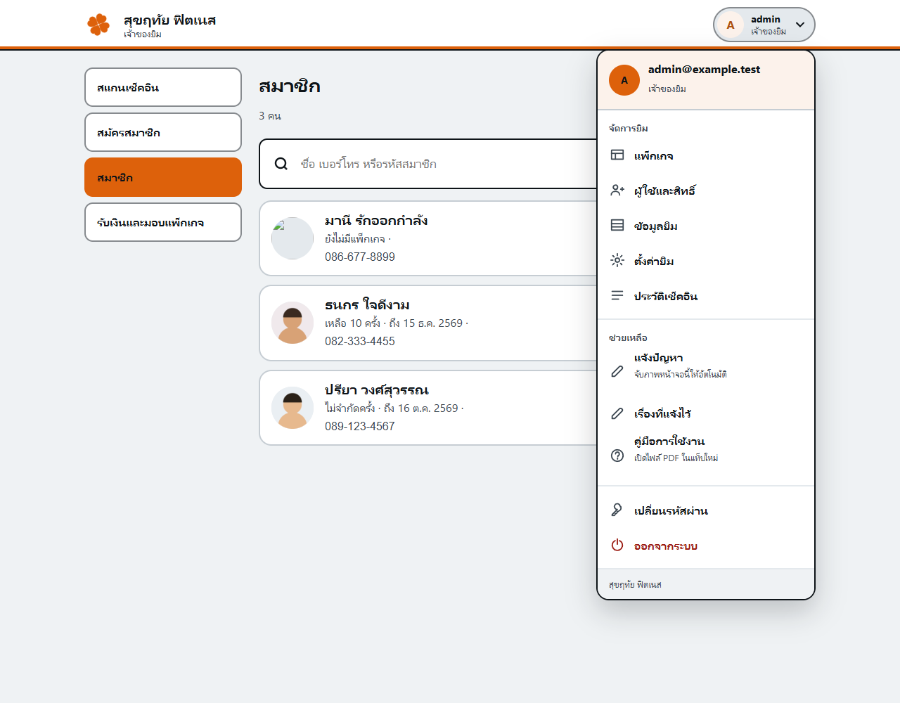

| ในเมนู | พนักงาน | เจ้าของยิม (ผู้ดูแลระบบ) |
|---|---|---|
| **หัวเมนู** — อีเมลและบทบาทของคนที่ล็อกอินอยู่ | ✓ | ✓ |
| **จัดการยิม** → ตั้งค่ายิม (โลโก้ สี LINE ID) | ดูได้อย่างเดียว | ✓ แก้ไขได้ |
| **จัดการยิม** → ประวัติเช็คอิน | ✓ | ✓ |
| **จัดการยิม** → แพ็กเกจ · ผู้ใช้และสิทธิ์ · ข้อมูลยิม | ✕ ไม่ขึ้นในเมนูเลย | ✓ |
| **ช่วยเหลือ** → แจ้งปัญหา | ✓ | ✓ |
| **ช่วยเหลือ** → เรื่องที่แจ้งไว้ | ✕ | ✓ |
| **ช่วยเหลือ** → คู่มือการใช้งาน | ✓ | ✓ |
| **ออกจากระบบ** | ✓ | ✓ |
| **ออกบัตรใหม่** (ทำให้บัตรใบเดิมใช้ไม่ได้ · อยู่ในหน้าบัตร ไม่ใช่ในเมนู) | ✕ | ✓ |

<!-- pagebreak -->

**รายการที่บัญชีนั้นเปิดไม่ได้จะไม่ขึ้นในเมนูเลย** ไม่ใช่ขึ้นแบบจาง ๆ ให้กด — ถ้าพนักงานหาเมนูไม่เจอ แปลว่าบัญชีนั้นไม่มีสิทธิ์ ไม่ใช่ระบบเสีย

**ปุ่ม "ออกจากระบบ" ย้ายเข้าไปอยู่ในเมนูนี้แล้ว** (เดิมอยู่มุมขวาบนโดยตรง) อยู่ล่างสุดของเมนู

> **เปิดคู่มือเล่มนี้จากในแอปได้** เมนูมุมขวาบน → **"คู่มือการใช้งาน"** เปิดไฟล์ PDF ในแท็บใหม่ · เป็นเล่มล่าสุดที่ทีมวางไว้ในระบบ ไม่ต้องหาไฟล์ในไลน์หรืออีเมล

**ชื่อยิมบนแถบบนของมือถือถูกตัดด้วย "…" เป็นเรื่องปกติ** เช่น ขึ้นว่า "สุขฤทัย ฟิตเ…" เพราะจอแคบ ไม่ใช่ข้อมูลผิดหรือตั้งค่าพลาด **ชื่อเต็มอยู่บนบัตรสมาชิกทุกใบ** ซึ่งเป็นที่ที่ลูกค้าเห็นจริง

### แถบเหลือง "โหมดทดลอง" บนหัวจอ — เป็นเรื่องปกติ

ระบบขึ้นแถบเหลือง **"โหมดทดลอง · ยังไม่ได้ผูกบัญชีพร้อมเพย์ — รับเงินและมอบแพ็กเกจที่หน้าสมาชิกได้ตามปกติ"** ตลอดเวลา **ไม่ใช่ความผิดพลาด ไม่ต้องแจ้งใคร** แปลว่ายิมยังไม่ได้ผูกบัญชีรับเงินอัตโนมัติ ซึ่งไม่กระทบงานหน้าเคาน์เตอร์เลย เพราะเงินรับกันที่เคาน์เตอร์อยู่แล้ว · แถบนี้จะหายไปเมื่อเจ้าของยิมให้เลขบัญชีพร้อมเพย์กับทีมติดตั้งในอนาคต

<!-- pagebreak -->

## ส่วนที่ 1 · พนักงานหน้าเคาน์เตอร์

### 1.1 เข้าสู่ระบบ

เปิด https://srv1979069.hstgr.cloud แล้วกรอก **อีเมล** และ **รหัสผ่าน** ที่เจ้าของยิมตั้งให้ → กด **"เข้าสู่ระบบ"**

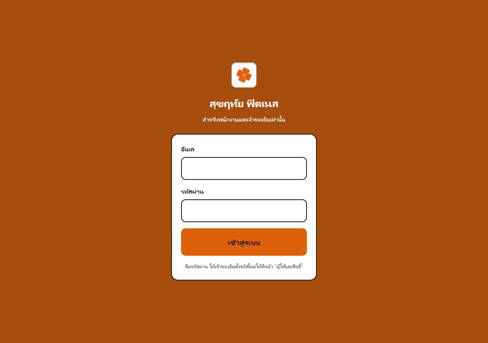

**สิ่งที่ควรรู้**

- กรอกผิดได้ 5 ครั้ง ครั้งที่ 5 ระบบจะ **ล็อกอีเมลนั้นไว้ 15 นาที** ข้อความบนจอจะบอกว่าเหลืออีกกี่ครั้งก่อนถูกล็อก
- ข้อความ "อีเมลหรือรหัสผ่านไม่ถูกต้อง" ใช้กับทุกกรณีที่เข้าไม่ได้ — ไม่ว่าจะพิมพ์อีเมลผิด ยังไม่ได้ตั้งรหัสผ่าน หรือรหัสผ่านผิด เป็นการตั้งใจ ไม่ให้คนนอกเดาว่าอีเมลไหนมีอยู่จริง
- ถ้าขึ้นว่า **"บัญชีนี้ถูกระงับ"** แปลว่าเจ้าของยิมปิดบัญชีไว้ ให้ติดต่อเจ้าของยิม
- **ลืมรหัสผ่าน** ระบบไม่ส่งอีเมลรีเซ็ต ให้เจ้าของยิมตั้งรหัสใหม่ให้ที่หน้า "ผู้ใช้และสิทธิ์" (ข้อ 2.2)
- เมื่อเจ้าของยิมตั้งรหัสผ่านใหม่ เปลี่ยนสิทธิ์ หรือระงับบัญชีของคุณ **คุณจะหลุดออกจากระบบทันทีทุกเครื่อง** ถ้ากำลังยืนสแกนอยู่ ให้ล็อกอินใหม่แล้วสแกนต่อได้เลย ประวัติไม่หาย

### 1.2 ภาพรวมงานประจำวัน

| สถานการณ์ | ไปที่เมนู | ใช้เวลา |
|---|---|---|
| ลูกค้าใหม่มาสมัคร | สมัครสมาชิก | ไม่ถึงหนึ่งนาที |
| ลูกค้าเก่ามาเข้ายิม | สแกนเช็คอิน | ไม่กี่วินาที |
| ลูกค้าต่ออายุ / ซื้อแพ็กเกจเพิ่ม | รับเงินและมอบแพ็กเกจ | หนึ่งหน้า 3 ขั้น |
| ลูกค้าทำรูปบัตรหาย | สมาชิก → เปิดคนนั้น → **ส่งบัตรซ้ำ** | ไม่กี่วินาที (ดูข้อ 1.10) |

<!-- pagebreak -->

### 1.3 สมัครสมาชิกที่เคาน์เตอร์ — 3 ขั้น

เมนู **"สมัครสมาชิก"** ทำทีละขั้น ขั้นละเรื่องเดียว ลูกค้าไม่ต้องกรอกอะไรเองและไม่ต้องมีอีเมล

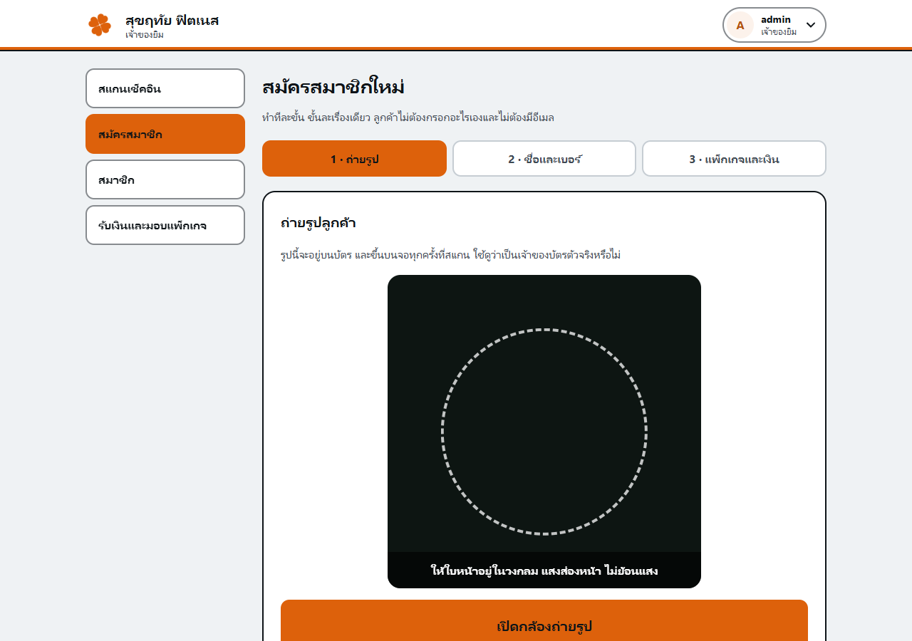

**ขั้นที่ 1 · ถ่ายรูป**

1. กด **"เปิดกล้องถ่ายรูป"** ครั้งแรกเบราว์เซอร์จะถามขออนุญาตใช้กล้อง ให้กดอนุญาต
2. จัดให้ใบหน้าลูกค้าอยู่ในวงกลม แสงส่องหน้า ไม่ย้อนแสง แล้วกด **"ถ่ายรูปนี้"**
3. ไม่พอใจให้กด **"ถ่ายรูปใหม่"** ได้ทันที · เครื่องไม่มีกล้อง ใช้ช่อง **"เลือกรูปจากเครื่องแทน"**
4. กด **"ถัดไป · ชื่อและเบอร์"**

> **อย่าข้ามรูป** ระบบยอมให้ไปขั้นต่อไปได้แม้ยังไม่ถ่าย แต่รูปถ่ายคือด่านเดียวที่กันการส่งบัตรต่อให้เพื่อน สมาชิกที่ไม่มีรูปจะขึ้นคำเตือนสีแดงในหน้าบัตรว่า "ยังไม่มีรูปถ่ายของสมาชิกรายนี้"

**ถ้าระบบไม่รับรูป** จะขึ้นข้อความบอกเหตุผลตรง ๆ แล้วพากลับมาที่ขั้นถ่ายรูปให้เอง — ถ่ายใหม่แล้วกดบันทึกต่อได้เลย

| ข้อความ | แปลว่า |
|---|---|
| ไฟล์รูปนี้เปิดไม่ได้ อาจอัปโหลดไม่ครบหรือไฟล์เสียหาย กรุณาถ่ายใหม่อีกครั้ง หรือเลือกรูปอื่นจากเครื่อง | ไฟล์เสียหรือส่งไม่ครบ ถ่ายใหม่หรือเลือกไฟล์อื่น |
| รองรับเฉพาะ JPG, PNG และ WEBP | ไฟล์ที่เลือกไม่ใช่รูปภาพ เช่น เผลอเลือกไฟล์ PDF |
| (ข้อความเรื่องไฟล์ HEIC) | รูปจาก iPhone บางเครื่องเป็นไฟล์ HEIC ให้ถ่ายด้วยกล้องในระบบแทน หรือตั้งมือถือให้ถ่ายเป็น JPG |

**ขั้นที่ 2 · ชื่อและเบอร์**

- **ชื่อ–นามสกุล** (บังคับ) — ชื่อนี้จะขึ้นบนบัตรและบนจอตอนสแกน
- **เบอร์มือถือ** (บังคับ) — ใช้โทรหาลูกค้าเมื่อแพ็กเกจใกล้หมด
- อีเมล วันเกิด ผู้ติดต่อฉุกเฉิน — **ไม่บังคับ** เว้นว่างได้ ไม่ต้องคิดอีเมลปลอมขึ้นมาให้ผ่านช่อง

กด **"ถัดไป · แพ็กเกจและเงิน"** (ปุ่มจะกดไม่ได้ถ้ายังไม่กรอกชื่อและเบอร์)

<!-- pagebreak -->

**ขั้นที่ 3 · แพ็กเกจและเงิน**

1. เลือกแพ็กเกจจากรายการ — เห็นเฉพาะแพ็กเกจที่เจ้าของยิมกรอกราคาไว้แล้ว **ถ้าลูกค้ายังไม่ตัดสินใจ ข้ามได้** สมัครไว้ก่อนแล้วค่อยมอบแพ็กเกจทีหลังที่หน้า "รับเงินและมอบแพ็กเกจ"
2. เลือกวิธีรับเงิน: **เงินสด** · **โอนเข้าบัญชี** (แนบรูปสลิปไว้เป็นหลักฐานได้ ไม่บังคับ) · **ไม่ได้รับเงิน (แถมให้)** — อย่างหลังไม่นับเข้ายอดขาย และ **ต้องเขียนเหตุผล**
3. กรอก **จำนวนเงินที่รับจริง** ถ้ากรอกน้อยกว่าราคาแพ็กเกจ ระบบจะเตือนให้เปลี่ยนไปใช้ "ไม่ได้รับเงิน (แถมให้)" พร้อมเขียนเหตุผล แทนการบันทึกยอดที่ไม่ตรงความจริง
4. กด **"บันทึกและออกบัตร"** — ระบบสร้างรูปบัตรให้ทันทีและเปิดหน้าบัตรให้เลย

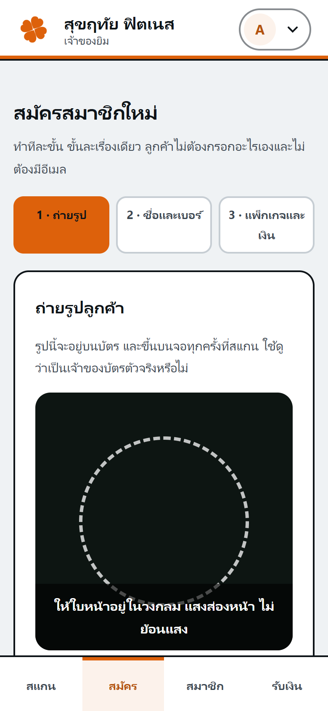

ข้อความ **"ออกบัตรให้สมาชิกใหม่แล้ว"** สีเขียวคือสัญญาณว่าเรียบร้อย ขั้นต่อไปคือส่งรูปบัตรให้ลูกค้า

> **กดบันทึกซ้ำได้ ไม่เกิดสมาชิกซ้ำ** ถ้ากดบันทึกแล้วติดตรงไหน (เช่น ระบบไม่รับรูป) ระบบจำไว้ว่าทำถึงขั้นไหนแล้ว กดบันทึกอีกครั้งจะทำต่อจากจุดที่ค้าง ไม่สร้างสมาชิกคนเดิมซ้ำอีกใบ และไม่บันทึกเงินซ้ำ · สิ่งที่กรอกไว้ไม่ถูกล้าง เพราะลูกค้ายังยืนรออยู่ตรงหน้า

<!-- pagebreak -->

### 1.4 ส่งบัตรให้ลูกค้า

หลังสมัครเสร็จ ระบบจะพาเข้าหน้า **"บัตรสมาชิก"** ของคนนั้นเอง (เข้าทีหลังได้ที่ เมนู "สมาชิก" → ค้นหาชื่อ → **"ดูบัตร"**)

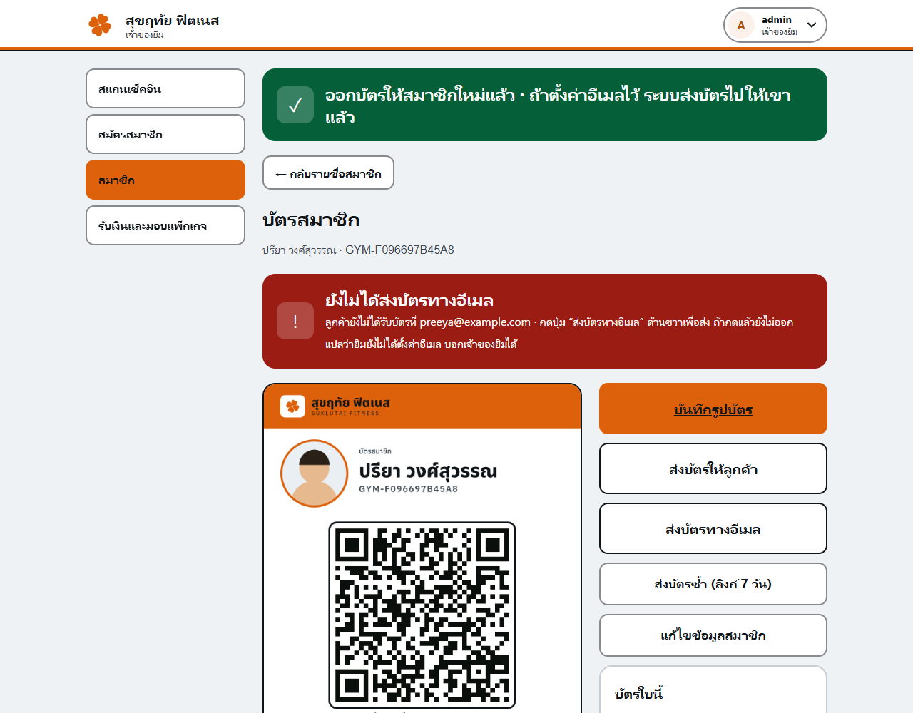

**ปุ่มสามปุ่ม ทำคนละหน้าที่**

| ปุ่ม | ได้อะไร | ใช้เมื่อไร |
|---|---|---|
| **บันทึกรูปบัตร** | ดาวน์โหลดไฟล์ PNG ลงเครื่อง | จะส่งเองทาง LINE จากคอมหรือมือถือเครื่องนั้น |
| **ส่งบัตรให้ลูกค้า** | เปิดช่องแชร์ของเครื่อง (บนมือถือจะมี LINE ให้เลือกเลย) | ส่งจากมือถือหน้าเคาน์เตอร์ ทางที่เร็วที่สุด |
| **ส่งบัตรซ้ำ (ลิงก์ 7 วัน)** | ลิงก์ดาวน์โหลด **บัตรใบเดิม** คัดลอกไปวางในแชตได้ | ลูกค้าทำรูปหาย หรือจะให้เขาโหลดเอง (ดูข้อ 1.10) |

**บัตรเป็นอย่างไร**

- ไฟล์ PNG ขนาด 1080 × 1350 px — สัดส่วนเดียวกับที่ LINE แสดงเต็มความกว้างในแชต ลูกค้าเปิดแล้ว QR เต็มจอทันที ไม่ต้องกดซูม
- บนบัตรมี: รูปถ่าย **ชื่อเต็มของสมาชิกและของยิม** รหัสสมาชิก QR ขนาดใหญ่ และแถบดำล่างที่บอกแพ็กเกจ วันหมดอายุ ชื่อยิม อำเภอ/จังหวัด และเบอร์โทรยิม — **เบอร์ที่ขึ้นบนบัตรตั้งได้ที่หน้า "ข้อมูลยิม" ค่าเริ่มต้นคือแสดงเบอร์หลัก** เลือกเป็นเบอร์สำรองหรือไม่แสดงเลยก็ได้ (ข้อ 2.4)
- **QR ไม่มีชื่อ ไม่มีเบอร์ ไม่มีข้อมูลส่วนตัวใด ๆ** ใครเอาแอปสแกน QR ทั่วไปส่องก็ไม่ได้อะไร
- บัตรใช้ได้ตลอด ไม่มีวันหมดอายุของตัวบัตรเอง **ต่ออายุแพ็กเกจแล้วไม่ต้องออกบัตรใหม่** ใบเดิมยังใช้ได้เพราะ QR ผูกกับตัวคน ไม่ได้ผูกกับแพ็กเกจ

**บอกลูกค้าตอนส่ง:** ให้เซฟรูปไว้ในเครื่องหรือปักหมุดแชตไว้ เวลามายิมเปิดรูปนี้แล้วยื่นให้พนักงานสแกน ถ้าลบไปแล้วมาบอกที่เคาน์เตอร์ได้ ส่งซ้ำให้ได้ทันที

ใต้รูปบัตรมีกล่องพับชื่อ **"รูปถ่ายของสมาชิก"** เปิดออกมาเพื่อถ่ายรูปใหม่ได้ตลอดเวลา — **รูปเปลี่ยนแล้วบัตรใบเดิมยังใช้ได้ QR ไม่เปลี่ยน** เพราะ QR ผูกกับตัวคน ไม่ได้ผูกกับรูป (ปกติกล่องนี้พับไว้ จะกางเองเมื่อสมาชิกยังไม่มีรูปหรือรูปใช้ไม่ได้)

<!-- pagebreak -->

### 1.5 ถ้ารูปบนบัตรขึ้นเป็นภาพเงา

บางครั้งไฟล์รูปเสียหรืออัปโหลดไม่ครบ ระบบยังออกบัตรให้ตามปกติแต่วาดเป็น **ภาพเงา** แทนหน้าคน และหน้าสมาชิกจะขึ้นแถบแดง **"รูปถ่ายของสมาชิกรายนี้ใช้ไม่ได้ กรุณาถ่ายใหม่"**

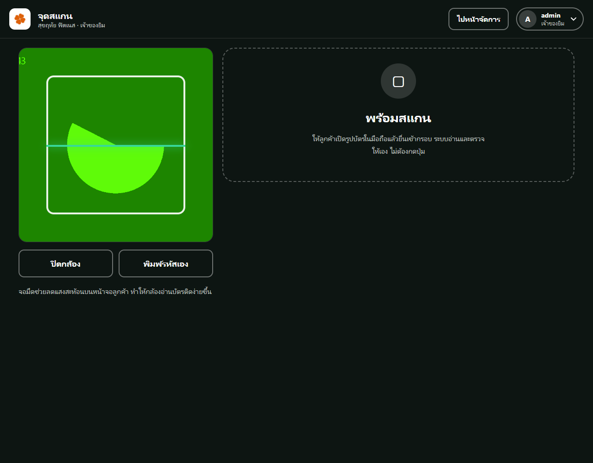

**วิธีแก้ ใช้เวลาไม่ถึงครึ่งนาที**

1. เปิดหน้าสมาชิกคนนั้น → **"ดูบัตร"** — กล่อง **"รูปถ่ายของสมาชิก"** จะกางรออยู่แล้วใต้รูปบัตร
2. กด **"เปิดกล้องถ่ายรูป"** ถ่ายใหม่ หรือเลือกไฟล์รูปจากเครื่อง
3. ขึ้นข้อความ **"บันทึกรูปถ่ายใหม่แล้ว บัตรใบเดิมยังใช้ได้ ไม่ต้องออกใหม่"** — รูปขึ้นบนบัตรทันที

**สิ่งที่ _ไม่_ ต้องทำ: ไม่ต้องกด "ออกบัตรใหม่"** เลขที่บัตรและ QR ไม่เปลี่ยน บัตรที่ลูกค้าถืออยู่ยังสแกนผ่านเหมือนเดิม แต่ควรส่งรูปบัตรใบที่มีหน้าคนให้เขาใหม่ด้วยปุ่ม "ส่งบัตรให้ลูกค้า" หรือ "ส่งบัตรซ้ำ" เพื่อให้บัตรในมือลูกค้าตรงกับที่ระบบมี

**แถบแดงสองแบบ ต่างกัน**

| แถบที่ขึ้น | แปลว่า | ทำอย่างไร |
|---|---|---|
| **รูปถ่ายของสมาชิกรายนี้ใช้ไม่ได้ กรุณาถ่ายใหม่** | มีไฟล์รูปอยู่ แต่เปิดไม่ได้ (ไฟล์เสีย หรือหายไปจากเครื่อง) | ถ่ายใหม่ตามขั้นตอนด้านบน |
| **ยังไม่มีรูปถ่ายของสมาชิกรายนี้** | ไม่เคยถ่ายรูปไว้เลย | ถ่ายเพิ่มที่กล่องเดียวกัน ตอนลูกค้ามายิมครั้งหน้า |

ทั้งสองแบบ **บัตรยังใช้สแกนเข้ายิมได้** แต่พนักงานจะเทียบหน้ากับตัวจริงไม่ได้ ซึ่งเป็นด่านเดียวที่กันการส่งบัตรต่อให้เพื่อน จึงควรแก้ให้เร็วที่สุดเท่าที่ลูกค้ามา

<!-- pagebreak -->

### 1.6 สแกนเช็คอิน

เมนู **"สแกนเช็คอิน"** เป็นจอมืดเต็มหน้าจอ ไม่มีเมนูรบกวน — จอมืดช่วยลดแสงสะท้อนบนหน้าจอลูกค้า ทำให้กล้องอ่านบัตรติดง่ายขึ้น

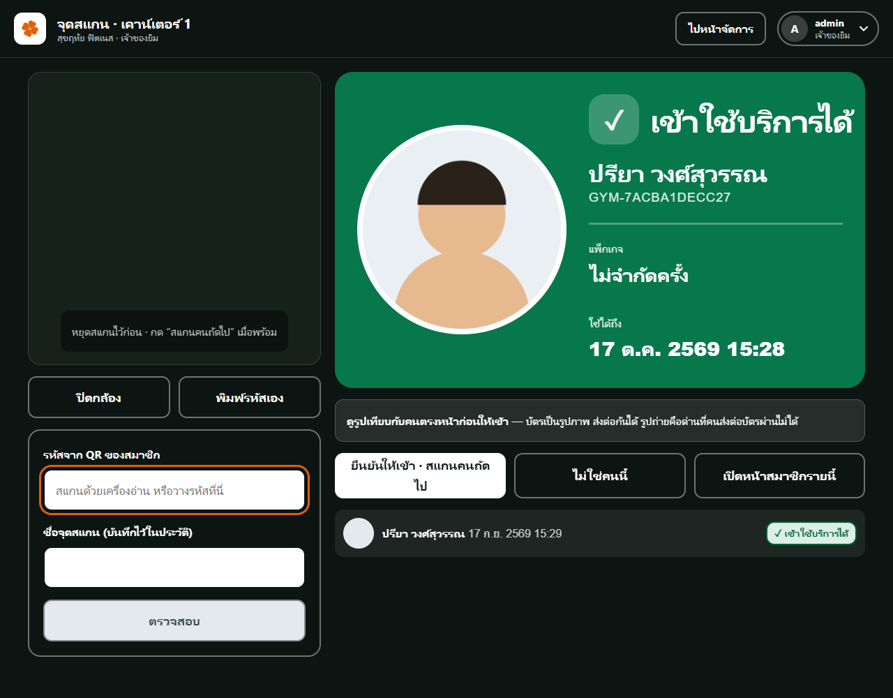

**ขั้นตอน**

1. เปิดหน้านี้ค้างไว้ตลอดเวลาที่เปิดร้าน — จอจะขึ้นว่า **"พร้อมสแกน"**
2. กรอก **"ชื่อจุดสแกน"** ครั้งเดียวตอนเปิดร้าน เช่น `เคาน์เตอร์ 1` ชื่อนี้ถูกบันทึกไว้ในประวัติ ทำให้ย้อนดูได้ว่ารายการไหนสแกนจากเครื่องใด
3. ให้ลูกค้าเปิดรูปบัตรแล้วยื่นเข้ากรอบ **ระบบอ่านและตรวจให้เอง ไม่ต้องกดปุ่ม**
4. **ดูรูปถ่ายบนจอเทียบกับคนตรงหน้าก่อนให้เข้า** แล้วจึงกด "ยืนยันให้เข้า · สแกนคนถัดไป"

> **ทำไมต้องดูรูป** บัตรเป็นรูปภาพ ส่งต่อกันได้ รูปถ่ายคือด่านที่คนส่งต่อบัตรผ่านไม่ได้ ระบบจึงวางรูปไว้ก่อนและใหญ่กว่าคำว่า "เข้าใช้บริการได้" โดยตั้งใจ

**ถ้าไม่ใช่คนเดียวกัน** กด **"ไม่ใช่คนนี้"** — การปฏิเสธเป็นเรื่องปกติ ไม่ใช่เรื่องที่ต้องไปหาว่ากดตรงไหน จากนั้นแจ้งลูกค้าว่าบัตรใบนี้เป็นของคนอื่น และแจ้งเจ้าของยิม

ด้านล่างจอจะไล่รายการที่เพิ่งสแกนไปพร้อมผลของแต่ละราย ใช้ยืนยันย้อนหลังได้ทันทีว่าคนก่อนหน้าผ่านหรือไม่ผ่าน

<!-- pagebreak -->

### 1.7 อ่านผลการสแกน — 4 อย่างที่เจอได้

| ผลบนจอ | แปลว่า | ทำอย่างไรต่อ |
|---|---|---|
| ✓ **เข้าใช้บริการได้** (แถบเขียว) | บัตรใช้ได้ สิทธิ์เหลือ | **เทียบรูปกับตัวจริง** แล้วกด "ยืนยันให้เข้า · สแกนคนถัดไป" |
| ◷ **เช็คอินไปแล้ว** | สแกนซ้ำภายในช่วงเวลาที่ตั้งไว้ (ค่าเริ่มต้น 5 นาที) — **ไม่ได้หักสิทธิ์ซ้ำ** | ให้เข้าได้ตามปกติ ไม่ต้องทำอะไรเพิ่ม |
| ✕ **เข้าใช้บริการไม่ได้** | มีเหตุผลกำกับเสมอ ดูตารางด้านล่าง | ทำตามเหตุผลที่ขึ้น |
| **กำลังตรวจสอบ…** | ระบบกำลังอ่าน | **อย่าเพิ่งให้ลูกค้าเข้าจนกว่าจะเห็นผลและรูปถ่าย** |

**เหตุผลของ "เข้าใช้บริการไม่ได้" ที่พบบ่อย**

| ข้อความ | ความหมายและทางออก |
|---|---|
| บัตรใบนี้ถูกยกเลิกแล้ว กรุณาส่งบัตรใบใหม่ให้สมาชิก | มีการออกบัตรใหม่ไปแล้ว ให้ลูกค้าใช้บัตรใบล่าสุด · ถ้าเขาไม่มี เปิดหน้าสมาชิกรายนี้แล้วกด "ส่งบัตรซ้ำ" · **ถ้าเขายืนยันว่าไม่เคยได้รับบัตรใหม่ ให้แจ้งเจ้าของยิม อาจมีคนอื่นถือบัตรเก่าอยู่** |
| ยังไม่มีแพ็กเกจที่ใช้งานได้ / แพ็กเกจหมดอายุหรือใช้ครบจำนวนครั้งแล้ว | พาไปที่หน้า "รับเงินและมอบแพ็กเกจ" ต่ออายุให้ แล้วสแกนใหม่ — **ไม่ต้องออกบัตรใหม่** |
| สมาชิกถูกระงับ / สถานะสมาชิกหมดอายุ | ติดต่อเจ้าของยิม พนักงานแก้เองไม่ได้ |
| QR ไม่ถูกต้อง กรุณาให้สมาชิกเปิดรูปบัตรอีกครั้ง | อ่านไม่ออกหรือไม่ใช่ QR ของระบบนี้ ให้เปิดรูปบัตรเต็มจอแล้วสแกนใหม่ · ถ้ายังไม่ได้ ใช้ "พิมพ์รหัสเอง" |
| เชื่อมต่อเซิร์ฟเวอร์ไม่ได้ | เน็ตหลุดชั่วคราว **ประวัติและสิทธิ์ของลูกค้าไม่ได้หายไปไหน** ลองสแกนอีกครั้งเมื่อเน็ตกลับมา |

<!-- pagebreak -->

### 1.8 เมื่อกล้องเปิดไม่ได้ — งานไม่หยุด

ถ้าจอขึ้นว่า **"เบราว์เซอร์ไม่ให้ใช้กล้อง"** ยังเช็คอินให้ลูกค้าได้ตามปกติ:

1. กด **"พิมพ์รหัสเอง"** แล้วพิมพ์ (หรือใช้เครื่องอ่านบาร์โค้ดยิง) **รหัสที่อยู่ใต้ QR บนบัตร** ลงในช่อง
2. กด **"ตรวจสอบ"** — ผลที่ได้เหมือนการสแกนทุกอย่าง รวมทั้งรูปถ่ายที่ต้องเทียบกับตัวจริง

**วิธีเปิดกล้องคืน** กดไอคอนรูปกุญแจ 🔒 ข้างช่อง URL ด้านบนของเบราว์เซอร์ → เลือก "กล้อง" แล้วเปลี่ยนเป็น "อนุญาต" → โหลดหน้านี้ใหม่ · ถ้าเปิดผ่าน http:// ธรรมดา เบราว์เซอร์จะไม่ให้ใช้กล้องเลย ต้องเป็น https:// เท่านั้น ให้แจ้งทีมติดตั้ง

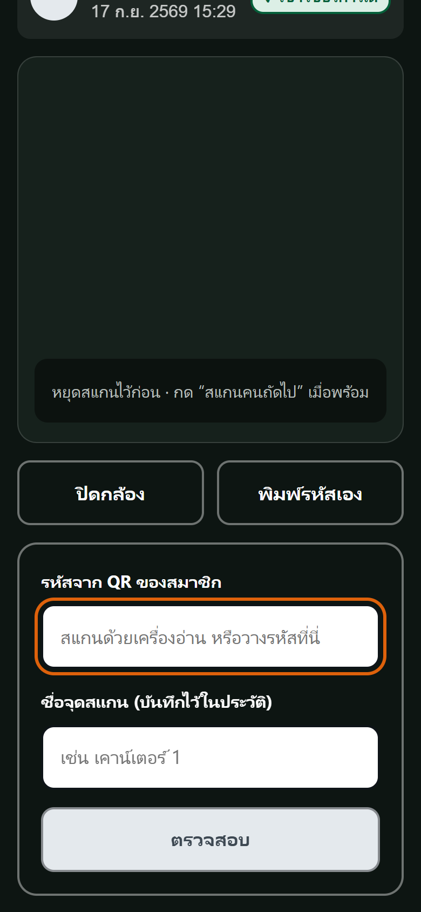

<!-- pagebreak -->

### 1.9 รับเงินและมอบแพ็กเกจ

ใช้เมื่อลูกค้าเก่าต่ออายุหรือซื้อเพิ่ม (ลูกค้าใหม่ทำจบในขั้นที่ 3 ของการสมัครแล้ว) ทุกอย่างอยู่ในหน้าเดียว 3 ขั้น

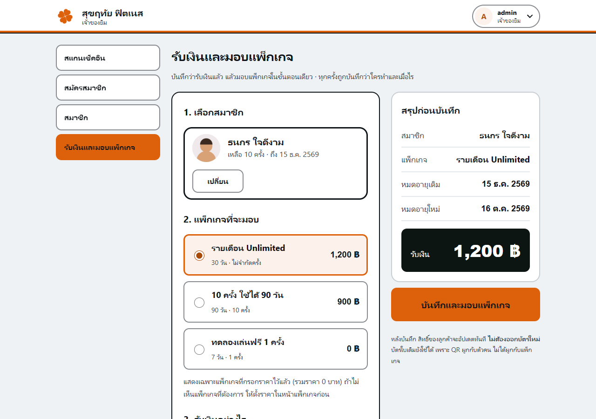

1. **เลือกสมาชิก** — ค้นหาด้วยชื่อ เบอร์โทร หรือรหัสสมาชิก
2. **เลือกแพ็กเกจที่จะมอบ** — เห็นเฉพาะแพ็กเกจที่กรอกราคาไว้แล้วและเปิดขายอยู่ (รวมราคา 0 บาท) ถ้าไม่เห็นแพ็กเกจที่ต้องการ ให้เจ้าของยิมตั้งราคาและกดเปิดขายที่หน้า "แพ็กเกจ" ก่อน
3. **รับเงินอย่างไร** — เงินสด / โอนเข้าบัญชี / ไม่ได้รับเงิน (แถมให้)
4. **อ่านแผงสรุปด้านขวาก่อนกด** โดยเฉพาะบรรทัด **"หมดอายุเดิม → หมดอายุใหม่"** นี่คือจุดที่พลาดแล้วเจ็บที่สุด เพราะกว่าจะรู้ก็ตอนลูกค้าถูกปฏิเสธหน้าเคาน์เตอร์
5. กด **"บันทึกและมอบแพ็กเกจ"**

**หลังบันทึก สิทธิ์ของลูกค้าอัปเดตทันที และ _ไม่ต้องออกบัตรใหม่_** บัตรใบเดิมยังใช้ได้ ทุกครั้งถูกบันทึกว่าใครทำและเมื่อไร

> ช่อง "บันทึกช่วยจำ" เขียนให้คนอื่นอ่านย้อนหลังแล้วเข้าใจ เช่น "ต่ออายุรายเดือน รับเงินสดที่เคาน์เตอร์" · ถ้าเลือก "ไม่ได้รับเงิน (แถมให้)" ช่องนี้กลายเป็น **เหตุผลที่บังคับกรอก**

<!-- pagebreak -->

### 1.9 (ต่อ) เมื่อขายแพ็กเกจไม่ได้ และเรื่องวันหมดอายุ

**ถ้ากดบันทึกแล้วขึ้นว่าขายแพ็กเกจนี้ไม่ได้**

ระบบจะไม่ยอมให้ขายแพ็กเกจที่เจ้าของยิมยังไม่ได้เปิดขาย หรือเลิกขายไปแล้ว — ข้อความบอกไว้ว่าต้องทำอะไรต่อ

| ข้อความ | แปลว่า | พนักงานทำอย่างไร |
|---|---|---|
| **แพ็กเกจนี้ยังไม่ได้เปิดขาย กรุณาเปิดขายก่อนที่หน้าแพ็กเกจ หรือเลือกแพ็กเกจอื่น** | เจ้าของยิมสร้างไว้แล้วแต่ยังไม่ได้กดเปิดขาย (สถานะ "ร่าง") | เลือกแพ็กเกจอื่นที่ขายอยู่ หรือให้เจ้าของยิมกดเปิดขายที่หน้า "แพ็กเกจ" แล้วขายได้ทันที |
| **แพ็กเกจนี้ปิดการขายไปแล้ว กรุณาเลือกแพ็กเกจอื่น หรือเปิดขายอีกครั้งที่หน้าแพ็กเกจ** | เจ้าของยิมตั้งใจเลิกขายราคานี้แล้ว | **อย่าเปิดขายเองโดยพลการ** ให้เลือกแพ็กเกจปัจจุบันแทน หรือถามเจ้าของยิมก่อน |
| **แพ็กเกจนี้ยังไม่ได้กำหนดราคา กรุณากรอกราคาก่อน** | ยังไม่ได้ใส่ราคา | ให้เจ้าของยิมกรอกราคาที่หน้า "แพ็กเกจ" |

ข้อความเหล่านี้จะเจอได้เมื่อแท็บเล็ตเปิดค้างไว้นานแล้วรายการบนจอเก่ากว่าที่เจ้าของยิมเพิ่งแก้ **โหลดหน้าใหม่แล้วรายการจะตรงกับปัจจุบัน**

**ต่ออายุทั้งที่สิทธิ์เดิมยังไม่หมด — ต้องบอกลูกค้าก่อนกด**

**วันหมดอายุของแพ็กเกจใหม่นับจากวันที่กดบันทึก ไม่ได้เอาวันที่เหลือของแพ็กเกจเดิมมาบวกต่อท้าย** เช่น ลูกค้าเหลือสิทธิ์อีก 10 วันแล้วมาต่อรายเดือน 30 วันวันนี้ แพ็กเกจใหม่จะหมดอายุในอีก 30 วันนับจากวันนี้ ไม่ใช่ 40 วัน

- **อ่านบรรทัด "หมดอายุเดิม → หมดอายุใหม่" ในแผงสรุปให้ลูกค้าฟังก่อนกดบันทึก** ถ้าเขาไม่อยากเสียวันที่เหลือ ให้กลับมาต่อวันที่แพ็กเกจเดิมหมดพอดี
- ระบบไม่ดึงวันหมดอายุที่แสดงให้ **ถอยหลัง** — ถ้าซื้อแพ็กเกจสั้นกว่าทับของยาวกว่า วันที่แสดงยังเป็นใบที่หมดช้าที่สุด และตอนเช็คอินระบบหักใบที่จะหมดก่อนให้เอง
- ลูกค้าที่จ่ายล่วงหน้าบ่อย ๆ ควรบอกตั้งแต่ตอนขายว่ามานับวันกันใหม่ในวันที่มาต่อ จะได้ไม่มีข้อโต้แย้งภายหลัง

<!-- pagebreak -->

### 1.10 ถ้าลูกค้าทำรูปบัตรหาย

**คำตอบสั้น: กด "ส่งบัตรซ้ำ" ไม่ใช่ "ออกบัตรใหม่"**

เมนู "สมาชิก" → ค้นหาชื่อลูกค้า → **"ดูบัตร"** → กด **"ส่งบัตรซ้ำ (ลิงก์ 7 วัน)"** → คัดลอกลิงก์ที่ขึ้นมาส่งให้ลูกค้าทาง LINE (หรือกด "ส่งบัตรให้ลูกค้า" เพื่อส่งตัวรูปไปเลย)

**สองปุ่มนี้ต้องไม่ถูกกดสลับกัน**

| | ส่งบัตรซ้ำ (ลิงก์ 7 วัน) | ออกบัตรใหม่ |
|---|---|---|
| ได้บัตรใบไหน | **ใบเดิม** ใบที่ลูกค้าเคยได้ | **ใบใหม่** ครั้งที่เพิ่มขึ้นหนึ่ง |
| บัตรเก่า | **ยังใช้ได้ตามปกติ** | **สแกนไม่ผ่านทันที ทุกใบที่เคยส่งไป** |
| ใครกดได้ | พนักงานและเจ้าของยิม | **เจ้าของยิมเท่านั้น** และต้องผ่านหน้ายืนยัน |
| ใช้เมื่อ | ลูกค้าลบรูป เปลี่ยนมือถือ หาไม่เจอ | **บัตรหลุดไปถึงคนอื่น** หรือพบการใช้ซ้ำผิดปกติ |
| ต้องทำอะไรต่อ | ไม่ต้อง | **ต้องส่งรูปใบใหม่ให้ลูกค้า** ไม่งั้นเขาเข้ายิมไม่ได้ครั้งถัดไป |

**เรื่องลิงก์ 7 วัน**

- ลิงก์ดาวน์โหลด **บัตรใบเดิม** ใช้ได้ 7 วัน หน้าจอบอกวันเวลาหมดอายุไว้ให้
- ออกใหม่ได้เรื่อย ๆ ไม่จำกัดจำนวนครั้ง ลิงก์เก่าที่ยังไม่หมดอายุก็ยังใช้ได้
- **ถ้ามีการออกบัตรใหม่ ลิงก์เก่าทุกอันตายพร้อมกันทันที** — ตรงนี้ตั้งใจให้เป็นแบบนั้น เพราะลิงก์ที่ยังส่งบัตรที่ถูกยกเลิกไปแล้วได้ ก็ไม่ต่างอะไรกับการไม่ได้ยกเลิก
- ใครมีลิงก์ก็โหลดบัตรได้ **ส่งให้เจ้าตัวโดยตรง อย่าส่งลงกลุ่ม**

### 1.11 สิ่งที่พนักงานทำไม่ได้ (ต้องเรียกเจ้าของยิม)

- **ออกบัตรใหม่** — ปุ่มไม่ขึ้นในกล่อง "เมนูเพิ่มเติม" ของหน้าบัตรเมื่อเข้าด้วยบัญชีพนักงาน
- ตั้ง/แก้ราคาแพ็กเกจ · แก้ข้อมูลยิมและเวลาเปิด · สร้างหรือระงับบัญชีผู้ใช้ · ตั้งรหัสผ่านให้คนอื่น

**สิ่งที่พนักงานทำได้ และมักเข้าใจผิดว่าทำไม่ได้:** สมัครสมาชิก · รับเงินและมอบแพ็กเกจ · ส่งบัตรซ้ำ · **ถ่ายรูปสมาชิกใหม่เมื่อรูปใช้ไม่ได้** (ข้อ 1.5) · ดูประวัติการรับเงินและสลิปของสมาชิกรายคน

<!-- pagebreak -->

### 1.12 ลูกค้าถามเบอร์โทรหรือ LINE ของยิม

เปิดเมนูมุมขวาบน → **"ตั้งค่ายิม"** — พนักงานเปิดหน้านี้ได้เพื่ออ่านอย่างเดียว ข้างในมี **ชื่อยิม · ชื่อย่อบนบัตร · เบอร์โทร · LINE ID · ที่อยู่** ครบในกล่องเดียว ตอบลูกค้าได้โดยไม่ต้องไปถามเจ้าของยิม

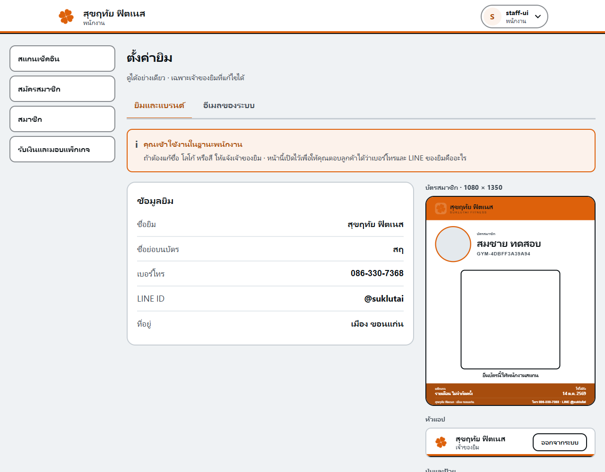

บนจอมีแถบบอกว่า **"คุณเข้าใช้งานในฐานะพนักงาน — ถ้าต้องแก้ชื่อ โลโก้ หรือสี ให้แจ้งเจ้าของยิม"** · ช่องที่เจ้าของยิมยังไม่ได้กรอก (เช่น LINE ID) จะขึ้นขีด "—" แปลว่ายังไม่มี ไม่ใช่ระบบเสีย

<!-- pagebreak -->

### 1.13 แจ้งปัญหาเมื่อระบบใช้ไม่ได้

**กดตอนที่ปัญหายังอยู่บนจอ** เมนูมุมขวาบน → **"แจ้งปัญหา"** — ระบบ **จับภาพหน้าจอให้อัตโนมัติก่อนเปิดกล่อง** จึงได้ภาพของปัญหาจริง ไม่ใช่ภาพของกล่องแจ้งปัญหา · ระหว่างนั้นจะขึ้นว่า "กำลังจับภาพหน้าจอ…" แป๊บเดียว

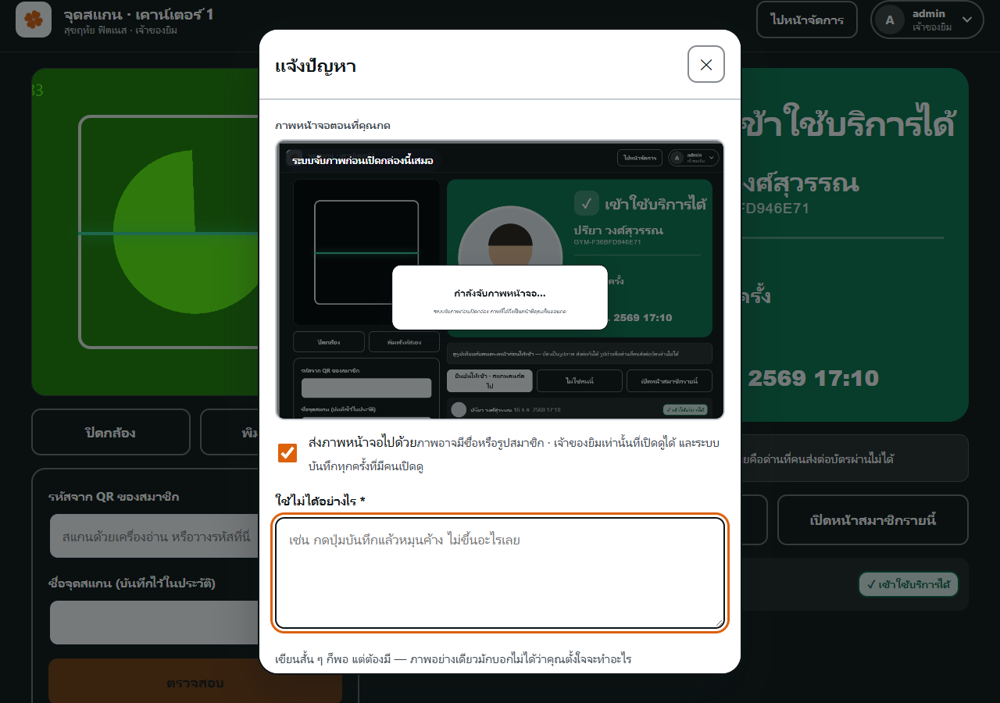

**ในกล่องมีอะไร**

- **ภาพหน้าจอตอนที่คุณกด** พร้อมติ๊ก **"ส่งภาพหน้าจอไปด้วย"** (เอาออกได้) · ใต้ติ๊กเขียนไว้ว่า *ภาพอาจมีชื่อหรือรูปสมาชิก · เจ้าของยิมเท่านั้นที่เปิดดูได้ และระบบบันทึกทุกครั้งที่มีคนเปิดดู*
- **"ใช้ไม่ได้อย่างไร" เป็นช่องเดียวที่บังคับกรอก** — เขียนสั้น ๆ ก็พอ แต่ต้องมี เพราะภาพอย่างเดียวมักบอกไม่ได้ว่าคุณกำลังจะทำอะไร · เขียนแบบนี้ช่วยได้มากที่สุด: **กำลังทำอะไร → กดปุ่มไหน → เกิดอะไรขึ้นแทน** เช่น "กดปุ่มบันทึกแล้วหมุนค้าง ไม่ขึ้นอะไรเลย"
- ด้านล่างบอกสิ่งที่จะถูกส่งไปด้วยทั้งหมด ไม่มีอะไรซ่อน: **หน้าที่เกิด · เวลา · ผู้แจ้ง · เครื่องที่ใช้**

กด **"ส่งเรื่อง"** → ขึ้น **"ส่งเรื่องแล้ว"** พร้อม **เลขเรื่อง (เรื่อง #…)** — จดเลขนี้ไว้ถ้าต้องคุยกันต่อ · หน้าจอบอกตรง ๆ ว่า **เรื่องนี้ยังไม่ได้แก้ให้คุณตอนนี้** ถ้ามีวิธีทำอย่างอื่นไปก่อนได้ ให้ทำวิธีนั้นเพื่อไม่ให้ลูกค้ารอ

**ถ้าเน็ตหลุดตอนกดส่ง — เรื่องไม่หาย**

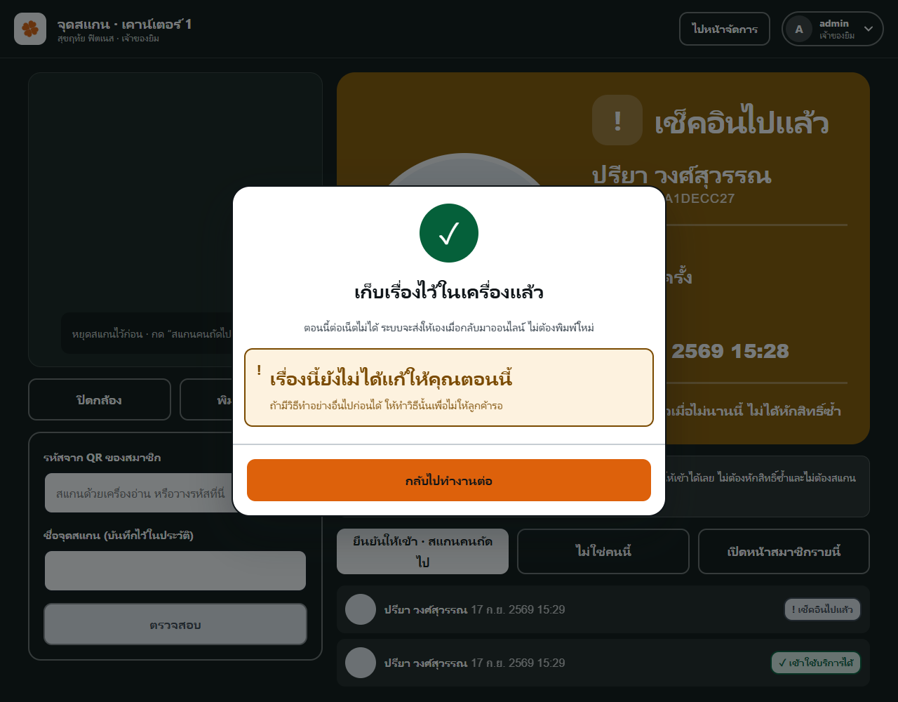

ขึ้นว่า **"เก็บเรื่องไว้ในเครื่องแล้ว"** ระบบจะส่งให้เองเมื่อเน็ตกลับมา **ไม่ต้องพิมพ์ใหม่** · ระหว่างที่ยังค้าง เมนูจะขึ้นว่า **"แจ้งปัญหา (รอส่ง 1)"** ให้รู้ว่ายังมีของค้างอยู่ในเครื่องนี้ — อย่าเพิ่งล้างข้อมูลเบราว์เซอร์หรือปิดโหมดส่วนตัวก่อนตัวเลขนั้นหายไป

**ถ้าจับภาพไม่สำเร็จ** ขึ้นว่า "จับภาพหน้าจอไม่สำเร็จ · ส่งเรื่องต่อได้ตามปกติ แค่ไม่มีภาพประกอบ" แล้วให้ **เลือกเองว่าเกิดที่หน้าไหน** จากรายการ — ส่งต่อได้ปกติ

**ใช้ได้ทุกหน้า รวมจอสแกน** ระหว่างสแกนก็กดแจ้งได้ ระบบวาดภาพจากกล้องลงในภาพหน้าจอให้ด้วย

<!-- pagebreak -->

## ส่วนที่ 2 · เจ้าของยิม

### 2.1 ตั้งรหัสผ่านครั้งแรกจากลิงก์

ระบบไม่ส่งอีเมล จึงไม่มีปุ่ม "ลืมรหัสผ่าน" บนหน้าเว็บ **รหัสผ่านของแอดมินคนแรกมาจากลิงก์ที่ออกจากเครื่องเซิร์ฟเวอร์** ทีมติดตั้งเป็นคนออกให้ด้วยคำสั่ง:

```
docker compose exec app npm --silent run admin:set-password-link -- อีเมลของคุณ
```

บรรทัดแรกที่ได้คือลิงก์หน้าตาแบบนี้ `https://srv1979069.hstgr.cloud/?setpw=<รหัสยาว ๆ>`

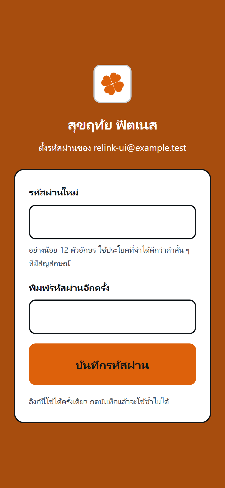

**วิธีใช้**

1. เปิดลิงก์ในเบราว์เซอร์ — ได้หน้า **"ตั้งรหัสผ่านของ &lt;อีเมล&gt;"** โดยไม่ต้องล็อกอินก่อน (ช่องบนคือรหัสผ่านใหม่ ช่องล่างคือพิมพ์ซ้ำอีกครั้ง)
2. พิมพ์รหัสผ่านใหม่สองครั้งให้ตรงกัน **อย่างน้อย 12 ตัวอักษร** — ใช้ประโยคที่จำได้ดีกว่าคำสั้น ๆ ที่มีสัญลักษณ์
3. กด **"บันทึกรหัสผ่าน"** → ขึ้น "ตั้งรหัสผ่านเรียบร้อย" → กด "ไปหน้าเข้าสู่ระบบ" แล้วเข้าด้วยรหัสที่เพิ่งตั้ง

**กฎของลิงก์ที่ต้องรู้**

- **ใช้ได้ครั้งเดียว** และ **หมดอายุใน 24 ชั่วโมง** · ออกใหม่แล้วอันเก่าตายทันที
- หมดอายุหรือกดพลาด ให้ทีมติดตั้งรันคำสั่งเดิมออกลิงก์ใหม่ได้ ไม่จำกัดจำนวนครั้ง
- ใช้ได้กับ **บัญชีผู้ดูแลระบบเท่านั้น** บัญชีพนักงาน บัญชีที่ถูกระงับ และอีเมลที่ไม่มีอยู่จริง จะถูกปฏิเสธ
- **ใครเปิดลิงก์นี้ได้ก็ตั้งรหัสผ่านของบัญชีนี้ได้** ส่งให้เจ้าของบัญชีโดยตรง อย่าส่งลงกลุ่ม ตั้งเสร็จแล้วลบข้อความทิ้ง
- ตั้งรหัสเสร็จ ระบบจะตัด session เดิมของบัญชีนั้นทุกเครื่อง และบันทึกไว้ในประวัติการใช้งานว่าลิงก์ถูกออกเมื่อไรและถูกใช้เมื่อไร
- ถ้าเปิดลิงก์แล้วขึ้น **"ลิงก์นี้ใช้ไม่ได้แล้ว"** แปลว่าหมดอายุ ถูกใช้ไปแล้ว หรือมีการออกลิงก์ใหม่ทับ — ขอลิงก์ใหม่

**หลังจากนี้ไม่ต้องใช้เซิร์ฟเวอร์อีก** รหัสผ่านของพนักงานทุกคน และของตัวคุณเอง ตั้งได้จากหน้า "ผู้ใช้และสิทธิ์" บนเว็บ

<!-- pagebreak -->

### 2.2 ผู้ใช้และสิทธิ์

หน้านี้ตอบว่า *ใครเข้าระบบได้และเข้าในฐานะอะไร* — คนละเรื่องกับหน้า "สมาชิก" ซึ่งเป็นรายชื่อคนที่มาออกกำลังกาย

**เพิ่มบัญชีพนักงาน**

1. กรอกอีเมล → เลือกสิทธิ์ **"พนักงาน — สแกนเช็คอินและสมัครสมาชิก"** หรือ **"ผู้ดูแลระบบ — จัดการทุกอย่าง"**
2. ตั้งรหัสผ่านให้เขาเลยก็ได้ (อย่างน้อย 12 ตัวอักษร) หรือเว้นว่างไว้ตั้งทีหลัง — **บัญชีที่ยังไม่มีรหัสผ่านเข้าระบบไม่ได้** และตารางจะขึ้นว่า "✕ ยังไม่ได้ตั้ง" ไม่ให้พนักงานไปยืนงงที่หน้าล็อกอิน
3. กด **"สร้างบัญชี"** แล้ว **บอกรหัสให้เขาแบบตัวต่อตัว ไม่ส่งลงกลุ่ม**

**ตั้งรหัสผ่านใหม่ให้พนักงานที่ลืมรหัส** กด **"ตั้งรหัสใหม่"** ในแถวของเขา → พิมพ์รหัสใหม่ หรือกด **"สุ่มรหัสผ่านให้"** → กด "บันทึกรหัสผ่านใหม่"

- รหัสแสดงเป็นตัวอักษรปกติโดยตั้งใจ เพื่อให้คุณอ่านให้เขาฟังได้ถูก และไม่ถูกเก็บไว้ที่ไหนหลังกดบันทึก
- **กดบันทึกแล้วเขาจะถูกออกจากระบบทันที** ถ้าเขากำลังสแกนอยู่หน้าเคาน์เตอร์ ให้บอกเขาก่อน

**ระงับ / คืนสิทธิ์ / เปลี่ยนสิทธิ์**

- ปุ่ม **"ระงับ"** ปิดการเข้าใช้ทันทีโดยไม่ลบประวัติ · **"คืนสิทธิ์"** เปิดกลับ
- การเปลี่ยนสิทธิ์หรือระงับบัญชี **เตะคนนั้นออกจากระบบทันที** — บอกเขาก่อนกด
- ระบบไม่ยอมให้เหลือผู้ดูแลระบบ 0 คน จึงกันไม่ให้คุณระงับหรือลดสิทธิ์ตัวเองจนไม่มีใครดูแลระบบได้
- ถ้าคุณเปลี่ยนสิทธิ์หรือระงับบัญชีของตัวเอง ระบบจะให้คุณออกจากระบบด้วยเช่นกัน

หัวตารางบอกไว้ครบว่าแต่ละบัญชี: อีเมล · สิทธิ์ · รหัสผ่าน (✓ ตั้งแล้ว / ✕ ยังไม่ได้ตั้ง) · สถานะ (✓ ใช้งานได้ / ถูกระงับ) และมีตัวนับ **"ผู้ดูแลระบบที่ใช้งานได้"** ให้เห็นตลอด

<!-- pagebreak -->

### 2.3 แพ็กเกจและราคา

เมนูมุมขวาบน → **"แพ็กเกจ"** → **"เพิ่มแพ็กเกจ"** หรือ "แก้ไข" ในแถวที่มีอยู่

- ตั้งได้: ชื่อแพ็กเกจ · ประเภท (**ไม่จำกัดครั้ง** หรือ **จำกัดจำนวนครั้ง**) · อายุแพ็กเกจเป็นวัน · จำนวนครั้ง · ราคา · สถานะ (ร่าง / เปิดขาย / ปิดการขาย)
- **แพ็กเกจที่ยังไม่กรอกราคาจะมอบให้ใครไม่ได้** และไม่ขึ้นในหน้ารับเงิน จะติดป้าย "มอบไม่ได้" ในรายการ
- **แพ็กเกจที่ขายจริงต้องอยู่ในสถานะ "เปิดขาย"** — สถานะ "ร่าง" และ "ปิดการขาย" จะไม่ขึ้นให้พนักงานเลือกทั้งในหน้าสมัครและหน้ารับเงิน ตั้งราคาแล้วอย่าลืมเปิดขายด้วย
- ถึงจะกดจากหน้าจอที่ค้างอยู่ ระบบก็ยังไม่ยอมให้ขาย และตอบกลับคนละข้อความตามสถานะ: **"แพ็กเกจนี้ยังไม่ได้เปิดขาย กรุณาเปิดขายก่อนที่หน้าแพ็กเกจ หรือเลือกแพ็กเกจอื่น"** (ร่าง) และ **"แพ็กเกจนี้ปิดการขายไปแล้ว กรุณาเลือกแพ็กเกจอื่น หรือเปิดขายอีกครั้งที่หน้าแพ็กเกจ"** (ปิดการขาย) · ไม่มีรายการขายหรือยอดเงินเกิดขึ้นเมื่อถูกปฏิเสธ
- **ปิดการขายไม่กระทบสิทธิ์ที่ลูกค้าจ่ายไปแล้ว** คนที่ถือแพ็กเกจนั้นอยู่ยังเข้ายิมและสแกนได้ตามปกติจนหมดอายุ การปิดการขายมีผลแค่ว่าขายใบใหม่ไม่ได้เท่านั้น — ใช้เมื่อเลิกขายราคานี้แล้ว แทนการลบแพ็กเกจทิ้ง
- **ราคา 0 บาทคือแพ็กเกจฟรีจริง** มอบได้ และไม่กระทบยอดขาย
- แก้ราคาแล้วไม่กระทบสิทธิ์ที่มอบไปแล้ว มีผลกับรายการที่มอบหลังจากนั้น

<!-- pagebreak -->

### 2.4 ข้อมูลยิม

เมนูมุมขวาบน → **"ข้อมูลยิม"** — ทุกอย่างในหน้านี้แก้ได้เอง ไม่มีค่าไหนถูกฝังไว้ในโค้ด

- **ชื่อยิม (ไทย/อังกฤษ) · ที่อยู่ · อำเภอ จังหวัด · เบอร์โทรหลักและสำรอง** — ชื่อ อำเภอ/จังหวัด และเบอร์โทร **จะไปขึ้นบนบัตรสมาชิกทุกใบ**
- **เบอร์โทรที่ขึ้นบนบัตร** ตั้งที่ช่อง **"เบอร์ที่แสดงบนบัตรและหน้าสาธารณะ"** ในหน้านี้ เลือกได้ 3 แบบ: **เบอร์หลัก (ค่าเริ่มต้น)** · เบอร์สำรอง · ไม่แสดงเบอร์ — ตัดสินใจเรื่องนี้ **ก่อนออกบัตรใบแรก** เพราะบัตรเป็นรูปที่ลูกค้าเก็บไว้และส่งต่อกันได้ ถ้าไม่อยากให้เบอร์ติดไปกับรูป ให้เลือก "ไม่แสดงเบอร์"
- **การเช็คอิน → "สแกนซ้ำภายในกี่นาทีถือเป็นครั้งเดียวกัน"** ค่าเริ่มต้น 5 นาที (ตั้งได้ 1 นาที ถึง 12 ชั่วโมง) — ค่านี้คือสิ่งที่กันการหักสิทธิ์ซ้ำเวลาบัตรถูกสแกนซ้ำโดยบังเอิญ ซึ่งเกิดบ่อยกับบัตรถาวร
- **เวลาเปิดทำการ** รายวัน และปุ่มยืนยันว่าเวลาถูกต้องแล้ว
- แก้ชื่อยิมหรือเบอร์แล้ว **บัตรใบเก่าที่ลูกค้าถืออยู่ยังใช้สแกนได้ตามปกติ** (ข้อมูลบนรูปที่ส่งไปแล้วจะยังเป็นของเดิม ถ้าอยากให้รูปตรงกับข้อมูลใหม่ ต้องส่งบัตรซ้ำให้เขาโหลดใหม่)

### 2.5 ตั้งค่ายิม — โลโก้และสีของยิม

เมนูมุมขวาบน → **"ตั้งค่ายิม"** คือที่ที่ยิมใส่โลโก้และสีของตัวเองลงในระบบ **มีผลกับหัวแอป ปุ่ม หน้าเข้าสู่ระบบ และบัตรสมาชิก**

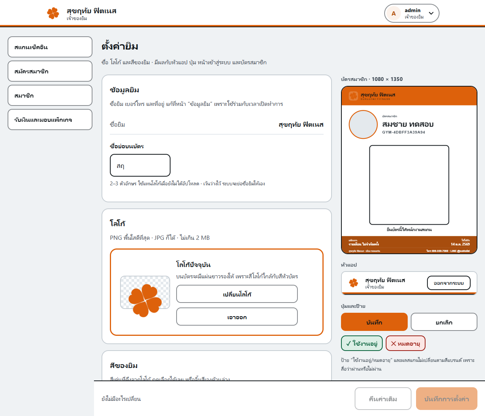

หน้านี้แบ่งเป็น 4 กล่อง และ **ไม่มีอะไรถูกบันทึกจนกว่าจะกดปุ่มในแถบล่างจอ** — แถบนั้นบอกด้วยว่าแก้ไปกี่อย่างแล้ว ("แก้ไขแล้ว N อย่าง · ยังไม่ได้บันทึก") และมีปุ่ม **"คืนค่าเดิม"** ให้ทิ้งที่แก้ทั้งหมด

**ข้อมูลยิม (กล่องบนสุด)** — ชื่อยิม เบอร์โทร และที่อยู่ แสดงให้ดูเฉย ๆ **แก้ที่หน้า "ข้อมูลยิม" (ข้อ 2.4)** เพราะใช้ร่วมกับเวลาเปิดทำการ เก็บไว้ที่เดียวเพื่อไม่ให้ชื่อบนบัตรกับบนหน้าจอเพี้ยนจากกัน · ช่อง **"ชื่อย่อบนบัตร"** แก้ได้ที่นี่ 2–3 ตัวอักษร ใช้แทนโลโก้เมื่อยังไม่ได้อัปโหลด เว้นว่างไว้ระบบจะย่อชื่อยิมให้เอง

<!-- pagebreak -->

#### ตั้งค่ายิม · โลโก้

กด **"เลือกไฟล์โลโก้"** — รับ **PNG (พื้นใสดีที่สุด) หรือ JPG ไม่เกิน 2 MB** ระบบย่อขนาดให้เองและเก็บเป็น PNG เพื่อรักษาพื้นใส

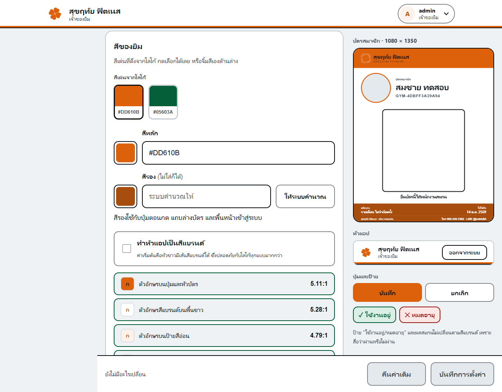

- อัปโหลดแล้วได้กล่อง **"โลโก้ปัจจุบัน"** พร้อมปุ่ม **"เปลี่ยนโลโก้"** และ **"เอาออก"**
- ใต้รูปบอกว่าบนบัตรโลโก้จะ **มีแผ่นขาวรองให้** (เมื่อสีโลโก้ใกล้กับสีหัวบัตร) หรือ **วางบนหัวบัตรได้เลย** — ระบบตัดสินให้เอง ไม่ต้องตั้งค่า
- **ยังไม่มีโลโก้ก็เริ่มใช้ได้** บัตรจะขึ้นชื่อย่อในกรอบสีแบรนด์แทน อัปโหลดทีหลังแล้วบัตรใบเดิมจะเปลี่ยนตามเองเมื่อส่งใหม่

**ถ้าไฟล์ไม่ผ่าน** ขึ้นกล่องแดง **"อัปโหลดโลโก้ไม่สำเร็จ"** พร้อมเหตุผล เช่น *"ไฟล์โลโก้ใหญ่เกิน 2 MB กรุณาย่อรูปก่อนอัปโหลด"* หรือ *"ไฟล์โลโก้นี้เปิดไม่ได้ อาจอัปโหลดไม่ครบหรือไฟล์เสียหาย กรุณาเลือกไฟล์ PNG หรือ JPG อีกครั้ง"* · **โลโก้เดิมไม่หาย** ยังอยู่ครบตามเดิม เลือกไฟล์ใหม่ได้ทันที

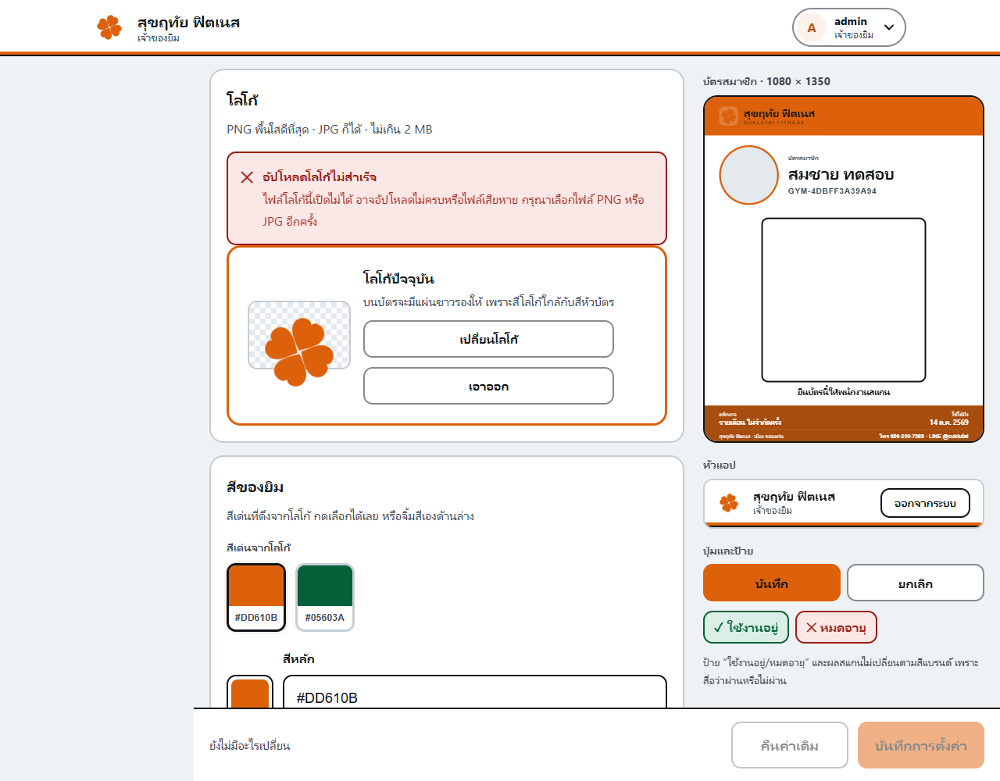

<!-- pagebreak -->

#### ตั้งค่ายิม · สีของยิม

มีสองทางเลือก ใช้ทางไหนก็ได้

1. **กดเลือกจากแถบ "สีเด่นจากโลโก้"** — ระบบดึงสีเด่นจากไฟล์โลโก้มาให้ 3–4 สีพร้อมรหัสสี และ **ต่อท้ายด้วยสีเขียวเริ่มต้นของระบบเสมอ** เผื่ออยากกลับไปใช้ของเดิม
2. **จิ้มสีเอง** ที่ช่อง **"สีหลัก"** (ใส่รหัสแบบ `#RRGGBB` หรือกดช่องสีแล้วเลือก)

**สีรอง** เว้นว่างไว้ได้ กด **"ให้ระบบคำนวณ"** แล้วระบบคิดให้จากสีหลัก · สีรองใช้กับปุ่มตอนกด แถบล่างบัตร และพื้นหน้าเข้าสู่ระบบ

**ติ๊ก "ทำหัวแอปเป็นสีแบรนด์"** — ค่าเริ่มต้นคือหัวแอปสีขาวมีเส้นสีแบรนด์ใต้ ซึ่งปลอดภัยกับโลโก้ทุกแบบมากกว่า ติ๊กช่องนี้ถ้าอยากให้หัวแอปเป็นสีเต็มแถบ

**ตารางตัวเลขใต้ช่องสี — อ่านก่อนกดบันทึก**

ห้าแถวนี้คือค่าความต่างของสีตัวอักษรกับพื้นจริง ๆ ที่จะไปอยู่บนจอและบนบัตร **ตัวเลขยิ่งสูงยิ่งอ่านง่าย** เกณฑ์คือ 4.5:1 สำหรับตัวอักษร และ 3:1 สำหรับเส้นขอบ แถวไหนต่ำกว่าเกณฑ์จะขึ้นสีแดง

| แถว | หมายถึงตรงไหน |
|---|---|
| ตัวอักษรบนปุ่มและหัวบัตร | ตัวหนังสือบนปุ่มสีหลักและบนแถบหัวบัตร |
| ตัวอักษรสีแบรนด์บนพื้นขาว | ตัวหนังสือสีแบรนด์บนพื้นขาวของหน้าจอ |
| ตัวอักษรบนป้ายสีอ่อน | ป้ายเล็ก ๆ ที่ใช้พื้นอ่อนของสีแบรนด์ |
| เส้นขอบช่องกรอกบนพื้นหน้า | เส้นรอบช่องกรอกข้อมูล |
| ตัวอักษรบนสีรอง (แถบล่างบัตร) | แถบล่างของบัตรสมาชิก |

ถ้าสีที่เลือกอ่อนหรือเข้มเกินไป ระบบขึ้นกล่องเตือนอธิบายให้ เช่น สีอ่อนมากจะทำให้โลโก้จมหายบนหัวบัตร หรือสีเกือบดำจะทำให้บัตรดูเป็นขาวดำ **ระบบไม่ห้ามใช้** เพราะเป็นป้ายของยิมเอง แต่บอกให้รู้ก่อนตัดสินใจ · บางกรณีระบบปรับสีพื้นให้เข้มขึ้นเล็กน้อยเฉพาะตอนใช้เป็นพื้นปุ่มและหัวบัตร แล้วแจ้งไว้ในกล่องเตือน สีที่เลือกยังอยู่ครบในที่อื่น

#### ข้อมูลติดต่อท้ายบัตร

**LINE ID** พิมพ์ต่อท้ายเบอร์โทรที่ท้ายบัตร เว้นว่างไว้ก็ได้ · เบอร์โทรและที่อยู่แสดงให้ดู แก้ที่หน้า "ข้อมูลยิม" · **ช่องที่เว้นว่างจะไม่ขึ้นบนบัตร**

<!-- pagebreak -->

#### ตั้งค่ายิม · พรีวิวด้านขวา — ดูก่อนกดบันทึก

พรีวิวเปลี่ยนตามทันทีที่เลือกสี **แต่แอปจริงยังไม่เปลี่ยนจนกว่าจะกดบันทึก** มีให้ดูสามอย่าง: **บัตรสมาชิก 1080 × 1350** · **หัวแอป** · **ปุ่มและป้าย** (บนมือถือ พรีวิวขึ้นก่อนฟอร์ม)

**ป้าย "ใช้งานอยู่ / หมดอายุ" และผลการสแกนไม่เปลี่ยนตามสีแบรนด์** เพราะสองอย่างนั้นสื่อว่าผ่านหรือไม่ผ่าน ไม่ใช่เรื่องแบรนด์ — เขียว/แดงจึงคงที่ไม่ว่ายิมจะเลือกสีอะไร

#### กดบันทึกแล้วเกิดอะไรขึ้น

ขึ้นข้อความ **"บันทึกการตั้งค่ายิมแล้ว · บัตรใบใหม่ทุกใบจะใช้สีนี้"**

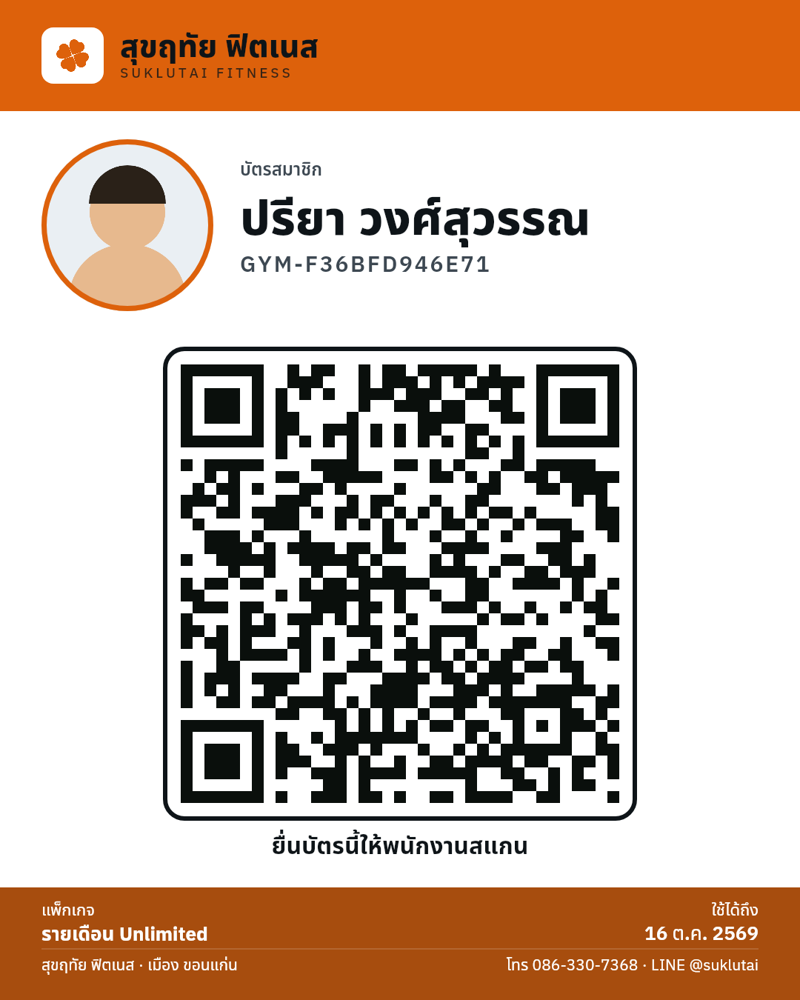

**เปลี่ยนทันที**

- หัวแอป ปุ่ม และหน้าเข้าสู่ระบบ ของทุกเครื่องที่โหลดหน้าใหม่
- บัตรที่ออกใหม่หลังจากนี้
- **บัตรใบเดิมเมื่อถูกโหลดใหม่** — กด "บันทึกรูปบัตร" หรือส่งลิงก์ "ส่งบัตรซ้ำ" จะได้บัตรหน้าตาใหม่

**ไม่เปลี่ยน**

- **QR และเลขที่บัตรไม่ขยับ** บัตรที่ลูกค้าถืออยู่ยังสแกนผ่านเหมือนเดิม **ไม่ต้องออกบัตรใหม่ให้ใครทั้งนั้น**
- **QR ยังเป็นดำบนขาวเสมอ** ไม่ว่าจะเลือกสีอะไร เพราะ QR ที่ย้อมสีคือ QR ที่กล้องอ่านไม่ติดบนจอมือถือที่หรี่แสง
- **รูปบัตรที่ส่ง LINE ไปแล้วยังเป็นรูปเก่า** รูปในแชตของลูกค้าไม่เปลี่ยนตามระบบ ถ้าอยากให้เขาได้ใบสีใหม่ต้องส่งให้ใหม่ (ข้อ 1.4) ซึ่ง **ไม่จำเป็นต่อการใช้งาน** ใบเก่ายังเข้ายิมได้ปกติ
- สิทธิ์ ประวัติเช็คอิน และยอดขาย ไม่เกี่ยวกับการเปลี่ยนสีเลย

> **ถ้าเปิดหน้านี้ค้างไว้สองเครื่องแล้วต่างคนต่างกดบันทึก** เครื่องที่กดทีหลังจะขึ้นว่า *"มีคนแก้ตั้งค่ายิมไปแล้วระหว่างที่คุณเปิดหน้านี้ กรุณาโหลดหน้าใหม่แล้วลองอีกครั้ง"* — กันไม่ให้ค่าของอีกคนถูกทับเงียบ ๆ โหลดหน้าใหม่แล้วแก้ซ้ำได้เลย

<!-- pagebreak -->

### 2.6 ออกบัตรใหม่ — ใช้เมื่อบัตรหลุดไปถึงคนอื่น

เมนู "สมาชิก" → เปิดคนนั้น → **"ดูบัตร"** → กล่อง "บัตรใบนี้" → **"เมนูเพิ่มเติม"** → **"ออกบัตรใหม่"**

หน้ายืนยันจะไล่ผลลัพธ์ให้อ่านทีละข้อก่อน: บัตรใบเดิมจะสแกนไม่ผ่านอีกเลย (รวมถึงที่ลูกค้าถืออยู่) · ระบบสร้างใบใหม่ให้ทันทีโดยใช้รูปถ่ายและแพ็กเกจเดิม · **คุณต้องส่งรูปใบใหม่ให้ลูกค้า** · สิทธิ์คงเหลือและประวัติเช็คอินไม่เปลี่ยน

**ต้องเขียนเหตุผลทุกครั้ง** (มีตัวเลือกให้เลือก เช่น "ลูกค้าแจ้งว่าบัตรหลุดไปถึงคนอื่น" / "ลูกค้าทำรูปหาย ขอใหม่" / "พบการใช้บัตรซ้ำผิดปกติ") เหตุผลถูกบันทึกในประวัติเพื่อให้ตรวจย้อนหลังได้ · **การกระทำนี้ย้อนกลับไม่ได้**

> ลูกค้าแค่ทำรูปหาย ให้ใช้ "ส่งบัตรซ้ำ" (ข้อ 1.9) การออกบัตรใหม่ทุกครั้งที่ลูกค้าทำรูปหาย จะทำให้ลูกค้าที่ยังถือใบเก่าอยู่เข้ายิมไม่ได้โดยไม่จำเป็น

<!-- pagebreak -->

### 2.7 ประวัติ ยอดขาย และสลิป

**ประวัติเช็คอิน** (เมนูมุมขวาบน) — ดูว่าใครเข้ายิมเมื่อไร และใครถูกปฏิเสธเพราะอะไร กรองตามวันที่และค้นหาด้วยชื่อหรือรหัสสมาชิกได้ · มีชุด **"ไม่ถูกต้อง"** แยกไว้ต่างหากสำหรับรายการที่สแกนแล้วระบุตัวสมาชิกไม่ได้ เช่น QR ปลอมหรืออ่านไม่ออก เพื่อไม่ให้กลบประวัติการเข้าใช้จริง · ด้านล่างมีสรุปรายวัน: เข้าใช้บริการ / ซ้ำ / ถูกปฏิเสธ

**ยอดขายรายวัน** — ใช้เทียบกับรายการเงินเข้าบัญชีจริง **นับเฉพาะที่รับเงินจริง ไม่รวมแพ็กเกจที่แถมให้**

**ประวัติการรับเงิน (รายคน) — ที่เก็บสลิป** อยู่ท้ายหน้าบัตรของสมาชิกแต่ละคน: เมนู "สมาชิก" → เปิดคนนั้น → **"ดูบัตร"** → เลื่อนลงล่างสุด ไม่ต้องไปหาที่แท็บไหนอีก

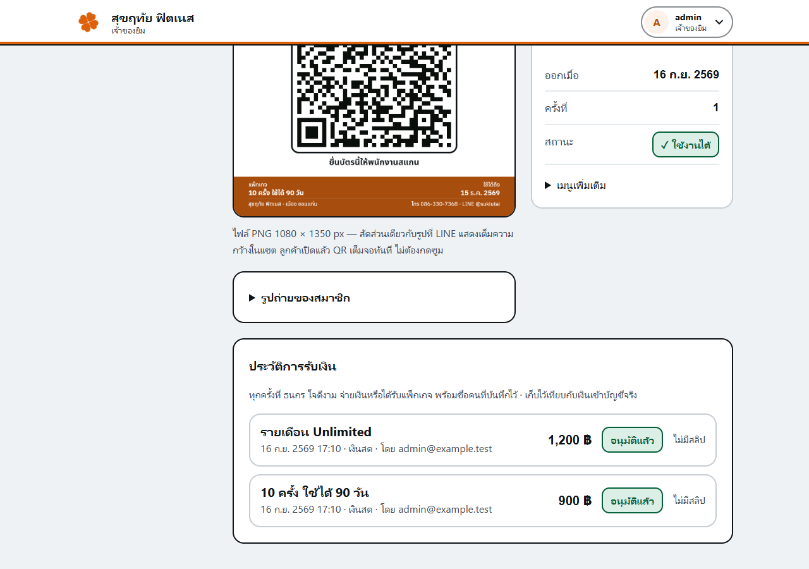

- แต่ละบรรทัดบอก **แพ็กเกจ · วันเวลา · วิธีรับเงิน · ชื่อคนที่บันทึก · ยอดเงิน · สถานะ**
- มีสลิปแนบไว้จะมีปุ่ม **"ดูสลิป"** กดแล้วรูปเปิดในหน้าเดียวกัน (กดที่รูปเพื่อเปิดขนาดเต็ม) — อยู่บรรทัดเดียวกับยอดเงิน เพื่อให้เทียบรูปกับยอดได้โดยไม่ต้องสลับหน้า · รายการที่ไม่มีสลิปจะขึ้นว่า "ไม่มีสลิป"
- รายการที่แถมให้จะขึ้นยอด **0 ฿** และไม่ถูกนับเข้ายอดขาย

> **แท็บ "ตรวจสลิป" ถูกถอดออกแล้ว** (ตั้งแต่ระบบรุ่นนี้) คิวนั้นเคยไว้ตรวจสลิปที่ลูกค้าอัปโหลดเองจากแอปสมาชิก ซึ่งไม่มีอีกแล้ว ส่วนสลิปที่พนักงานแนบตอนรับเงินที่เคาน์เตอร์ ไม่ต้องอนุมัติ — บันทึกแล้วสิทธิ์ให้ทันที และเก็บไว้ที่ประวัติการรับเงินของคนนั้น · ถ้าเจอคำสั่งซื้อเก่าค้างสถานะ "รอตรวจสอบ" จากระบบเดิม จะเห็นในประวัติการรับเงินของสมาชิกคนนั้นพร้อมสลิป ถ้าตรวจแล้วว่าเขาโอนมาจริง ให้มอบแพ็กเกจให้ที่หน้า "รับเงินและมอบแพ็กเกจ" ตามปกติ

<!-- pagebreak -->

### 2.8 ก่อนให้ลูกค้าจริงใช้ — รายการที่ควรทำให้ครบ

1. ตั้งรหัสผ่านของตัวเองจากลิงก์ (ข้อ 2.1) และเข้าระบบได้แล้ว
2. กรอก **ข้อมูลยิม** ให้ครบ — ชื่อ อำเภอ/จังหวัด เบอร์โทร และเลือกว่าจะให้เบอร์ไหนขึ้นบนบัตร **ทำก่อนออกบัตรใบแรก** เพราะข้อมูลนี้ถูกวาดลงบนรูปบัตรที่ส่งให้ลูกค้า
3. **อัปโหลดโลโก้และเลือกสีของยิมที่หน้า "ตั้งค่ายิม" ก่อนออกบัตรใบแรก** (ข้อ 2.5) — บัตรที่ส่งเข้าแชตลูกค้าไปแล้วจะไม่เปลี่ยนตามเมื่อแก้สีทีหลัง ต้องส่งใหม่ให้ทีละคน · ทำครั้งเดียวตอนนี้ง่ายกว่ามาก
4. ตั้ง **แพ็กเกจและราคา** ให้ครบทุกตัวที่ขายจริง แล้ว **กดเปิดขาย** (แพ็กเกจที่ไม่มีราคา หรือยังเป็น "ร่าง" จะไม่ขึ้นให้พนักงานเลือก)
5. ตั้งค่า **"สแกนซ้ำภายในกี่นาที"** และ **เวลาเปิดทำการ**
6. สร้าง **บัญชีพนักงาน** ให้คนที่ยืนเคาน์เตอร์ และบอกรหัสแบบตัวต่อตัว
7. **ซ้อมกับพนักงานจริง 1 รอบ**: สมัครสมาชิกตัวอย่าง 1 คน → ส่งบัตรเข้า LINE จริง → ให้เปิดรูปจากมือถือแล้วสแกนจริง → ต่ออายุ 1 ครั้ง → ลอง "ส่งบัตรซ้ำ" และ **อธิบายให้ชัดว่าต่างจาก "ออกบัตรใหม่" อย่างไร**
8. ชี้ให้พนักงานเห็นกล่อง **"รูปถ่ายของสมาชิก"** ใต้รูปบัตร และบอกว่าถ้าบัตรขึ้นเป็นภาพเงา ให้ถ่ายใหม่ตรงนั้น **ไม่ใช่กดออกบัตรใหม่** (ข้อ 1.5)
9. บอกพนักงานเรื่องการต่ออายุว่า **นับวันใหม่จากวันที่กดบันทึก** และให้อ่านบรรทัด "หมดอายุเดิม → หมดอายุใหม่" ให้ลูกค้าฟังก่อนกด (ข้อ 1.9)
10. ให้พนักงานลอง **แจ้งปัญหา** 1 ครั้งจากหน้าจอจริง แล้วคุณเปิดดูที่ "เรื่องที่แจ้งไว้" (ข้อ 2.9) — ซ้อมครั้งเดียวพอ แต่ต้องซ้อม ไม่งั้นวันที่มีปัญหาจริงจะไม่มีใครกด
11. บอกพนักงานว่า **คู่มือเล่มนี้เปิดได้จากเมนูมุมขวาบน → "คู่มือการใช้งาน"** ไม่ต้องหาไฟล์ในไลน์
12. ลบสมาชิกตัวอย่างหรือทำเครื่องหมายไว้ ไม่ให้ปนกับข้อมูลจริง

**สองข้อที่ต้องลองกับของจริง ทำแทนกันไม่ได้**

- **ส่งบัตรทาง LINE จริงแล้วสแกนกลับ** — กด "บันทึกรูปบัตร" แล้วส่งไฟล์นั้นให้ตัวเองทาง LINE **แบบรูปปกติ (ไม่ใช่ส่งเป็นไฟล์)** เปิดจากแชตบนอีกเครื่องแล้วสแกน ลองทั้งเต็มจอและตอนหรี่แสงจอ ถ้าอ่านไม่ออกให้แจ้งทีมทันที เพราะนี่คือทางที่ลูกค้าจะได้บัตรจริง
- **เปิดกล้องบนเครื่องที่จะใช้จริง** — เปิดหน้า "สแกนเช็คอิน" บนมือถือ แท็บเล็ต และคอมที่มีเว็บแคมที่ยิมจะใช้ กด "เปิดกล้อง" ดูว่าขออนุญาตแล้วภาพขึ้น และลองกดปฏิเสธสิทธิ์กล้องหนึ่งครั้งเพื่อดูว่าปุ่ม "พิมพ์รหัสเอง" ใช้แทนได้ (ข้อ 1.8)

<!-- pagebreak -->

### 2.9 เรื่องที่แจ้งไว้ — อ่านปัญหาที่พนักงานกดแจ้ง

เมนูมุมขวาบน → **"เรื่องที่แจ้งไว้"** (เฉพาะเจ้าของยิม) รวมทุกเรื่องที่พนักงานกดแจ้งจากหน้าจอ พร้อมภาพตอนที่กด

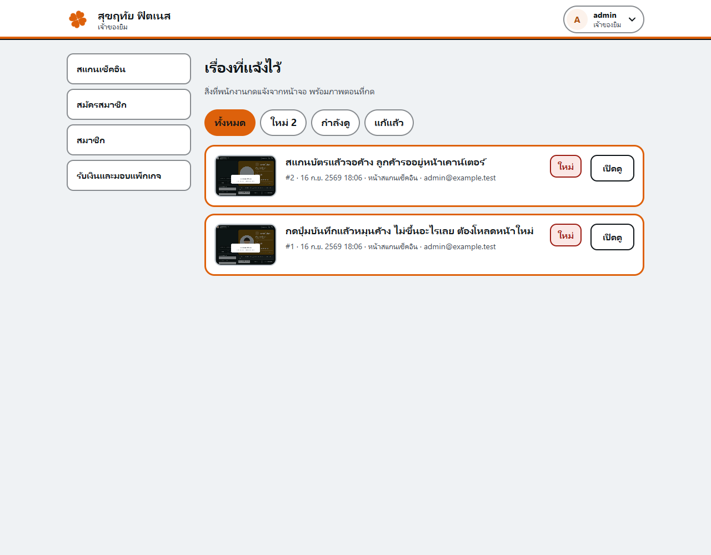

**สถานะมี 4 แบบ** กรองด้านบนได้

| สถานะ | ใช้เมื่อ |
|---|---|
| **ใหม่** | ยังไม่มีใครอ่าน — เรื่องใหม่ขอบหนาให้สังเกตได้ |
| **กำลังดู** | รับเรื่องแล้ว กำลังหาทางแก้หรือส่งต่อทีม |
| **แก้แล้ว** | จบแล้ว |
| **ไม่ใช่ปัญหา** | เข้าใจผิด ใช้งานถูกอยู่แล้ว หรือแจ้งซ้ำ |

**เปิดดูรายละเอียด** กด "เปิดดู" จะเห็น **เลขเรื่อง · เวลาที่แจ้ง · ผู้แจ้ง · หน้าที่เกิด · สิ่งที่ผู้แจ้งเขียนมา · ภาพหน้าจอตอนที่กด**

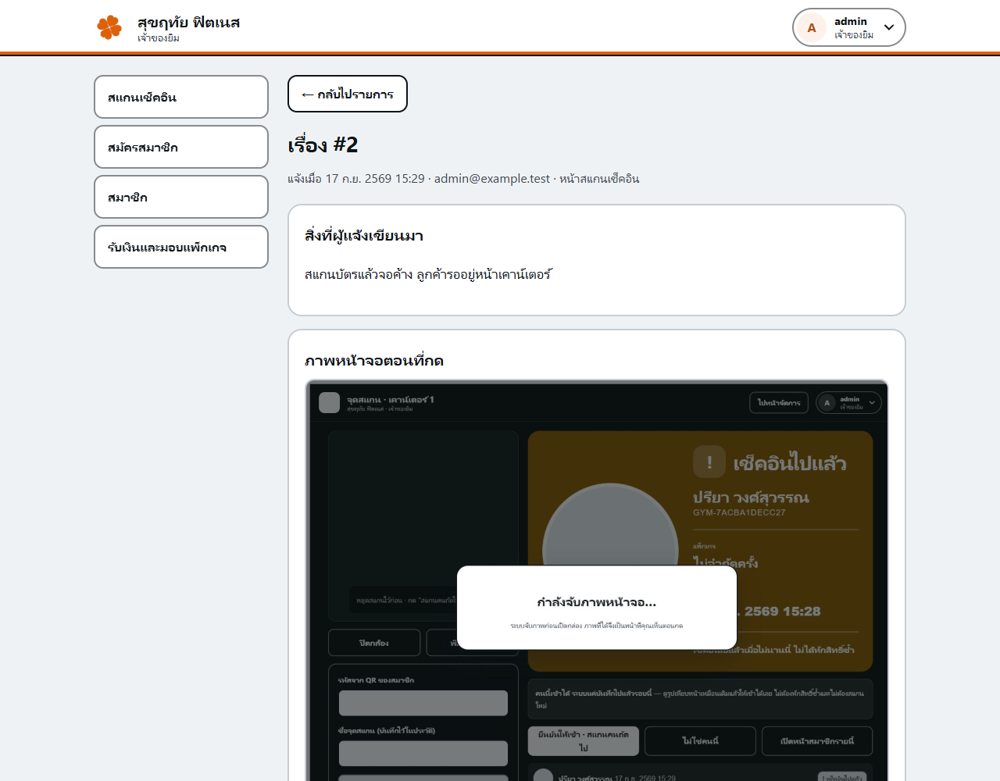

ในกล่อง **"จัดการเรื่องนี้"** เปลี่ยน **สถานะ** ได้ และเขียน **"บันทึกภายใน"** ไว้เตือนตัวเองหรือบอกทีม — **ผู้แจ้งไม่เห็นข้อความนี้** · ปุ่ม **"ลบเรื่องนี้"** อยู่ล่างสุด **ลบแล้วภาพหน้าจอถูกลบออกจากเครื่องด้วย ย้อนกลับไม่ได้**

> **ภาพหน้าจออาจติดชื่อและรูปของสมาชิก** ระบบจึงเปิดให้ **เฉพาะบัญชีเจ้าของยิม** ดูได้ พนักงานที่เป็นคนแจ้งเองก็เปิดดูรายการนี้ไม่ได้ · และ **ระบบบันทึกทุกครั้งที่มีคนเปิดดูภาพ** ว่าใครเปิดเมื่อไร — เปิดดูเท่าที่จำเป็นต่อการแก้ปัญหา และลบเรื่องที่จบแล้วเป็นระยะ · เรื่องที่ไม่มีภาพจะบอกว่า "เรื่องนี้ไม่มีภาพ — จับภาพไม่สำเร็จ หรือผู้แจ้งเลือกไม่ส่งภาพมา"

**ของเก่าไม่ต้องเก็บไว้ตลอด** ระบบมีคำสั่งล้างเรื่องและภาพที่เก่ากว่า 180 วัน ซึ่งทีมติดตั้งเป็นผู้สั่งให้ — ถ้าอยากให้ล้างถี่กว่านั้นหรือไม่ล้างเลย บอกทีมได้

<!-- pagebreak -->

## ภาคผนวก ก · ข้อความบนจอที่พบบ่อย

| ข้อความ | อยู่ที่ไหน | ความหมาย |
|---|---|---|
| อีเมลหรือรหัสผ่านไม่ถูกต้อง เหลืออีก N ครั้งก่อนถูกล็อก 15 นาที | หน้าเข้าสู่ระบบ | เข้าไม่ได้ ไม่ว่าด้วยเหตุใด · ครบ 5 ครั้งจะถูกล็อก 15 นาที |
| บัญชีนี้ถูกระงับ กรุณาติดต่อผู้ดูแลระบบ | หน้าเข้าสู่ระบบ | เจ้าของยิมปิดบัญชีไว้ |
| ลิงก์นี้ใช้ไม่ได้แล้ว | หน้าตั้งรหัสผ่านจากลิงก์ | หมดอายุ 24 ชม. ถูกใช้ไปแล้ว หรือมีลิงก์ใหม่ออกทับ — ขอลิงก์ใหม่ |
| ยังไม่มีรูปถ่ายของสมาชิกรายนี้ | หน้าบัตรสมาชิก | ไม่เคยถ่ายรูปไว้ บัตรออกได้แต่เทียบหน้าตอนสแกนไม่ได้ ควรถ่ายเพิ่ม |
| รูปถ่ายของสมาชิกรายนี้ใช้ไม่ได้ กรุณาถ่ายใหม่ | หน้าบัตรสมาชิก | ไฟล์รูปเสีย บัตรขึ้นเป็นภาพเงา ถ่ายใหม่ที่กล่องด้านล่าง **ไม่ต้องออกบัตรใหม่** (ข้อ 1.5) |
| ไฟล์รูปนี้เปิดไม่ได้ อาจอัปโหลดไม่ครบหรือไฟล์เสียหาย… | ตอนถ่าย/เลือกรูป | ระบบไม่รับไฟล์นี้ ถ่ายใหม่หรือเลือกไฟล์อื่น แล้วกดบันทึกต่อได้ ไม่เกิดสมาชิกซ้ำ |
| บันทึกรูปถ่ายใหม่แล้ว บัตรใบเดิมยังใช้ได้ ไม่ต้องออกใหม่ | หน้าบัตรสมาชิก | เปลี่ยนรูปสำเร็จ QR และเลขที่บัตรไม่เปลี่ยน |
| ลิงก์ดาวน์โหลดบัตรใบเดิม ใช้ได้ถึง … | หน้าบัตรสมาชิก | ลิงก์ส่งบัตรซ้ำ 7 วัน **เป็นบัตรใบเดิม ไม่ใช่ใบใหม่** |
| ออกบัตรใหม่แล้ว บัตรใบเดิมใช้ไม่ได้ทันที | หน้าบัตรสมาชิก | ต้องส่งรูปใบใหม่ให้ลูกค้าทันที |

<!-- pagebreak -->

## ภาคผนวก ก (ต่อ)

| ข้อความ | อยู่ที่ไหน | ความหมาย |
|---|---|---|
| พร้อมสแกน | จอสแกน | ยังไม่มีใครเช็คอิน ให้ลูกค้ายื่นบัตรเข้ากรอบได้ |
| เช็คอินไปแล้วเมื่อไม่นานนี้ ไม่ได้หักสิทธิ์ซ้ำ | จอสแกน | สแกนซ้ำในช่วงเวลาที่ตั้งไว้ ให้เข้าได้ตามปกติ |
| บัตรใบนี้ถูกยกเลิกแล้ว กรุณาส่งบัตรใบใหม่ให้สมาชิก | จอสแกน | มีการออกบัตรใหม่ · ถ้าลูกค้ายืนยันว่าไม่เคยได้รับ **ให้แจ้งเจ้าของยิม** |
| แพ็กเกจหมดอายุหรือใช้ครบจำนวนครั้งแล้ว | จอสแกน | พาไปต่ออายุที่ "รับเงินและมอบแพ็กเกจ" ไม่ต้องออกบัตรใหม่ |
| แพ็กเกจนี้ยังไม่ได้เปิดขาย กรุณาเปิดขายก่อนที่หน้าแพ็กเกจ หรือเลือกแพ็กเกจอื่น | หน้ารับเงิน / หน้าสมัคร | แพ็กเกจยังเป็น "ร่าง" — เลือกตัวอื่น หรือให้เจ้าของยิมกดเปิดขาย (ข้อ 1.9, 2.3) |
| แพ็กเกจนี้ปิดการขายไปแล้ว กรุณาเลือกแพ็กเกจอื่น หรือเปิดขายอีกครั้งที่หน้าแพ็กเกจ | หน้ารับเงิน / หน้าสมัคร | เจ้าของยิมเลิกขายราคานี้แล้ว — เลือกแพ็กเกจปัจจุบันแทน **สิทธิ์ที่ลูกค้าถืออยู่ไม่กระทบ** |
| แพ็กเกจนี้ยังไม่ได้กำหนดราคา กรุณากรอกราคาก่อน | หน้ารับเงิน / หน้าสมัคร | ให้เจ้าของยิมกรอกราคาที่หน้า "แพ็กเกจ" ก่อน |
| บันทึกการตั้งค่ายิมแล้ว · บัตรใบใหม่ทุกใบจะใช้สีนี้ | ตั้งค่ายิม | บันทึกสำเร็จ · บัตรที่ส่ง LINE ไปแล้วยังเป็นใบเก่า (ข้อ 2.5) |
| อัปโหลดโลโก้ไม่สำเร็จ · ไฟล์โลโก้ใหญ่เกิน 2 MB กรุณาย่อรูปก่อนอัปโหลด | ตั้งค่ายิม | ย่อรูปแล้วอัปโหลดใหม่ · **โลโก้เดิมไม่หาย** |
| ไฟล์โลโก้นี้เปิดไม่ได้ อาจอัปโหลดไม่ครบหรือไฟล์เสียหาย… | ตั้งค่ายิม | เลือกไฟล์ PNG หรือ JPG อีกไฟล์ · โลโก้เดิมยังอยู่ |
| มีคนแก้ตั้งค่ายิมไปแล้วระหว่างที่คุณเปิดหน้านี้ กรุณาโหลดหน้าใหม่แล้วลองอีกครั้ง | ตั้งค่ายิม | อีกเครื่องกดบันทึกไปก่อน โหลดหน้าใหม่แล้วแก้ซ้ำ |
| เบราว์เซอร์ไม่ให้ใช้กล้อง | จอสแกน | ใช้ "พิมพ์รหัสเอง" ทำงานต่อได้ทันที (ข้อ 1.8) |
| เชื่อมต่อเซิร์ฟเวอร์ไม่ได้ | ทุกหน้า | เน็ตหลุด ข้อมูลไม่หาย กดลองใหม่ได้ |
| ระบบขัดข้อง กรุณาลองใหม่อีกครั้ง (พร้อมรหัสอ้างอิง) | ทุกหน้า | **จดรหัสอ้างอิงกับเวลาไว้** แล้วแจ้งทีมติดตั้ง |

<!-- pagebreak -->

## ภาคผนวก ก (ต่อ 2)

| ข้อความ | อยู่ที่ไหน | ความหมาย |
|---|---|---|
| กำลังจับภาพหน้าจอ… | กล่องแจ้งปัญหา | ระบบจับภาพก่อนเปิดกล่องเสมอ รอแป๊บเดียว (ข้อ 1.13) |
| ส่งเรื่องแล้ว · เรื่อง #… | กล่องแจ้งปัญหา | ส่งสำเร็จ **จดเลขเรื่องไว้** ถ้าต้องคุยกันต่อ |
| เก็บเรื่องไว้ในเครื่องแล้ว | กล่องแจ้งปัญหา | เน็ตหลุด ระบบส่งให้เองเมื่อกลับมาออนไลน์ · เมนูขึ้น "แจ้งปัญหา (รอส่ง N)" |
| จับภาพหน้าจอไม่สำเร็จ | กล่องแจ้งปัญหา | ส่งเรื่องต่อได้ แค่ไม่มีภาพ ให้เลือกเองว่าเกิดที่หน้าไหน |
| ส่งเรื่องไม่สำเร็จ | กล่องแจ้งปัญหา | ลองกดส่งอีกครั้ง · ถ้ายังไม่ได้ให้จดข้อความไว้แล้วแจ้งเจ้าของยิม |

<!-- pagebreak -->

## ภาคผนวก ข · ที่มาและขอบเขตของคู่มือฉบับนี้

**ที่มาของเนื้อหา**

1. ชื่อปุ่ม ชื่อเมนู และข้อความบนจอทั้งหมดในเล่มนี้ ตรวจกับโค้ดจริงของระบบรุ่นที่ติดตั้งเมื่อ **16 กันยายน 2569** (ไฟล์ที่ใช้ตรวจ: `web/main.jsx`, `web/usermenu.jsx`, `web/report.jsx`, `web/reports.jsx`, `web/settings.jsx`, `web/checkin.jsx`, `web/camera.jsx`, `server/app.js`, `server/cards.js`, `server/cards-routes.js`, `server/checkin.js`, `server/payments.js`, `server/settings-routes.js`, `server/theme.js`, `server/admin-link.js`, `server/validation.js`)
2. **ภาพประกอบทั้ง 20 ภาพถ่ายใหม่ทั้งเล่มจากระบบรุ่นที่ติดตั้งอยู่** ที่ความกว้าง 1280 px และ 390 px ในสภาพเดียวกับที่พนักงานเห็น: สีส้มของยิม โลโก้จริง ชื่อ "สุขฤทัย ฟิตเนส" เมนูมุมขวาบน และหน้าแจ้งปัญหา · ถ่ายจากเครื่องทดสอบของทีมที่ตั้งค่าเหมือนเครื่องจริง ไม่ได้ถ่ายจากเครื่องที่ให้บริการอยู่ · ชื่อสมาชิก เบอร์โทร และ QR ในภาพเป็นข้อมูลสมมติทั้งหมด
3. เหตุผลเบื้องหลังลำดับหน้าจอและถ้อยคำ (รูปถ่ายมาก่อนผลการสแกน ปุ่ม "ไม่ใช่คนนี้" หน้าจอกล้องเสียที่ไม่ทำให้งานหยุด แผงสรุป "หมดอายุเดิม → หมดอายุใหม่" และการแยก "ส่งบัตรซ้ำ" ออกจาก "ออกบัตรใหม่") มาจาก UI kit แบบ 2 ของ Designer ในเธรดเดียวกัน
4. คู่มือ pilot 1.3 และคู่มือ 2.0 ถูกแทนที่ทั้งฉบับ ไม่ควรใช้อ้างอิงต่อ

**เปลี่ยนอะไรในรุ่น 2.3**

- เขียนหัวข้อเมนูในหน้า "ก่อนเริ่ม" ใหม่ทั้งหัวข้อ: แถบงานประจำวัน 4 รายการ + เมนูมุมขวาบน 3 กลุ่ม + ตารางสิทธิ์ตามบทบาท · ตัดปุ่ม "เพิ่มเติม" บนมือถือออก และระบุว่าปุ่มออกจากระบบย้ายเข้าเมนู
- ไล่แก้ทุกจุดในเล่มที่บอกเส้นทางว่า "เมนู …" ให้เป็น "เมนูมุมขวาบน → …" สำหรับหน้าที่ย้ายเข้าเมนู (แพ็กเกจ · ผู้ใช้และสิทธิ์ · ข้อมูลยิม · ตั้งค่ายิม · ประวัติเช็คอิน)
- เพิ่มข้อ 1.13 **แจ้งปัญหา** ฝั่งพนักงาน รวมกรณีเน็ตหลุด ("รอส่ง") เลขเรื่อง และกรณีจับภาพไม่สำเร็จ
- เพิ่มข้อ 2.9 **เรื่องที่แจ้งไว้** ฝั่งเจ้าของยิม: 4 สถานะ บันทึกภายในที่ผู้แจ้งไม่เห็น การลบที่ลบภาพด้วย และย่อหน้าเรื่องภาพที่อาจติดข้อมูลสมาชิก
- รายการข้อ 2.8 เพิ่ม 2 ข้อ: ซ้อมแจ้งปัญหา 1 ครั้ง และบอกพนักงานว่าคู่มืออยู่ในเมนู
- ภาคผนวก ก เพิ่มข้อความของหน้าแจ้งปัญหา

<!-- pagebreak -->

## ภาคผนวก ข (ต่อ 1)

**เปลี่ยนอะไรในรุ่น 2.2**

- เพิ่มข้อ 2.5 **"ตั้งค่ายิม — โลโก้และสีของยิม"** ทั้งบท พร้อมภาพหน้าจอ 5 ภาพ
- เพิ่มข้อ 1.12 ฝั่งพนักงาน: ดูเบอร์โทรและ LINE ของยิมได้ที่หน้า "ตั้งค่ายิม"
- ตารางเมนูในหน้า "ก่อนเริ่ม" เพิ่มแถว "ตั้งค่ายิม" (พนักงานดูได้อย่างเดียว)
- รายการข้อ 2.8 เพิ่มข้อ 3: **ตั้งโลโก้และสีก่อนออกบัตรใบแรก**
- ภาคผนวก ก เพิ่ม 4 บรรทัดของหน้าตั้งค่ายิม
- เลขหัวข้อเดิมเลื่อนลง: ออกบัตรใหม่ 2.5 → **2.6** · ประวัติ ยอดขาย และสลิป 2.6 → **2.7** · ก่อนให้ลูกค้าจริงใช้ 2.7 → **2.8**

<!-- pagebreak -->

## ภาคผนวก ข (ต่อ 2)

**เปลี่ยนอะไรในรุ่น 2.1.2**

- ข้อ 1.9 เพิ่มตารางข้อความที่ระบบใช้ปฏิเสธการขาย 3 แบบ (ยังไม่เปิดขาย / ปิดการขายไปแล้ว / ยังไม่กำหนดราคา) พร้อมวิธีแก้ของแต่ละแบบ — ยกข้อความจากโค้ดตรงตัว
- ข้อ 2.3 เพิ่มข้อความทั้งสองแบบในมุมของเจ้าของยิม และบรรทัดว่า **ปิดการขายไม่ย้อนไปกระทบสิทธิ์ที่ลูกค้าจ่ายไปแล้ว** ใช้แทนการลบแพ็กเกจทิ้งได้
- ภาคผนวก ก เพิ่ม 3 แถวของข้อความชุดเดียวกัน

**เปลี่ยนอะไรในรุ่น 2.1.1**

- ข้อ 1.9 เพิ่มเรื่องการต่ออายุขณะสิทธิ์เดิมยังไม่หมด — วันหมดอายุนับจากวันที่กดบันทึก ไม่บวกวันที่เหลือเข้าไป (ตรวจกับโค้ดที่ออกสิทธิ์: `starts_at` และ `expires_at` คำนวณจากเวลาที่บันทึก) และ QA ยืนยันบนเครื่องจริงว่าวันหมดอายุที่แสดงไม่ถอยหลังเมื่อซื้อแพ็กเกจสั้นทับของยาว
- ข้อ 1.4 และ 2.4 ระบุว่าเบอร์โทรบนบัตรตั้งที่ "ข้อมูลยิม" ค่าเริ่มต้นคือแสดงเบอร์หลัก
- หน้า "ก่อนเริ่ม" เพิ่มว่าชื่อยิมยาวถูกตัดด้วย "…" บนแถบบนของมือถือเป็นเรื่องปกติ ชื่อเต็มอยู่บนบัตร
- ข้อ 2.3 เพิ่มว่าแพ็กเกจต้องอยู่สถานะ "เปิดขาย" จึงจะขึ้นให้พนักงานเลือก

**เปลี่ยนอะไรจากรุ่น 2.0**

- เพิ่มข้อ 1.5 "ถ้ารูปบนบัตรขึ้นเป็นภาพเงา" และข้อความที่ระบบใช้ปฏิเสธไฟล์รูปตอนสมัคร
- เพิ่มคำอธิบายว่าการกดบันทึกซ้ำตอนสมัครทำต่อจากขั้นที่ค้าง ไม่สร้างสมาชิกซ้ำ
- ตัดแท็บ "ตรวจสลิป" ออกจากตารางเมนูและจากข้อ 2.7 แทนด้วย "ประวัติการรับเงิน" ในหน้าสมาชิกรายคน
- แก้ข้อความเรื่องแถบเหลือง "โหมดทดลอง" — รุ่น 2.0 เขียนว่าให้แจ้งทีมติดตั้งให้ปิด **ซึ่งผิด** บนเครื่องจริงต้องเปิดโหมดนี้ไว้จนกว่ายิมจะให้เลขบัญชีพร้อมเพย์ (ถ้าปิดโดยไม่มีเลขบัญชี แอปจะไม่ยอมเริ่มทำงาน)
- เพิ่มภาพหน้าตั้งรหัสผ่าน ภาพประวัติการรับเงิน และภาพหน้าบัตรที่รูปถ่ายใช้ไม่ได้

<!-- pagebreak -->

## ภาคผนวก ข (ต่อ 3)

**ข้อจำกัดที่ต้องบอกให้ชัด**

- **คู่มือ 2.3 ตรงกับระบบรุ่นที่ติดตั้งเมื่อ 16 กันยายน 2569** ทั้งเล่ม — รวมเมนูมุมขวาบน (หน้า "ก่อนเริ่ม") การแจ้งปัญหา (ข้อ 1.13) และเรื่องที่แจ้งไว้ (ข้อ 2.9) · **เล่มนี้ไม่อ้างเลขรุ่น (commit) ของระบบ** เพราะเลขนั้นเปลี่ยนทุกครั้งที่ติดตั้ง ถ้าต้องการรู้ว่าเครื่องกำลังรันรุ่นไหน ดูได้จากกล่อง "แจ้งปัญหา" ในแอป (ติดไปกับทุกเรื่องที่ส่ง) หรือจากคู่มือเครื่องของทีมติดตั้ง (RUNBOOK)
- **QA ตรวจผ่านก่อนขึ้นเครื่องทุกรอบ** — รอบใหญ่บนเครื่องจริงครอบงานหน้าเคาน์เตอร์ทั้งหมดและหน้า "ตั้งค่ายิม" (สิทธิ์ของพนักงาน ไฟล์โลโก้ที่ผิดรูป การเปลี่ยนสีแล้วบัตรเดิมยังสแกนผ่าน QR ที่ยังดำบนขาวทุกสี) · รอบล่าสุดครอบเมนูมุมขวาบนและการแจ้งปัญหาทั้งหมวด รวมสิทธิ์ที่พนักงานเปิดรายการเรื่องที่แจ้งไว้ไม่ได้ · ทีมติดตั้งยิงตรวจกฎการขายบนเครื่องจริงครบทั้ง 4 กรณี (ร่าง / ปิดการขาย / ไม่มีราคา / เปิดขายจริง) ได้ผลตรงกับข้อความในข้อ 1.9 และ 2.3
- สิ่งที่ยังไม่มีใครยืนยันได้จากระยะไกล และเจ้าของยิมต้องลองเองก่อนแจกบัตรใบแรก: **ส่งบัตรทาง LINE จริงแล้วสแกนจากจออีกเครื่อง** และ **เปิดกล้องบนเครื่องที่จะใช้จริง** (อยู่ในรายการข้อ 2.8 ด้วย)
- ชื่อคน ราคา เบอร์โทร และวันหมดอายุในภาพเป็นข้อมูลตัวอย่างจากเครื่องทดสอบ ไม่ใช่ข้อมูลของยิม

**ยังต้องเติมก่อนแจกให้พนักงาน**

- ช่องทางติดต่อเจ้าของยิม (หน้าแรกของคู่มือ)
- ราคาและเวลาเปิดทำการที่เจ้าของยิมยืนยันแล้ว
- ลิงก์ตั้งรหัสผ่านของแอดมินคนแรก — ทีมติดตั้งเป็นผู้ออกและส่งให้เจ้าของยิมโดยตรง **อย่าพิมพ์ลิงก์ลงในคู่มือที่แจกต่อ**
