# คู่มือฉบับพนักงาน — สุขฤทัย ฟิตเนส

รุ่นเอกสาร **2.6.1** | 17 กันยายน 2569 | ใช้แทนคู่มือ 2.6 และรุ่นก่อนหน้าทั้งหมด | ตรงกับระบบรุ่นที่กำลังจะติดตั้งรอบนี้

**ใหม่ในรุ่น 2.6:** **หน้าจอ "เครื่องและโปรแกรม" ของเจ้าของยิม** — แก้เนื้อหาเครื่อง อัปโหลดรูป เปลี่ยนคลิป กด "ตรวจแล้ว" อนุมัติข้อความความปลอดภัย และพิมพ์แผ่น QR ได้เองทั้งหมด (ข้อ 2.10)

**จากรุ่น 2.5:** พอร์ทัลสมาชิก "ช่วยเล่น" ฝั่งพนักงาน · ป้าย QR ติดเครื่อง · หน้าจอเมื่อหมดอายุหรือถูกยกเลิกสิทธิ์ (ข้อ 1.14)

**จากรุ่น 2.4:** ลืมรหัสผ่านทางอีเมล · เปลี่ยนรหัสผ่านจากเมนู · แท็บ "อีเมลของระบบ" · แก้ไขข้อมูลสมาชิก · อีเมลสมาชิกและส่งบัตรทางอีเมล

**ที่อยู่ระบบ: https://srv1979069.hstgr.cloud** — เปิดผ่านเบราว์เซอร์บนมือถือ แท็บเล็ต หรือคอมพิวเตอร์ ไม่ต้องติดตั้งแอปจากสโตร์

**ช่องทางติดต่อเจ้าของยิม:** ____________________________________ (เจ้าของยิมกรอกก่อนแจกคู่มือ)

## ระบบเปลี่ยนไปจากคู่มือเล่มก่อนอย่างไร

คู่มือ 1.3 เขียนไว้ตอนที่ลูกค้ามีหน้าเว็บของตัวเอง ล็อกอินด้วยรหัส OTP ทางอีเมล และซื้อแพ็กเกจเอง **ระบบไม่ได้ทำงานแบบนั้นแล้ว** ทุกอย่างอยู่ที่เคาน์เตอร์ ลูกค้าถือแค่ "รูปบัตร" หนึ่งใบในแชต

| เรื่อง | คู่มือ 1.3 (ของเดิม) | ระบบปัจจุบัน |
|---|---|---|
| ลูกค้าเข้าระบบ | มีหน้าเว็บของสมาชิก ล็อกอินด้วย OTP ทางอีเมล | **ลูกค้าไม่ต้องล็อกอินและไม่ต้องมีอีเมล** ใช้รูปบัตรอย่างเดียว · ถ้ากรอกอีเมลไว้จะได้บัตรทางอีเมลด้วย (ข้อ 1.3) |
| พนักงาน/เจ้าของยิมเข้าระบบ | ขอรหัส OTP | **อีเมล + รหัสผ่าน** ไม่มี OTP · ลืมรหัสผ่านแล้วขอลิงก์ตั้งใหม่ทางอีเมลได้เอง (ข้อ 1.1) |
| สมัครสมาชิก | ลูกค้าสมัครเอง | **พนักงานสมัครให้ที่เคาน์เตอร์ 3 ขั้น พร้อมถ่ายรูป** |
| บัตร / QR | QR บนหน้าเว็บของลูกค้า เปลี่ยนทุกไม่กี่นาที | **รูปบัตร PNG หนึ่งใบ ใช้ได้ตลอด** ยิมส่งให้ทาง LINE |
| ตอนสแกน | ขึ้นชื่อและสิทธิ์คงเหลือ | ขึ้น **รูปถ่ายของสมาชิกก่อน** แล้วพนักงานเทียบกับตัวจริง มีปุ่ม "ไม่ใช่คนนี้" |
| จ่ายเงิน | ลูกค้าโอนพร้อมเพย์แล้วส่งสลิป | **รับเงินที่เคาน์เตอร์** แล้วบันทึกในหน้า "รับเงินและมอบแพ็กเกจ" |

**ทิ้งคู่มือ 1.3 ได้เลย** ขั้นตอนที่เกี่ยวกับ OTP, แท็บ "รหัส OTP", หน้าซื้อแพ็กเกจของสมาชิก และการส่งสลิปของลูกค้า ไม่มีในระบบแล้ว

<!-- pagebreak -->

## คู่มือเล่มนี้แบ่งเป็นสองส่วน

- **ส่วนที่ 1 พนักงานหน้าเคาน์เตอร์** — งานประจำวัน: เข้าระบบ สมัครสมาชิก ส่งบัตร แก้เมื่อรูปถ่ายใช้ไม่ได้ สแกน รับเงิน และเมื่อลูกค้าทำรูปบัตรหาย
- **ส่วนที่ 2 เจ้าของยิม** — ตั้งรหัสผ่านครั้งแรก จัดการบัญชีพนักงาน ตั้งแพ็กเกจและราคา ข้อมูลยิม **ตั้งค่าอีเมลของระบบ** และการออกบัตรใหม่

ชื่อคน ราคา วันหมดอายุ และ QR ในภาพประกอบทั้งหมดเป็นข้อมูลตัวอย่างจากเครื่องทดสอบ **ห้ามใช้ QR ในคู่มือนี้เช็คอิน**

<!-- pagebreak -->

## ก่อนเริ่ม

### อุปกรณ์ที่ใช้ได้

หน้าเว็บเดียวกันนี้ใช้ได้ทั้งบนคอมพิวเตอร์หน้าเคาน์เตอร์ แท็บเล็ต และมือถือ — หน้าจอจะจัดใหม่ให้เองตามขนาดจอ เครื่องที่จะใช้ **สแกน** และ **ถ่ายรูปสมาชิก** ต้องมีกล้อง ถ้าเครื่องไม่มีกล้องก็ยังใช้งานได้ทุกอย่าง เพียงแต่ต้องพิมพ์รหัสใต้ QR เองตอนเช็คอิน และเลือกไฟล์รูปจากเครื่องแทนการถ่าย

ต้องเปิดผ่าน **https://** เท่านั้น ถ้าเปิดผ่าน http:// ธรรมดา เบราว์เซอร์จะไม่ยอมให้ใช้กล้องเลยไม่ว่าจะกดอนุญาตกี่ครั้ง

### หน้าจอแบ่งเป็นสองที่: แถบงานประจำวัน และเมนูมุมขวาบน

**แถบด้านซ้าย (บนมือถือคือแถบล่างจอ) มีแค่ 4 งานที่ทำทุกวัน** — สแกนเช็คอิน · สมัครสมาชิก · สมาชิก · รับเงินและมอบแพ็กเกจ · ไม่มีปุ่ม "เพิ่มเติม" อีกแล้ว

**ที่เหลือทั้งหมดอยู่ในเมนูมุมขวาบน** กดที่ชื่อผู้ใช้/ไอคอนวงกลมมุมขวาบนของทุกหน้า (รวมจอสแกน) เมนูจะกางลงมาเป็น 3 กลุ่ม บนมือถือเมนูเลื่อนขึ้นมาจากขอบล่างจอ


| ในเมนู | พนักงาน | เจ้าของยิม (ผู้ดูแลระบบ) |
|---|---|---|
| **หัวเมนู** — อีเมลและบทบาทของคนที่ล็อกอินอยู่ | ✓ | ✓ |
| **จัดการยิม** → ตั้งค่ายิม (โลโก้ สี LINE ID) | ดูได้อย่างเดียว | ✓ แก้ไขได้ |
| **จัดการยิม** → ประวัติเช็คอิน | ✓ | ✓ |
| **จัดการยิม** → แพ็กเกจ · ผู้ใช้และสิทธิ์ · ข้อมูลยิม | ✕ ไม่ขึ้นในเมนูเลย | ✓ |
| **ช่วยเหลือ** → แจ้งปัญหา | ✓ | ✓ |
| **ช่วยเหลือ** → เรื่องที่แจ้งไว้ | ✕ | ✓ |
| **ช่วยเหลือ** → คู่มือการใช้งาน | ✓ | ✓ |
| **เปลี่ยนรหัสผ่าน** (ของบัญชีตัวเอง · ใหม่ในรุ่นนี้) | ✓ | ✓ |
| **ออกจากระบบ** | ✓ | ✓ |
| **ออกบัตรใหม่** (ทำให้บัตรใบเดิมใช้ไม่ได้ · อยู่ในหน้าบัตร ไม่ใช่ในเมนู) | ✕ | ✓ |

<!-- pagebreak -->

**รายการที่บัญชีนั้นเปิดไม่ได้จะไม่ขึ้นในเมนูเลย** ไม่ใช่ขึ้นแบบจาง ๆ ให้กด — ถ้าพนักงานหาเมนูไม่เจอ แปลว่าบัญชีนั้นไม่มีสิทธิ์ ไม่ใช่ระบบเสีย

**ปุ่ม "ออกจากระบบ" ย้ายเข้าไปอยู่ในเมนูนี้แล้ว** (เดิมอยู่มุมขวาบนโดยตรง) อยู่ล่างสุดของเมนู

> **เปิดคู่มือเล่มนี้จากในแอปได้** เมนูมุมขวาบน → **"คู่มือการใช้งาน"** เปิดไฟล์ PDF ในแท็บใหม่ · เป็นเล่มล่าสุดที่ทีมวางไว้ในระบบ ไม่ต้องหาไฟล์ในไลน์หรืออีเมล

**ชื่อยิมบนแถบบนของมือถือถูกตัดด้วย "…" เป็นเรื่องปกติ** เช่น ขึ้นว่า "สุขฤทัย ฟิตเ…" เพราะจอแคบ ไม่ใช่ข้อมูลผิดหรือตั้งค่าพลาด **ชื่อเต็มอยู่บนบัตรสมาชิกทุกใบ** ซึ่งเป็นที่ที่ลูกค้าเห็นจริง

### แถบเหลือง "โหมดทดลอง" บนหัวจอ — เป็นเรื่องปกติ

ระบบขึ้นแถบเหลือง **"โหมดทดลอง — รับเงินสด/โอนนอกระบบได้ตามปกติ ยังไม่เปิดพร้อมเพย์ในระบบ"** ตลอดเวลา (ข้อความนี้เขียนใหม่ในรุ่นนี้ ของเดิมยาวกว่าและอ่านเหมือนระบบมีปัญหา) **ไม่ใช่ความผิดพลาด ไม่ต้องแจ้งใคร** แปลว่ายิมยังไม่ได้ผูกบัญชีรับเงินอัตโนมัติ ซึ่งไม่กระทบงานหน้าเคาน์เตอร์เลย เพราะเงินรับกันที่เคาน์เตอร์อยู่แล้ว · แถบนี้จะหายไปเมื่อเจ้าของยิมให้เลขบัญชีพร้อมเพย์กับทีมติดตั้งในอนาคต

<!-- pagebreak -->

## ส่วนที่ 1 · พนักงานหน้าเคาน์เตอร์

### 1.1 เข้าสู่ระบบ

เปิด https://srv1979069.hstgr.cloud แล้วกรอก **อีเมล** และ **รหัสผ่าน** → กด **"เข้าสู่ระบบ"**


**หน้าแรกมีแค่สองอย่าง: ช่องเข้าสู่ระบบ และ "ลืมรหัสผ่าน"** — ไม่มีปุ่มสมัครใช้งานเอง เพราะยิมนี้ปิดการขอบัญชีเองไว้ ท้ายกล่องจึงเขียนตอบไว้ให้เลยว่า **"บัญชีพนักงานออกให้โดยเจ้าของยิมเท่านั้น · ต้องการบัญชีใหม่ โทร (เบอร์ของยิม)"** ใครเปิดหน้านี้แล้วหาปุ่มสมัครไม่เจอ ไม่ใช่ระบบเสีย

**สิ่งที่ควรรู้**

- กรอกผิดได้ 5 ครั้ง ครั้งที่ 5 ระบบจะ **ล็อกอีเมลนั้นไว้ 15 นาที** ข้อความบนจอจะบอกว่าเหลืออีกกี่ครั้งก่อนถูกล็อก
- ข้อความ "อีเมลหรือรหัสผ่านไม่ถูกต้อง" ใช้กับทุกกรณีที่เข้าไม่ได้ — ไม่ว่าจะพิมพ์อีเมลผิด ยังไม่ได้ตั้งรหัสผ่าน หรือรหัสผ่านผิด เป็นการตั้งใจ ไม่ให้คนนอกเดาว่าอีเมลไหนมีอยู่จริง
- ถ้าขึ้นว่า **"บัญชีนี้ถูกระงับ"** แปลว่าเจ้าของยิมปิดบัญชีไว้ ให้ติดต่อเจ้าของยิม
- เมื่อเจ้าของยิมเปลี่ยนสิทธิ์หรือระงับบัญชีของคุณ **คุณจะหลุดออกจากระบบทันทีทุกเครื่อง** ถ้ากำลังยืนสแกนอยู่ ให้ล็อกอินใหม่แล้วสแกนต่อได้เลย ประวัติไม่หาย

<!-- pagebreak -->

**ลืมรหัสผ่าน — ทำเองได้แล้ว** (ข้อนี้เปลี่ยนจากคู่มือ 2.3 ซึ่งบอกว่าต้องให้เจ้าของยิมตั้งรหัสให้)

1. กด **"ลืมรหัสผ่าน"** ที่หน้าแรก → กรอกอีเมลที่ใช้เข้าสู่ระบบ → กด **"ส่งลิงก์ตั้งรหัสผ่านใหม่"**
2. จอจะขึ้นว่า **"ถ้ามีบัญชีนี้อยู่ เราส่งอีเมลไปแล้ว"** — ขึ้นแบบนี้เสมอ ไม่ว่าอีเมลนั้นจะมีอยู่จริงหรือไม่ เพื่อไม่ให้คนนอกใช้หน้านี้ไล่เดาว่าใครมีบัญชี
3. เปิดกล่องจดหมาย กดลิงก์ในอีเมล (หัวข้อ **"ตั้งรหัสผ่านใหม่ — สุขฤทัย ฟิตเนส"**) แล้วตั้งรหัสใหม่

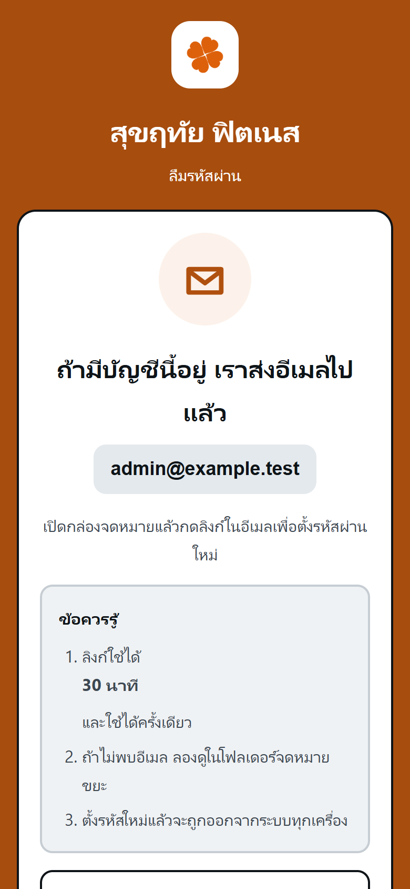

- **ลิงก์ใช้ได้ 30 นาที และใช้ได้ครั้งเดียว** · ไม่พบอีเมลให้ดูในโฟลเดอร์จดหมายขยะก่อน
- **ตั้งรหัสใหม่แล้วจะถูกออกจากระบบทุกเครื่อง** รวมเครื่องที่เคาน์เตอร์ ให้ล็อกอินใหม่
- ขอลิงก์ได้ **5 ครั้งต่อ 15 นาที** ต่อหนึ่งอีเมล กดรัวไม่ช่วยให้เร็วขึ้น
- **ถ้ายิมยังไม่ได้ตั้งค่าอีเมลของระบบ** (ข้อ 2.5 ต่อ) หน้านี้จะขึ้นกล่องเหลืองบอกไว้ตรง ๆ ว่า *"ยิมนี้ยังไม่ได้ตั้งค่าการส่งอีเมล"* กดส่งได้แต่จะไม่มีจดหมายออก — ให้โทรหาเจ้าของยิมขอ **ลิงก์ตั้งรหัสผ่าน** จากหน้า "ผู้ใช้และสิทธิ์" แทน (ข้อ 2.2)

<!-- pagebreak -->

### 1.1 (ต่อ) เปลี่ยนรหัสผ่านของตัวเอง

**เมนูมุมขวาบน → "เปลี่ยนรหัสผ่าน"** ทุกบัญชีทำได้ ไม่ต้องขอใคร ไม่ต้องรออีเมล

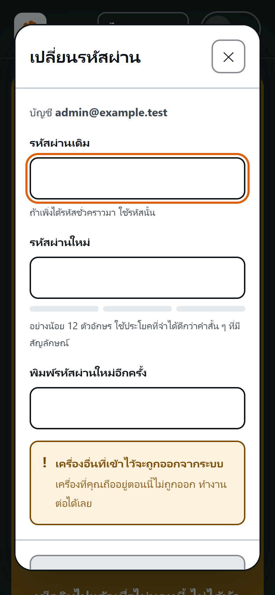

1. กรอก **รหัสผ่านเดิม** — ถ้าเพิ่งได้รหัสชั่วคราวจากเจ้าของยิมมา ใช้รหัสนั้น
2. กรอก **รหัสผ่านใหม่** สองช่องให้ตรงกัน **อย่างน้อย 12 ตัวอักษร** — ใช้ประโยคที่จำได้ดีกว่าคำสั้น ๆ ที่มีสัญลักษณ์ แถบใต้ช่องบอกความแข็งแรงให้ดูคร่าว ๆ
3. กด **"บันทึกรหัสผ่านใหม่"**

> **เครื่องอื่นที่เข้าไว้จะถูกออกจากระบบ · เครื่องที่คุณถืออยู่ตอนนี้ไม่ถูกออก ทำงานต่อได้เลย** — กล่องนี้เขียนบอกไว้ก่อนกด และหลังบันทึกจะขึ้นว่าออกไปกี่เครื่อง · ถ้าเคยล็อกอินค้างไว้ที่เครื่องเคาน์เตอร์เครื่องอื่น ต้องไปล็อกอินใหม่ที่เครื่องนั้น

### 1.2 ภาพรวมงานประจำวัน

| สถานการณ์ | ไปที่เมนู | ใช้เวลา |
|---|---|---|
| ลูกค้าใหม่มาสมัคร | สมัครสมาชิก | ไม่ถึงหนึ่งนาที |
| ลูกค้าเก่ามาเข้ายิม | สแกนเช็คอิน | ไม่กี่วินาที |
| ลูกค้าต่ออายุ / ซื้อแพ็กเกจเพิ่ม | รับเงินและมอบแพ็กเกจ | หนึ่งหน้า 3 ขั้น |
| ลูกค้าทำรูปบัตรหาย | สมาชิก → เปิดคนนั้น → **ส่งบัตรซ้ำ** | ไม่กี่วินาที (ดูข้อ 1.10) |

<!-- pagebreak -->

### 1.3 สมัครสมาชิกที่เคาน์เตอร์ — 3 ขั้น

เมนู **"สมัครสมาชิก"** ทำทีละขั้น ขั้นละเรื่องเดียว ลูกค้าไม่ต้องกรอกอะไรเองและไม่ต้องมีอีเมล


**ขั้นที่ 1 · ถ่ายรูป**

1. กด **"เปิดกล้องถ่ายรูป"** ครั้งแรกเบราว์เซอร์จะถามขออนุญาตใช้กล้อง ให้กดอนุญาต
2. จัดให้ใบหน้าลูกค้าอยู่ในวงกลม แสงส่องหน้า ไม่ย้อนแสง แล้วกด **"ถ่ายรูปนี้"**
3. ไม่พอใจให้กด **"ถ่ายรูปใหม่"** ได้ทันที · เครื่องไม่มีกล้อง ใช้ช่อง **"เลือกรูปจากเครื่องแทน"**
4. กด **"ถัดไป · ชื่อและเบอร์"**

> **อย่าข้ามรูป** ระบบยอมให้ไปขั้นต่อไปได้แม้ยังไม่ถ่าย แต่รูปถ่ายคือด่านเดียวที่กันการส่งบัตรต่อให้เพื่อน สมาชิกที่ไม่มีรูปจะขึ้นคำเตือนสีแดงในหน้าบัตรว่า "ยังไม่มีรูปถ่ายของสมาชิกรายนี้"

<!-- pagebreak -->

**ถ้าระบบไม่รับรูป** จะขึ้นข้อความบอกเหตุผลตรง ๆ แล้วพากลับมาที่ขั้นถ่ายรูปให้เอง — ถ่ายใหม่แล้วกดบันทึกต่อได้เลย

| ข้อความ | แปลว่า |
|---|---|
| ไฟล์รูปนี้เปิดไม่ได้ อาจอัปโหลดไม่ครบหรือไฟล์เสียหาย กรุณาถ่ายใหม่อีกครั้ง หรือเลือกรูปอื่นจากเครื่อง | ไฟล์เสียหรือส่งไม่ครบ ถ่ายใหม่หรือเลือกไฟล์อื่น |
| รองรับเฉพาะ JPG, PNG และ WEBP | ไฟล์ที่เลือกไม่ใช่รูปภาพ เช่น เผลอเลือกไฟล์ PDF |
| (ข้อความเรื่องไฟล์ HEIC) | รูปจาก iPhone บางเครื่องเป็นไฟล์ HEIC ให้ถ่ายด้วยกล้องในระบบแทน หรือตั้งมือถือให้ถ่ายเป็น JPG |

**ขั้นที่ 2 · ชื่อและเบอร์**

- **ชื่อ–นามสกุล** (บังคับ) — ชื่อนี้จะขึ้นบนบัตรและบนจอตอนสแกน
- **เบอร์มือถือ** (บังคับ) — ใช้โทรหาลูกค้าเมื่อแพ็กเกจใกล้หมด
- **อีเมล (ไม่บังคับ)** — ใต้ช่องเขียนไว้ว่า *"กรอกแล้วระบบส่งบัตรสมาชิกไปให้เขาทางอีเมลเลย · ไม่มีอีเมลก็สมัครและใช้บัตรได้ตามปกติ"* · **อย่าคิดอีเมลปลอมขึ้นมาให้ผ่านช่อง** เว้นว่างไว้ได้จริง ๆ
- วันเกิด ผู้ติดต่อฉุกเฉิน — ไม่บังคับเช่นกัน

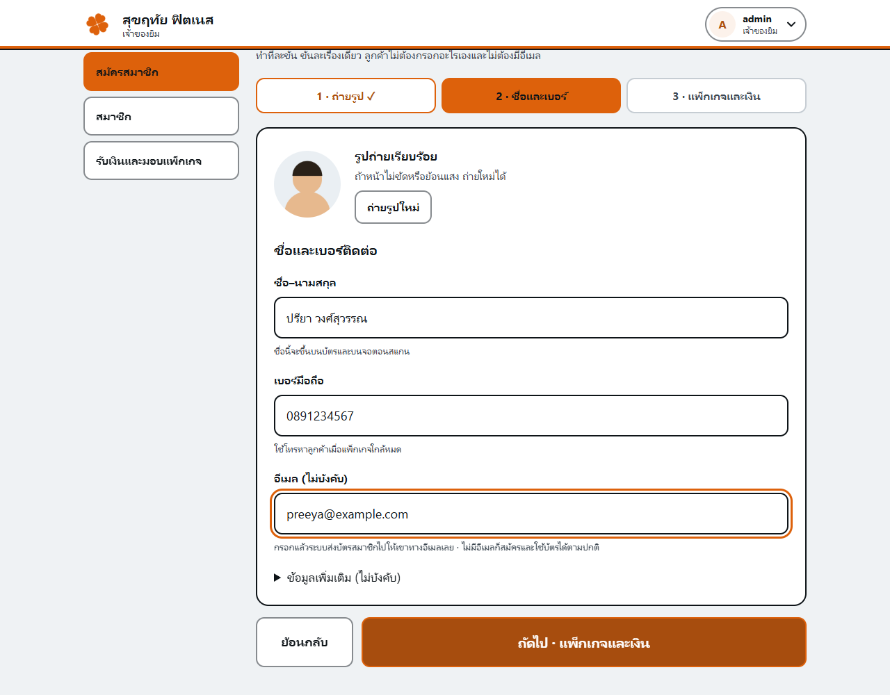

กด **"ถัดไป · แพ็กเกจและเงิน"** (ปุ่มจะกดไม่ได้ถ้ายังไม่กรอกชื่อและเบอร์)

> **ถามลูกค้าสั้น ๆ ว่า "ขออีเมลไว้ส่งบัตรให้ด้วยไหม"** ถ้าให้ เขาจะได้บัตรเป็นไฟล์แนบในอีเมลทันทีที่สมัครเสร็จ ไม่ต้องรอส่งทาง LINE และไม่หายไปกับแชตเก่า ๆ · ถ้าไม่ให้ ทุกอย่างทำงานเหมือนเดิมทุกประการ

<!-- pagebreak -->

**ขั้นที่ 3 · แพ็กเกจและเงิน**

1. เลือกแพ็กเกจจากรายการ — เห็นเฉพาะแพ็กเกจที่เจ้าของยิมกรอกราคาไว้แล้ว **ถ้าลูกค้ายังไม่ตัดสินใจ ข้ามได้** สมัครไว้ก่อนแล้วค่อยมอบแพ็กเกจทีหลังที่หน้า "รับเงินและมอบแพ็กเกจ"
2. เลือกวิธีรับเงิน: **เงินสด** · **โอนเข้าบัญชี** (แนบรูปสลิปไว้เป็นหลักฐานได้ ไม่บังคับ) · **ไม่ได้รับเงิน (แถมให้)** — อย่างหลังไม่นับเข้ายอดขาย และ **ต้องเขียนเหตุผล**
3. กรอก **จำนวนเงินที่รับจริง** ถ้ากรอกน้อยกว่าราคาแพ็กเกจ ระบบจะเตือนให้เปลี่ยนไปใช้ "ไม่ได้รับเงิน (แถมให้)" พร้อมเขียนเหตุผล แทนการบันทึกยอดที่ไม่ตรงความจริง
4. กด **"บันทึกและออกบัตร"** — ระบบสร้างรูปบัตรให้ทันทีและเปิดหน้าบัตรให้เลย


ข้อความ **"ออกบัตรให้สมาชิกใหม่แล้ว"** สีเขียวคือสัญญาณว่าเรียบร้อย ขั้นต่อไปคือส่งรูปบัตรให้ลูกค้า · ถ้ากรอกอีเมลไว้ ข้อความจะต่อท้ายว่า **"ถ้าตั้งค่าอีเมลไว้ ระบบส่งบัตรไปให้เขาแล้ว"** — ระบบส่งให้เองเบื้องหลัง **ไม่ต้องยืนรอ** ถ้าเมลมีปัญหาจะไม่ค้างหน้าจอ และยังส่งซ้ำได้ที่หน้าบัตร (ข้อ 1.4)

> **กดบันทึกซ้ำได้ ไม่เกิดสมาชิกซ้ำ** ถ้ากดบันทึกแล้วติดตรงไหน (เช่น ระบบไม่รับรูป) ระบบจำไว้ว่าทำถึงขั้นไหนแล้ว กดบันทึกอีกครั้งจะทำต่อจากจุดที่ค้าง ไม่สร้างสมาชิกคนเดิมซ้ำอีกใบ และไม่บันทึกเงินซ้ำ · สิ่งที่กรอกไว้ไม่ถูกล้าง เพราะลูกค้ายังยืนรออยู่ตรงหน้า

<!-- pagebreak -->

### 1.4 ส่งบัตรให้ลูกค้า

หลังสมัครเสร็จ ระบบจะพาเข้าหน้า **"บัตรสมาชิก"** ของคนนั้นเอง (เข้าทีหลังได้ที่ เมนู "สมาชิก" → ค้นหาชื่อ → **"ดูบัตร"**)


**ปุ่มที่มี ทำคนละหน้าที่**

| ปุ่ม | ได้อะไร | ใช้เมื่อไร |
|---|---|---|
| **บันทึกรูปบัตร** | ดาวน์โหลดไฟล์ PNG ลงเครื่อง | จะส่งเองทาง LINE จากคอมหรือมือถือเครื่องนั้น |
| **ส่งบัตรให้ลูกค้า** | เปิดช่องแชร์ของเครื่อง (บนมือถือจะมี LINE ให้เลือกเลย) | ส่งจากมือถือหน้าเคาน์เตอร์ ทางที่เร็วที่สุด |
| **ส่งบัตรทางอีเมล** / **ส่งบัตรทางอีเมลอีกครั้ง** | ส่งอีเมลพร้อมไฟล์บัตรแนบไปให้เขา | ลูกค้ากรอกอีเมลไว้ · ปุ่มนี้ **ขึ้นเฉพาะคนที่มีอีเมลในระบบ** |
| **ส่งบัตรซ้ำ (ลิงก์ 7 วัน)** | ลิงก์ดาวน์โหลด **บัตรใบเดิม** คัดลอกไปวางในแชตได้ | ลูกค้าทำรูปหาย หรือจะให้เขาโหลดเอง (ดูข้อ 1.10) |
| **สร้างลิงก์เข้าช่วยเล่น** | ลิงก์ให้ลูกค้าตั้งรหัสผ่านของ "ช่วยเล่น" **อายุ 24 ชม.** | ลูกค้าไม่ได้รับอีเมล ลืมรหัส หรือยิมยังส่งอีเมลไม่ได้ (ดูด้านล่าง) |
| **แก้ไขข้อมูลสมาชิก** | เปิดหน้าแก้ชื่อ เบอร์ อีเมล วันเกิด ผู้ติดต่อฉุกเฉิน | พิมพ์ผิดตอนสมัคร หรือลูกค้าเปลี่ยนเบอร์/อีเมล (ข้อ 1.4 ต่อ) |

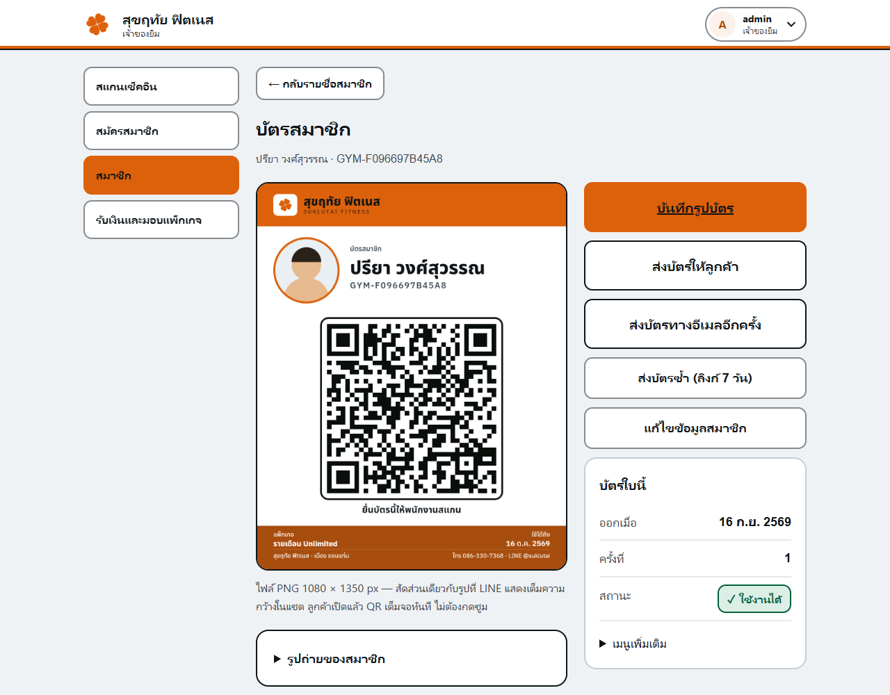

<!-- pagebreak -->

**ส่งบัตรทางอีเมล — สิ่งที่ควรรู้**

- กดแล้วจอขึ้น **"ส่งบัตรไปที่ (อีเมล) แล้ว"** เป็นคำตอบจริงจากเซิร์ฟเวอร์อีเมล ไม่ใช่แค่ "บันทึกแล้ว" · ถ้าส่งไม่ออกจะขึ้นเหตุผลให้อ่าน
- ลูกค้าได้อีเมลหัวข้อ **"บัตรสมาชิกของคุณ — สุขฤทัย ฟิตเนส"** มี **ไฟล์บัตร PNG แนบมา** รหัสสมาชิก วันหมดอายุ และปุ่ม **"ตั้งรหัสผ่านของคุณ"** สำหรับเข้าดู **"ช่วยเล่น"** (คลังวิธีใช้เครื่องและโปรแกรมฝึกที่กำลังจะเปิด) — ลิงก์ตั้งรหัสนั้นใช้ได้ **7 วัน** · ถ้าลูกค้าถามว่าต้องตั้งไหม ตอบได้ว่า **ไม่ต้องก็ได้ บัตรใช้ได้อยู่แล้ว**
- ปุ่มนี้กดซ้ำได้ ไม่เกิน **5 ครั้งต่อชั่วโมงต่อสมาชิกหนึ่งคน** · ส่งใหม่แล้วลิงก์ตั้งรหัสอันเก่าจะถูกยกเลิก เหลือใช้ได้อันเดียวคืออันล่าสุด
- ถ้าขึ้นว่า **"ยังส่งอีเมลไม่ได้ ผู้ดูแลระบบต้องกรอกกล่องจดหมายของยิมที่หน้า 'ตั้งค่าอีเมล' ก่อน"** แปลว่ายิมยังไม่ได้ตั้งค่าอีเมลของระบบ (ข้อ 2.5 ต่อ) — **ไม่ใช่ความผิดของลูกค้าและไม่ใช่อีเมลของเขาผิด** ส่งบัตรทาง LINE ไปก่อนแล้วแจ้งเจ้าของยิม
- **ส่งบัตรทางอีเมล ≠ ส่งบัตรซ้ำ (ลิงก์ 7 วัน)** — อันแรกส่งไฟล์บัตรเข้าอีเมล อันหลังให้ลิงก์ไว้วางในแชต ทั้งคู่เป็น **บัตรใบเดิม** ไม่ใช่บัตรใหม่

<!-- pagebreak -->

#### 1.4 (ต่อ) ปุ่ม "สร้างลิงก์เข้าช่วยเล่น"

**ใช้เมื่อลูกค้าเข้า "ช่วยเล่น" ไม่ได้** ไม่ว่าจะเพราะไม่ได้รับอีเมล ลิงก์ในอีเมลหมดอายุ ลืมรหัสผ่าน หรือ **ยิมยังไม่ได้ตั้งค่าอีเมลของระบบ** (ข้อ 2.5 ต่อ) — **พนักงานกดได้เอง ไม่ต้องรอเจ้าของยิม**

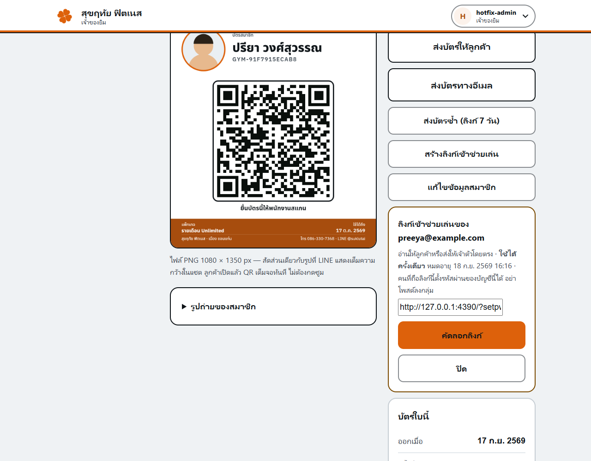

<!-- pagebreak -->

#### 1.4 (ต่อ) ลิงก์เข้าช่วยเล่น — วิธีใช้และกฎ

1. เปิดหน้าบัตรของลูกค้า → กด **"สร้างลิงก์เข้าช่วยเล่น"**
2. ได้กล่องเหลือง **"ลิงก์เข้าช่วยเล่นของ (อีเมลของลูกค้า)"** พร้อมปุ่ม **"คัดลอกลิงก์"**
3. **อ่านให้ลูกค้าหรือส่งให้เจ้าตัวโดยตรง** — ทางไลน์ส่วนตัวหรือให้เขาพิมพ์ตามก็ได้ · เสร็จแล้วกด "ปิด"

- **ใช้ได้ครั้งเดียว และหมดอายุใน 24 ชั่วโมง** (กล่องบอกเวลาหมดอายุไว้ให้) · สร้างใหม่ได้เรื่อย ๆ อันเก่าตายทันที
- **ปุ่มนี้ขึ้นเฉพาะสมาชิกที่มีอีเมลในระบบ** เพราะบัญชีของ "ช่วยเล่น" ผูกกับอีเมล · ถ้ายังไม่มี ให้กด "แก้ไขข้อมูลสมาชิก" เพิ่มอีเมลก่อน (ข้อ 1.4 ต่อ)
- **คนที่ถือลิงก์นี้ตั้งรหัสผ่านของบัญชีลูกค้าได้ อย่าโพสต์ลงกลุ่ม** · ระบบบันทึกไว้ทุกครั้งว่าใครสร้างลิงก์ให้ใครเมื่อไหร่
- กดได้ **10 ครั้งต่อชั่วโมง** ต่อสมาชิกหนึ่งคน

**แถบแดง "ยังไม่ได้ส่งบัตรทางอีเมล"** ขึ้นบนหน้าบัตรเมื่อสมาชิกมีอีเมลในระบบแต่ยัง **ไม่เคยได้รับบัตรทางอีเมลสำเร็จ** — เจอได้สองกรณี: ตอนสมัครระบบส่งให้ไม่สำเร็จ (เมลของยิมมีปัญหาชั่วคราวหรือยังไม่ได้ตั้งค่า) หรือเพิ่งมีการ **แก้อีเมล** ของคนนี้ (ข้อ 1.4 ต่อ) · **กดปุ่ม "ส่งบัตรทางอีเมล" ด้านขวาหนึ่งครั้ง** แล้วแถบจะหายไปเมื่อส่งสำเร็จ · ถ้ากดแล้วยังไม่ออก แปลว่ายิมยังไม่ได้ตั้งค่าอีเมล ให้บอกเจ้าของยิม

**บัตรเป็นอย่างไร**

- ไฟล์ PNG ขนาด 1080 × 1350 px — สัดส่วนเดียวกับที่ LINE แสดงเต็มความกว้างในแชต ลูกค้าเปิดแล้ว QR เต็มจอทันที ไม่ต้องกดซูม
- บนบัตรมี: รูปถ่าย **ชื่อเต็มของสมาชิกและของยิม** รหัสสมาชิก QR ขนาดใหญ่ และแถบดำล่างที่บอกแพ็กเกจ วันหมดอายุ ชื่อยิม อำเภอ/จังหวัด และเบอร์โทรยิม — **เบอร์ที่ขึ้นบนบัตรตั้งได้ที่หน้า "ข้อมูลยิม" ค่าเริ่มต้นคือแสดงเบอร์หลัก** เลือกเป็นเบอร์สำรองหรือไม่แสดงเลยก็ได้ (ข้อ 2.4)
- **QR ไม่มีชื่อ ไม่มีเบอร์ ไม่มีข้อมูลส่วนตัวใด ๆ** ใครเอาแอปสแกน QR ทั่วไปส่องก็ไม่ได้อะไร
- บัตรใช้ได้ตลอด ไม่มีวันหมดอายุของตัวบัตรเอง **ต่ออายุแพ็กเกจแล้วไม่ต้องออกบัตรใหม่** ใบเดิมยังใช้ได้เพราะ QR ผูกกับตัวคน ไม่ได้ผูกกับแพ็กเกจ

**บอกลูกค้าตอนส่ง:** ให้เซฟรูปไว้ในเครื่องหรือปักหมุดแชตไว้ เวลามายิมเปิดรูปนี้แล้วยื่นให้พนักงานสแกน ถ้าลบไปแล้วมาบอกที่เคาน์เตอร์ได้ ส่งซ้ำให้ได้ทันที

ใต้รูปบัตรมีกล่องพับชื่อ **"รูปถ่ายของสมาชิก"** เปิดออกมาเพื่อถ่ายรูปใหม่ได้ตลอดเวลา — **รูปเปลี่ยนแล้วบัตรใบเดิมยังใช้ได้ QR ไม่เปลี่ยน** เพราะ QR ผูกกับตัวคน ไม่ได้ผูกกับรูป (ปกติกล่องนี้พับไว้ จะกางเองเมื่อสมาชิกยังไม่มีรูปหรือรูปใช้ไม่ได้)

<!-- pagebreak -->

### 1.4 (ต่อ) แก้ไขข้อมูลสมาชิก

หน้าบัตร → ปุ่ม **"แก้ไขข้อมูลสมาชิก"** — **พนักงานแก้ได้เอง ไม่ต้องรอเจ้าของยิม** เพราะเรื่องแบบนี้ต้องจบตอนที่ลูกค้ายังยืนอยู่ตรงหน้า

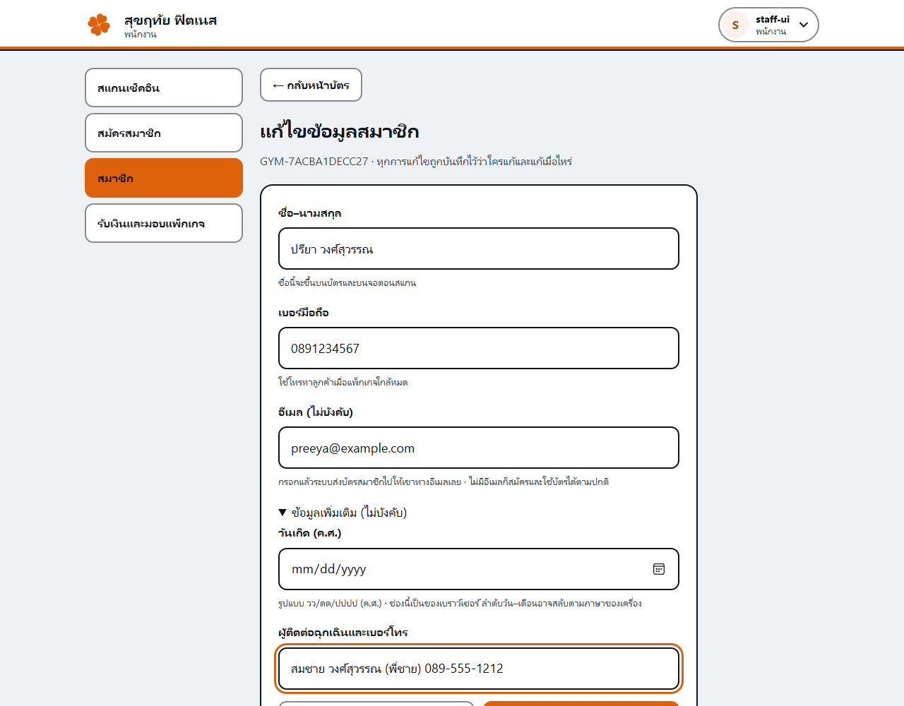

**แก้ได้: ชื่อ–นามสกุล · เบอร์มือถือ · อีเมล · วันเกิด · ผู้ติดต่อฉุกเฉินและเบอร์โทร** (สามช่องหลังอยู่ในกล่องพับ "ข้อมูลเพิ่มเติม") → กด **"บันทึกการแก้ไข"** → ขึ้น **"บันทึกข้อมูลสมาชิกแล้ว"**

- **ทุกการแก้ไขถูกบันทึกไว้ว่าใครแก้และแก้เมื่อไหร่** — เขียนไว้ใต้หัวข้อหน้านี้เลย · นี่คือเหตุผลที่เปิดให้พนักงานแก้ได้ ไม่ใช่เพราะเรื่องนี้ไม่สำคัญ
- **แก้แล้วบัตรใบเดิมยังใช้ได้ QR ไม่เปลี่ยน** ชื่อบนบัตรจะเปลี่ยนตามเมื่อออกไฟล์บัตรครั้งต่อไป — ถ้าอยากให้ลูกค้าถือใบที่ชื่อถูก ส่งบัตรให้เขาใหม่ (ข้อ 1.4)
- **การระงับสมาชิกไม่ใช่งานของพนักงาน** ยังเป็นของเจ้าของยิม เพราะเป็นการตัดสินใจ ไม่ใช่การแก้คำผิด
- ชื่อและเบอร์ **เว้นว่างไม่ได้** ปุ่มบันทึกจะกดไม่ได้ · อีเมลลบออกได้ (เว้นว่าง) ถ้าลูกค้าไม่ต้องการรับอีเมลอีก

<!-- pagebreak -->

**ถ้าเปลี่ยนอีเมลทั้งที่เคยส่งบัตรไปแล้ว ระบบจะถามก่อน — เรื่องนี้สำคัญ**

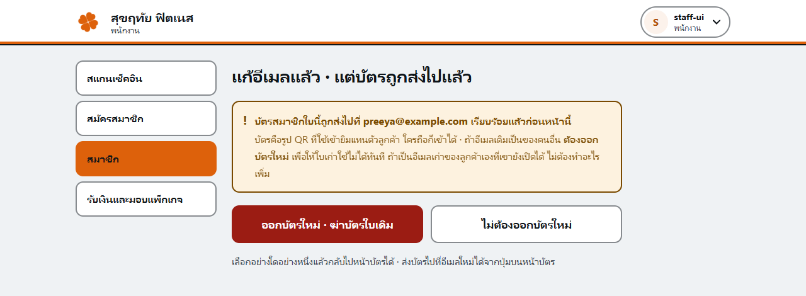

จอจะขึ้นว่า **"แก้อีเมลแล้ว · แต่บัตรถูกส่งไปแล้ว"** พร้อมบอก **อีเมลเดิมที่บัตรถูกส่งไป** แล้วให้เลือกสองทาง:

| สถานการณ์ | กดอะไร |
|---|---|
| **อีเมลเดิมพิมพ์ผิดจนไปเข้ากล่องของคนอื่น** | **"ออกบัตรใหม่ · ฆ่าบัตรใบเดิม"** — ใบที่คนแปลกหน้าถืออยู่ใช้ไม่ได้ทันที แล้วส่งใบใหม่ให้ลูกค้า |
| **เป็นอีเมลเก่าของลูกค้าเองที่เขายังเปิดได้** | **"ไม่ต้องออกบัตรใหม่"** — ไม่ต้องทำอะไรเพิ่ม |

> **ทำไมต้องถาม** บัตรคือรูป QR ที่ใช้เข้ายิมแทนตัวลูกค้า **ใครถือก็เข้าได้** ถ้ามันไปอยู่ในกล่องจดหมายของคนอื่น การแก้อีเมลเฉย ๆ ไม่ได้เอาบัตรใบนั้นกลับมา มีแต่การออกบัตรใหม่เท่านั้นที่ทำให้ใบเก่าใช้ไม่ได้ · **ไม่แน่ใจให้ถามลูกค้าตรง ๆ ว่าอีเมลเดิมเป็นของเขาหรือเปล่า**

**หลังเปลี่ยนอีเมล หน้าบัตรจะขึ้นแถบแดง "ยังไม่ได้ส่งบัตรทางอีเมล"** เป็นเรื่องปกติ — อีเมลใหม่ยังไม่เคยได้รับอะไร กดปุ่ม **"ส่งบัตรทางอีเมล"** หนึ่งครั้งให้จบงาน

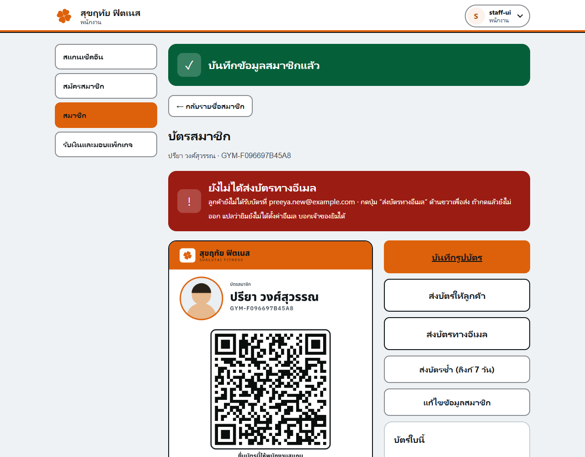

<!-- pagebreak -->

### 1.5 ถ้ารูปบนบัตรขึ้นเป็นภาพเงา

บางครั้งไฟล์รูปเสียหรืออัปโหลดไม่ครบ ระบบยังออกบัตรให้ตามปกติแต่วาดเป็น **ภาพเงา** แทนหน้าคน และหน้าสมาชิกจะขึ้นแถบแดง **"รูปถ่ายของสมาชิกรายนี้ใช้ไม่ได้ กรุณาถ่ายใหม่"**


**วิธีแก้ ใช้เวลาไม่ถึงครึ่งนาที**

1. เปิดหน้าสมาชิกคนนั้น → **"ดูบัตร"** — กล่อง **"รูปถ่ายของสมาชิก"** จะกางรออยู่แล้วใต้รูปบัตร
2. กด **"เปิดกล้องถ่ายรูป"** ถ่ายใหม่ หรือเลือกไฟล์รูปจากเครื่อง
3. ขึ้นข้อความ **"บันทึกรูปถ่ายใหม่แล้ว บัตรใบเดิมยังใช้ได้ ไม่ต้องออกใหม่"** — รูปขึ้นบนบัตรทันที

**สิ่งที่ _ไม่_ ต้องทำ: ไม่ต้องกด "ออกบัตรใหม่"** เลขที่บัตรและ QR ไม่เปลี่ยน บัตรที่ลูกค้าถืออยู่ยังสแกนผ่านเหมือนเดิม แต่ควรส่งรูปบัตรใบที่มีหน้าคนให้เขาใหม่ด้วยปุ่ม "ส่งบัตรให้ลูกค้า" หรือ "ส่งบัตรซ้ำ" เพื่อให้บัตรในมือลูกค้าตรงกับที่ระบบมี

**แถบแดงสองแบบ ต่างกัน**

| แถบที่ขึ้น | แปลว่า | ทำอย่างไร |
|---|---|---|
| **รูปถ่ายของสมาชิกรายนี้ใช้ไม่ได้ กรุณาถ่ายใหม่** | มีไฟล์รูปอยู่ แต่เปิดไม่ได้ (ไฟล์เสีย หรือหายไปจากเครื่อง) | ถ่ายใหม่ตามขั้นตอนด้านบน |
| **ยังไม่มีรูปถ่ายของสมาชิกรายนี้** | ไม่เคยถ่ายรูปไว้เลย | ถ่ายเพิ่มที่กล่องเดียวกัน ตอนลูกค้ามายิมครั้งหน้า |

ทั้งสองแบบ **บัตรยังใช้สแกนเข้ายิมได้** แต่พนักงานจะเทียบหน้ากับตัวจริงไม่ได้ ซึ่งเป็นด่านเดียวที่กันการส่งบัตรต่อให้เพื่อน จึงควรแก้ให้เร็วที่สุดเท่าที่ลูกค้ามา

<!-- pagebreak -->

### 1.6 สแกนเช็คอิน

เมนู **"สแกนเช็คอิน"** เป็นจอมืดเต็มหน้าจอ ไม่มีเมนูรบกวน — จอมืดช่วยลดแสงสะท้อนบนหน้าจอลูกค้า ทำให้กล้องอ่านบัตรติดง่ายขึ้น


**ขั้นตอน**

1. เปิดหน้านี้ค้างไว้ตลอดเวลาที่เปิดร้าน — จอจะขึ้นว่า **"พร้อมสแกน"**
2. กรอก **"ชื่อจุดสแกน"** ครั้งเดียวตอนเปิดร้าน เช่น `เคาน์เตอร์ 1` ชื่อนี้ถูกบันทึกไว้ในประวัติ ทำให้ย้อนดูได้ว่ารายการไหนสแกนจากเครื่องใด
3. ให้ลูกค้าเปิดรูปบัตรแล้วยื่นเข้ากรอบ **ระบบอ่านและตรวจให้เอง ไม่ต้องกดปุ่ม**
4. **ดูรูปถ่ายบนจอเทียบกับคนตรงหน้าก่อนให้เข้า** แล้วจึงกด "ยืนยันให้เข้า · สแกนคนถัดไป"

> **ทำไมต้องดูรูป** บัตรเป็นรูปภาพ ส่งต่อกันได้ รูปถ่ายคือด่านที่คนส่งต่อบัตรผ่านไม่ได้ ระบบจึงวางรูปไว้ก่อนและใหญ่กว่าคำว่า "เข้าใช้บริการได้" โดยตั้งใจ

**ถ้าไม่ใช่คนเดียวกัน** กด **"ไม่ใช่คนนี้"** — การปฏิเสธเป็นเรื่องปกติ ไม่ใช่เรื่องที่ต้องไปหาว่ากดตรงไหน จากนั้นแจ้งลูกค้าว่าบัตรใบนี้เป็นของคนอื่น และแจ้งเจ้าของยิม

ด้านล่างจอจะไล่รายการที่เพิ่งสแกนไปพร้อมผลของแต่ละราย ใช้ยืนยันย้อนหลังได้ทันทีว่าคนก่อนหน้าผ่านหรือไม่ผ่าน

<!-- pagebreak -->

### 1.7 อ่านผลการสแกน — 4 อย่างที่เจอได้

| ผลบนจอ | แปลว่า | ทำอย่างไรต่อ |
|---|---|---|
| ✓ **เข้าใช้บริการได้** (แถบเขียว) | บัตรใช้ได้ สิทธิ์เหลือ | **เทียบรูปกับตัวจริง** แล้วกด "ยืนยันให้เข้า · สแกนคนถัดไป" |
| **เช็คอินไปแล้ว** (แถบ **สีกลาง ไม่ใช่สีแดง**) | สแกนซ้ำภายในช่วงเวลาที่ตั้งไว้ (ค่าเริ่มต้น 5 นาที) — **ไม่ได้หักสิทธิ์ซ้ำ** | ให้เข้าได้ตามปกติ ไม่ต้องทำอะไรเพิ่ม |
| ✕ **เข้าใช้บริการไม่ได้** | มีเหตุผลกำกับเสมอ ดูตารางด้านล่าง | ทำตามเหตุผลที่ขึ้น |
| **กำลังตรวจสอบ…** | ระบบกำลังอ่าน | **อย่าเพิ่งให้ลูกค้าเข้าจนกว่าจะเห็นผลและรูปถ่าย** |

<!-- pagebreak -->

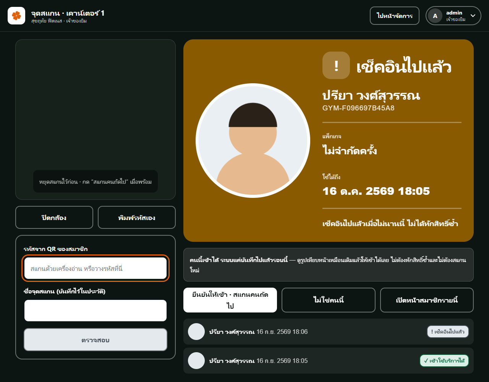

> **"เช็คอินไปแล้ว" ไม่ใช่การถูกปฏิเสธ** รุ่นนี้เปลี่ยนสีของผลนี้จากแดงเป็นสีกลาง เพราะของเดิมทำให้พนักงานหยุดลูกค้าไว้ทั้งที่ระบบอนุญาต · บนจอเขียนไว้ตรง ๆ ว่า **"คนนี้เข้าได้ ระบบแค่บันทึกไปแล้วรอบนี้ — ดูรูปเทียบหน้าเหมือนเดิมแล้วให้เข้าได้เลย ไม่ต้องหักสิทธิ์ซ้ำและไม่ต้องสแกนใหม่"** · เจอบ่อยตอนลูกค้ายื่นบัตรสองรอบหรือกล้องอ่านติดสองครั้ง

**เหตุผลของ "เข้าใช้บริการไม่ได้" ที่พบบ่อย**

| ข้อความ | ความหมายและทางออก |
|---|---|
| บัตรใบนี้ถูกยกเลิกแล้ว กรุณาส่งบัตรใบใหม่ให้สมาชิก | มีการออกบัตรใหม่ไปแล้ว ให้ลูกค้าใช้บัตรใบล่าสุด · ถ้าเขาไม่มี เปิดหน้าสมาชิกรายนี้แล้วกด "ส่งบัตรซ้ำ" · **ถ้าเขายืนยันว่าไม่เคยได้รับบัตรใหม่ ให้แจ้งเจ้าของยิม อาจมีคนอื่นถือบัตรเก่าอยู่** |
| ยังไม่มีแพ็กเกจที่ใช้งานได้ / แพ็กเกจหมดอายุหรือใช้ครบจำนวนครั้งแล้ว | พาไปที่หน้า "รับเงินและมอบแพ็กเกจ" ต่ออายุให้ แล้วสแกนใหม่ — **ไม่ต้องออกบัตรใหม่** |
| สมาชิกถูกระงับ / สถานะสมาชิกหมดอายุ | ติดต่อเจ้าของยิม พนักงานแก้เองไม่ได้ |
| QR ไม่ถูกต้อง กรุณาให้สมาชิกเปิดรูปบัตรอีกครั้ง | อ่านไม่ออกหรือไม่ใช่ QR ของระบบนี้ ให้เปิดรูปบัตรเต็มจอแล้วสแกนใหม่ · ถ้ายังไม่ได้ ใช้ "พิมพ์รหัสเอง" |
| เชื่อมต่อเซิร์ฟเวอร์ไม่ได้ | เน็ตหลุดชั่วคราว **ประวัติและสิทธิ์ของลูกค้าไม่ได้หายไปไหน** ลองสแกนอีกครั้งเมื่อเน็ตกลับมา |

<!-- pagebreak -->

### 1.8 เมื่อกล้องเปิดไม่ได้ — งานไม่หยุด

ถ้าจอขึ้นว่า **"เบราว์เซอร์ไม่ให้ใช้กล้อง"** ยังเช็คอินให้ลูกค้าได้ตามปกติ:

1. กด **"พิมพ์รหัสเอง"** แล้วพิมพ์ (หรือใช้เครื่องอ่านบาร์โค้ดยิง) **รหัสที่อยู่ใต้ QR บนบัตร** ลงในช่อง
2. กด **"ตรวจสอบ"** — ผลที่ได้เหมือนการสแกนทุกอย่าง รวมทั้งรูปถ่ายที่ต้องเทียบกับตัวจริง

**กรอบกล้องบอกสถานะของตัวเองแล้ว** (ใหม่ในรุ่นนี้) — กรอบดำ ๆ ที่ไม่บอกอะไรเลยทำให้พนักงานไม่รู้ว่ากำลังเปิดอยู่หรือค้าง ตอนนี้จะขึ้นสามอย่าง:

| บนกรอบเขียนว่า | แปลว่า | ทำอย่างไร |
|---|---|---|
| **ยังไม่ได้ถ่ายรูป · กดปุ่มด้านล่างเพื่อเปิดกล้อง** | ยังไม่ได้เปิดกล้อง | กด "เปิดกล้องถ่ายรูป" |
| **กำลังเปิดกล้อง…** (มีวงหมุน · ปุ่มล่างก็เปลี่ยนเป็นข้อความเดียวกันและกดไม่ได้) | กล้องกำลังติด รอไม่กี่วินาที | **รอ อย่ากดรัว** ปุ่มจะกลับมากดได้เองเมื่อภาพขึ้น |
| เห็นภาพจากกล้อง | พร้อมถ่าย | จัดหน้าลูกค้าให้อยู่ในวงกลมแล้วกด "ถ่ายรูปนี้" |

ถ้าค้างอยู่ที่ "กำลังเปิดกล้อง…" นานผิดปกติ แปลว่าเครื่องอื่นกำลังใช้กล้องอยู่หรือเบราว์เซอร์ยังไม่ปล่อยกล้องให้ — ปิดแอปกล้อง/แอปประชุมที่เปิดค้าง แล้วโหลดหน้าใหม่

**วิธีเปิดกล้องคืน** กดไอคอนรูปกุญแจ 🔒 ข้างช่อง URL ด้านบนของเบราว์เซอร์ → เลือก "กล้อง" แล้วเปลี่ยนเป็น "อนุญาต" → โหลดหน้านี้ใหม่ · ถ้าเปิดผ่าน http:// ธรรมดา เบราว์เซอร์จะไม่ให้ใช้กล้องเลย ต้องเป็น https:// เท่านั้น ให้แจ้งทีมติดตั้ง


<!-- pagebreak -->

### 1.9 รับเงินและมอบแพ็กเกจ

ใช้เมื่อลูกค้าเก่าต่ออายุหรือซื้อเพิ่ม (ลูกค้าใหม่ทำจบในขั้นที่ 3 ของการสมัครแล้ว) ทุกอย่างอยู่ในหน้าเดียว 3 ขั้น


1. **เลือกสมาชิก** — ค้นหาด้วยชื่อ เบอร์โทร หรือรหัสสมาชิก
2. **เลือกแพ็กเกจที่จะมอบ** — เห็นเฉพาะแพ็กเกจที่กรอกราคาไว้แล้วและเปิดขายอยู่ (รวมราคา 0 บาท) ถ้าไม่เห็นแพ็กเกจที่ต้องการ ให้เจ้าของยิมตั้งราคาและกดเปิดขายที่หน้า "แพ็กเกจ" ก่อน
3. **รับเงินอย่างไร** — เงินสด / โอนเข้าบัญชี / ไม่ได้รับเงิน (แถมให้)
4. **อ่านแผงสรุปด้านขวาก่อนกด** โดยเฉพาะบรรทัด **"หมดอายุเดิม → หมดอายุใหม่"** นี่คือจุดที่พลาดแล้วเจ็บที่สุด เพราะกว่าจะรู้ก็ตอนลูกค้าถูกปฏิเสธหน้าเคาน์เตอร์
5. กด **"บันทึกและมอบแพ็กเกจ"**

**หลังบันทึก สิทธิ์ของลูกค้าอัปเดตทันที และ _ไม่ต้องออกบัตรใหม่_** บัตรใบเดิมยังใช้ได้ ทุกครั้งถูกบันทึกว่าใครทำและเมื่อไร

> ช่อง "บันทึกช่วยจำ" เขียนให้คนอื่นอ่านย้อนหลังแล้วเข้าใจ เช่น "ต่ออายุรายเดือน รับเงินสดที่เคาน์เตอร์" · ถ้าเลือก "ไม่ได้รับเงิน (แถมให้)" ช่องนี้กลายเป็น **เหตุผลที่บังคับกรอก**

<!-- pagebreak -->

### 1.9 (ต่อ) เมื่อขายแพ็กเกจไม่ได้ และเรื่องวันหมดอายุ

**ถ้ากดบันทึกแล้วขึ้นว่าขายแพ็กเกจนี้ไม่ได้**

ระบบจะไม่ยอมให้ขายแพ็กเกจที่เจ้าของยิมยังไม่ได้เปิดขาย หรือเลิกขายไปแล้ว — ข้อความบอกไว้ว่าต้องทำอะไรต่อ

| ข้อความ | แปลว่า | พนักงานทำอย่างไร |
|---|---|---|
| **แพ็กเกจนี้ยังไม่ได้เปิดขาย กรุณาเปิดขายก่อนที่หน้าแพ็กเกจ หรือเลือกแพ็กเกจอื่น** | เจ้าของยิมสร้างไว้แล้วแต่ยังไม่ได้กดเปิดขาย (สถานะ "ร่าง") | เลือกแพ็กเกจอื่นที่ขายอยู่ หรือให้เจ้าของยิมกดเปิดขายที่หน้า "แพ็กเกจ" แล้วขายได้ทันที |
| **แพ็กเกจนี้ปิดการขายไปแล้ว กรุณาเลือกแพ็กเกจอื่น หรือเปิดขายอีกครั้งที่หน้าแพ็กเกจ** | เจ้าของยิมตั้งใจเลิกขายราคานี้แล้ว | **อย่าเปิดขายเองโดยพลการ** ให้เลือกแพ็กเกจปัจจุบันแทน หรือถามเจ้าของยิมก่อน |
| **แพ็กเกจนี้ยังไม่ได้กำหนดราคา กรุณากรอกราคาก่อน** | ยังไม่ได้ใส่ราคา | ให้เจ้าของยิมกรอกราคาที่หน้า "แพ็กเกจ" |

ข้อความเหล่านี้จะเจอได้เมื่อแท็บเล็ตเปิดค้างไว้นานแล้วรายการบนจอเก่ากว่าที่เจ้าของยิมเพิ่งแก้ **โหลดหน้าใหม่แล้วรายการจะตรงกับปัจจุบัน**

**ต่ออายุทั้งที่สิทธิ์เดิมยังไม่หมด — ต้องบอกลูกค้าก่อนกด**

**วันหมดอายุของแพ็กเกจใหม่นับจากวันที่กดบันทึก ไม่ได้เอาวันที่เหลือของแพ็กเกจเดิมมาบวกต่อท้าย** เช่น ลูกค้าเหลือสิทธิ์อีก 10 วันแล้วมาต่อรายเดือน 30 วันวันนี้ แพ็กเกจใหม่จะหมดอายุในอีก 30 วันนับจากวันนี้ ไม่ใช่ 40 วัน

- **อ่านบรรทัด "หมดอายุเดิม → หมดอายุใหม่" ในแผงสรุปให้ลูกค้าฟังก่อนกดบันทึก** ถ้าเขาไม่อยากเสียวันที่เหลือ ให้กลับมาต่อวันที่แพ็กเกจเดิมหมดพอดี
- ระบบไม่ดึงวันหมดอายุที่แสดงให้ **ถอยหลัง** — ถ้าซื้อแพ็กเกจสั้นกว่าทับของยาวกว่า วันที่แสดงยังเป็นใบที่หมดช้าที่สุด และตอนเช็คอินระบบหักใบที่จะหมดก่อนให้เอง
- ลูกค้าที่จ่ายล่วงหน้าบ่อย ๆ ควรบอกตั้งแต่ตอนขายว่ามานับวันกันใหม่ในวันที่มาต่อ จะได้ไม่มีข้อโต้แย้งภายหลัง

<!-- pagebreak -->

### 1.10 ถ้าลูกค้าทำรูปบัตรหาย

**คำตอบสั้น: กด "ส่งบัตรซ้ำ" ไม่ใช่ "ออกบัตรใหม่"**

เมนู "สมาชิก" → ค้นหาชื่อลูกค้า → **"ดูบัตร"** → กด **"ส่งบัตรซ้ำ (ลิงก์ 7 วัน)"** → คัดลอกลิงก์ที่ขึ้นมาส่งให้ลูกค้าทาง LINE (หรือกด "ส่งบัตรให้ลูกค้า" เพื่อส่งตัวรูปไปเลย)

**สองปุ่มนี้ต้องไม่ถูกกดสลับกัน**

| | ส่งบัตรซ้ำ (ลิงก์ 7 วัน) | ออกบัตรใหม่ |
|---|---|---|
| ได้บัตรใบไหน | **ใบเดิม** ใบที่ลูกค้าเคยได้ | **ใบใหม่** ครั้งที่เพิ่มขึ้นหนึ่ง |
| บัตรเก่า | **ยังใช้ได้ตามปกติ** | **สแกนไม่ผ่านทันที ทุกใบที่เคยส่งไป** |
| ใครกดได้ | พนักงานและเจ้าของยิม | **เจ้าของยิมเท่านั้น** และต้องผ่านหน้ายืนยัน |
| ใช้เมื่อ | ลูกค้าลบรูป เปลี่ยนมือถือ หาไม่เจอ | **บัตรหลุดไปถึงคนอื่น** หรือพบการใช้ซ้ำผิดปกติ |
| ต้องทำอะไรต่อ | ไม่ต้อง | **ต้องส่งรูปใบใหม่ให้ลูกค้า** ไม่งั้นเขาเข้ายิมไม่ได้ครั้งถัดไป |

**เรื่องลิงก์ 7 วัน**

- ลิงก์ดาวน์โหลด **บัตรใบเดิม** ใช้ได้ 7 วัน หน้าจอบอกวันเวลาหมดอายุไว้ให้
- ออกใหม่ได้เรื่อย ๆ ไม่จำกัดจำนวนครั้ง ลิงก์เก่าที่ยังไม่หมดอายุก็ยังใช้ได้
- **ถ้ามีการออกบัตรใหม่ ลิงก์เก่าทุกอันตายพร้อมกันทันที** — ตรงนี้ตั้งใจให้เป็นแบบนั้น เพราะลิงก์ที่ยังส่งบัตรที่ถูกยกเลิกไปแล้วได้ ก็ไม่ต่างอะไรกับการไม่ได้ยกเลิก
- ใครมีลิงก์ก็โหลดบัตรได้ **ส่งให้เจ้าตัวโดยตรง อย่าส่งลงกลุ่ม**

### 1.11 สิ่งที่พนักงานทำไม่ได้ (ต้องเรียกเจ้าของยิม)

- **ออกบัตรใหม่** — ปุ่มไม่ขึ้นในกล่อง "เมนูเพิ่มเติม" ของหน้าบัตรเมื่อเข้าด้วยบัญชีพนักงาน
- ตั้ง/แก้ราคาแพ็กเกจ · แก้ข้อมูลยิมและเวลาเปิด · สร้างหรือระงับบัญชีผู้ใช้ · **สร้างลิงก์ตั้งรหัสผ่านให้คนอื่น** (ข้อ 2.2)
- **ตั้งค่าอีเมลของระบบ** — พนักงานเปิดแท็บ "อีเมลของระบบ" ได้ แต่เห็นแค่ประโยคเดียวว่าส่งอีเมลได้หรือไม่ได้ (ข้อ 2.5 ต่อ)
- **ระงับสมาชิก** — เป็นการตัดสินใจ ไม่ใช่การแก้คำผิด จึงเป็นของเจ้าของยิม (ข้อ 2.7 ต่อ)

**สิ่งที่พนักงานทำได้ และมักเข้าใจผิดว่าทำไม่ได้:** สมัครสมาชิก · รับเงินและมอบแพ็กเกจ · ส่งบัตรซ้ำ · **ส่งบัตรทางอีเมลให้สมาชิกที่กรอกอีเมลไว้** (ข้อ 1.4) · **แก้ชื่อ เบอร์ อีเมล วันเกิด และผู้ติดต่อฉุกเฉินของสมาชิก** (ข้อ 1.4 ต่อ — ทุกครั้งมีบันทึกว่าใครแก้) · **ถ่ายรูปสมาชิกใหม่เมื่อรูปใช้ไม่ได้** (ข้อ 1.5) · **เปลี่ยนรหัสผ่านของตัวเอง** (ข้อ 1.1 ต่อ) · **กด "ลืมรหัสผ่าน" เองที่หน้าแรก** (ข้อ 1.1) · ดูประวัติการรับเงินและสลิปของสมาชิกรายคน

<!-- pagebreak -->

### 1.12 ลูกค้าถามเบอร์โทรหรือ LINE ของยิม

เปิดเมนูมุมขวาบน → **"ตั้งค่ายิม"** — พนักงานเปิดหน้านี้ได้เพื่ออ่านอย่างเดียว ข้างในมี **ชื่อยิม · ชื่อย่อบนบัตร · เบอร์โทร · LINE ID · ที่อยู่** ครบในกล่องเดียว ตอบลูกค้าได้โดยไม่ต้องไปถามเจ้าของยิม


บนจอมีแถบบอกว่า **"คุณเข้าใช้งานในฐานะพนักงาน — ถ้าต้องแก้ชื่อ โลโก้ หรือสี ให้แจ้งเจ้าของยิม"** · ช่องที่เจ้าของยิมยังไม่ได้กรอก (เช่น LINE ID) จะขึ้นขีด "—" แปลว่ายังไม่มี ไม่ใช่ระบบเสีย

<!-- pagebreak -->

### 1.13 แจ้งปัญหาเมื่อระบบใช้ไม่ได้

**กดตอนที่ปัญหายังอยู่บนจอ** เมนูมุมขวาบน → **"แจ้งปัญหา"** — ระบบ **จับภาพหน้าจอให้อัตโนมัติก่อนเปิดกล่อง** จึงได้ภาพของปัญหาจริง ไม่ใช่ภาพของกล่องแจ้งปัญหา

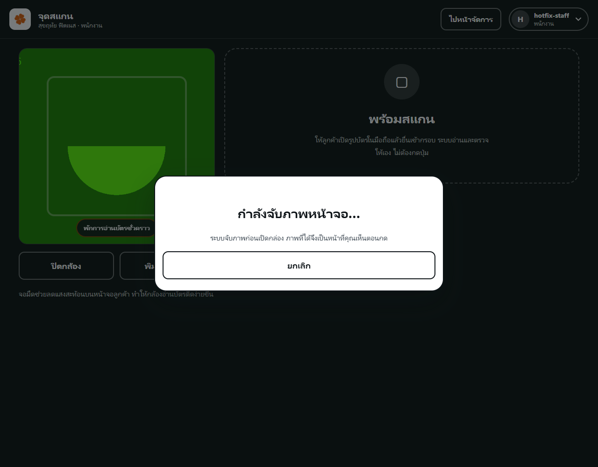

<!-- pagebreak -->

#### 1.13 (ต่อ) ระหว่างจับภาพหน้าจอ

**ระหว่างจับภาพจะขึ้นแผง "กำลังจับภาพหน้าจอ…" ไม่กี่วินาที** และมี **ปุ่ม "ยกเลิก"** อยู่ในแผงเสมอ — กดแล้วกลับไปทำงานต่อได้ทันที ไม่ต้องโหลดหน้าใหม่

- **บนจอสแกน กรอบกล้องจะหรี่ลงพร้อมป้าย "พักการอ่านบัตรชั่วคราว"** — ระบบหยุดอ่าน QR ชั่วคราวระหว่างจับภาพ **กล้องยังเปิดอยู่** ภาพที่ได้จึงยังเห็นสิ่งที่อยู่บนจอ · ป้ายหายเมื่อจับภาพเสร็จ แล้วสแกนบัตรใบถัดไปได้ตามปกติ
- **ถ้าลูกค้ายื่นบัตรพอดีตอนป้ายขึ้น** บอกเขาว่า "รอแป๊บหนึ่งนะครับ" แล้วยื่นใหม่หลังป้ายหาย — ไม่ใช่กล้องเสีย
- **ถ้าจับภาพนานเกิน 8 วินาที ระบบเลิกเอง** แล้วเปิดกล่องแจ้งปัญหาแบบไม่มีภาพให้แทน (ขึ้นว่า "จับภาพหน้าจอไม่สำเร็จ") — **ส่งเรื่องต่อได้ตามปกติ** แค่ต้องเลือกเองว่าเกิดที่หน้าไหน

<!-- pagebreak -->

#### 1.13 (ต่อ 2) กล่องแจ้งปัญหา


**ในกล่องมีอะไร**

- **ภาพหน้าจอตอนที่คุณกด** พร้อมติ๊ก **"ส่งภาพหน้าจอไปด้วย"** (เอาออกได้) · ใต้ติ๊กเขียนไว้ว่า *ภาพอาจมีชื่อหรือรูปสมาชิก · เจ้าของยิมเท่านั้นที่เปิดดูได้ และระบบบันทึกทุกครั้งที่มีคนเปิดดู*
- **"ใช้ไม่ได้อย่างไร" เป็นช่องเดียวที่บังคับกรอก** — เขียนสั้น ๆ ก็พอ แต่ต้องมี เพราะภาพอย่างเดียวมักบอกไม่ได้ว่าคุณกำลังจะทำอะไร · เขียนแบบนี้ช่วยได้มากที่สุด: **กำลังทำอะไร → กดปุ่มไหน → เกิดอะไรขึ้นแทน** เช่น "กดปุ่มบันทึกแล้วหมุนค้าง ไม่ขึ้นอะไรเลย"
- ด้านล่างบอกสิ่งที่จะถูกส่งไปด้วยทั้งหมด ไม่มีอะไรซ่อน: **หน้าที่เกิด · เวลา · ผู้แจ้ง · เครื่องที่ใช้**

กด **"ส่งเรื่อง"** → ขึ้น **"ส่งเรื่องแล้ว"** พร้อม **เลขเรื่อง (เรื่อง #…)** — จดเลขนี้ไว้ถ้าต้องคุยกันต่อ · หน้าจอบอกตรง ๆ ว่า **เรื่องนี้ยังไม่ได้แก้ให้คุณตอนนี้** ถ้ามีวิธีทำอย่างอื่นไปก่อนได้ ให้ทำวิธีนั้นเพื่อไม่ให้ลูกค้ารอ

**ถ้าเน็ตหลุดตอนกดส่ง — เรื่องไม่หาย**


ขึ้นว่า **"เก็บเรื่องไว้ในเครื่องแล้ว"** ระบบจะส่งให้เองเมื่อเน็ตกลับมา **ไม่ต้องพิมพ์ใหม่** · ระหว่างที่ยังค้าง เมนูจะขึ้นว่า **"แจ้งปัญหา (รอส่ง 1)"** ให้รู้ว่ายังมีของค้างอยู่ในเครื่องนี้ — อย่าเพิ่งล้างข้อมูลเบราว์เซอร์หรือปิดโหมดส่วนตัวก่อนตัวเลขนั้นหายไป

**ถ้าจับภาพไม่สำเร็จ** ขึ้นว่า "จับภาพหน้าจอไม่สำเร็จ · ส่งเรื่องต่อได้ตามปกติ แค่ไม่มีภาพประกอบ" แล้วให้ **เลือกเองว่าเกิดที่หน้าไหน** จากรายการ — ส่งต่อได้ปกติ

**ใช้ได้ทุกหน้า รวมจอสแกน** ระหว่างสแกนก็กดแจ้งได้ ระบบวาดภาพจากกล้องลงในภาพหน้าจอให้ด้วย

<!-- pagebreak -->

### 1.14 พอร์ทัลสมาชิก "ช่วยเล่น" — สิ่งที่พนักงานต้องตอบลูกค้าได้

**"ช่วยเล่น" คือหน้าเว็บของสมาชิก** เปิดที่ `https://srv1979069.hstgr.cloud/m/login` บนมือถือของลูกค้าเอง ข้างในมี **วิธีใช้เครื่อง 6 เครื่อง · โปรแกรมเริ่มต้น 4 สัปดาห์ · บทความเทคนิค 3 เรื่อง** — ไม่มีเรื่องเงิน ไม่มีข้อมูลของสมาชิกคนอื่น และ**ไม่ใช่ที่ที่ลูกค้าต่ออายุหรือจ่ายเงิน** ทุกอย่างเรื่องเงินยังอยู่ที่เคาน์เตอร์เหมือนเดิม

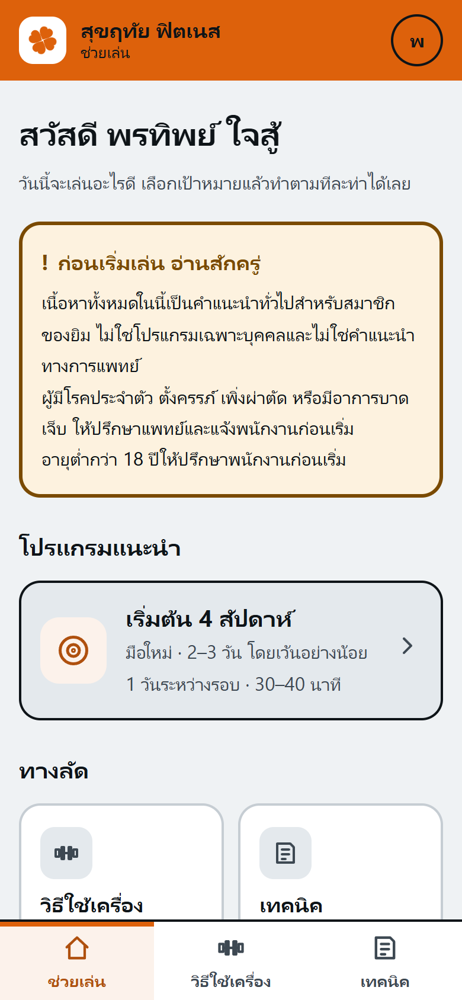

**ลูกค้าเข้าได้อย่างไร — ตอบสั้น ๆ ว่า "ดูในอีเมลที่ยิมส่งบัตรไปให้"**

1. ลูกค้าต้อง **กรอกอีเมลไว้ตอนสมัคร** (ข้อ 1.3) · ระบบส่งบัตรสมาชิกไปให้ทางอีเมลพร้อม **ปุ่ม "ตั้งรหัสผ่านของคุณ"**
2. กดปุ่มนั้นแล้วตั้งรหัสผ่านเอง **ลิงก์ใช้ได้ 7 วัน ใช้ได้ครั้งเดียว**
3. จากนั้นเข้าที่ `/m/login` ด้วย **อีเมลเดิมกับรหัสที่เพิ่งตั้ง**

<!-- pagebreak -->

#### 1.14 (ต่อ) ลูกค้าเข้าครั้งแรกอย่างไร

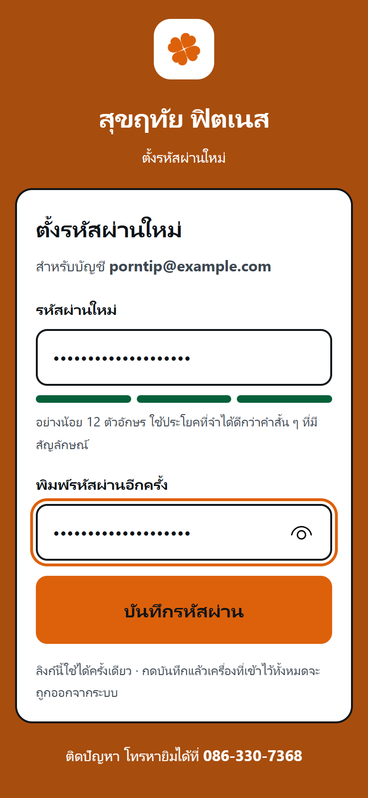

<!-- pagebreak -->

#### 1.14 (ต่อ) หน้าเข้าสู่ระบบของสมาชิก

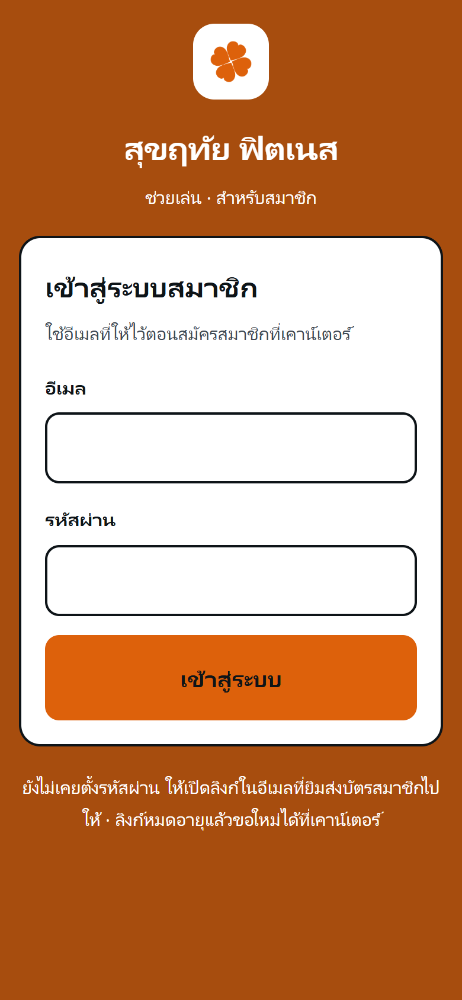

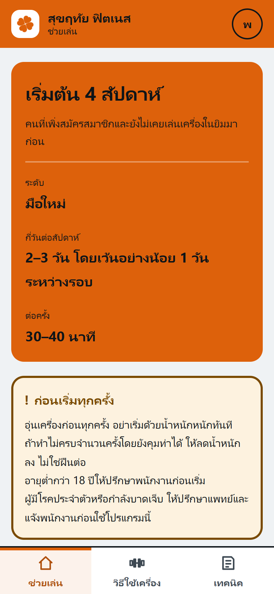

ในหน้าโปรแกรม สมาชิกเห็นสถานีเรียงตามลำดับพร้อมเซ็ต ครั้ง เวลาพัก และกดเข้าไปดูวิธีใช้เครื่องแต่ละตัวต่อได้ · **ถ้าเจ้าของยิมยังไม่ได้กด "ตรวจแล้ว" จะมีป้ายบอกว่าตัวเลขเป็นค่าตัวอย่าง** (ข้อ 2.10)

<!-- pagebreak -->

#### 1.14 (ต่อ 2) สามคำถามหน้าเคาน์เตอร์

**สามคำถามที่จะเจอหน้าเคาน์เตอร์ และคำตอบที่ทำได้เลย**

| ลูกค้าบอกว่า | ทำอย่างนี้ |
|---|---|
| **"ลืมรหัสผ่านของช่วยเล่น"** | เปิดหน้าบัตรของเขา → กด **"สร้างลิงก์เข้าช่วยเล่น"** → อ่านลิงก์ให้เขาหรือส่งให้เจ้าตัว **ลิงก์อายุ 24 ชม. ใช้ครั้งเดียว** (ข้อ 1.4 ต่อ) · **หน้าเข้าสู่ระบบสมาชิกไม่มีปุ่ม "ลืมรหัสผ่าน"** โดยตั้งใจ |
| **"ไม่ได้รับอีเมล"** หรือ **"ลิงก์ในอีเมลหมดอายุแล้ว"** | เร็วที่สุดคือกด **"สร้างลิงก์เข้าช่วยเล่น"** แล้วให้เขาตั้งรหัสตรงนั้นเลย · หรือกด **"ส่งบัตรทางอีเมลอีกครั้ง"** ถ้าอยากให้บัตรไปถึงกล่องจดหมายเขาด้วย (ลิงก์ในจดหมายอายุ 7 วัน) |
| **"ตอนสมัครไม่ได้ให้อีเมลไว้"** | เปิดหน้าบัตร → **"แก้ไขข้อมูลสมาชิก"** → กรอกอีเมล → บันทึก → จากนั้นกด **"สร้างลิงก์เข้าช่วยเล่น"** หรือ "ส่งบัตรทางอีเมล" ก็ได้ |

**ถ้ายิมยังไม่ได้ตั้งค่าอีเมลของระบบ หน้าเข้าสู่ระบบสมาชิกจะบอกลูกค้าเองว่าให้มาหาคุณ**

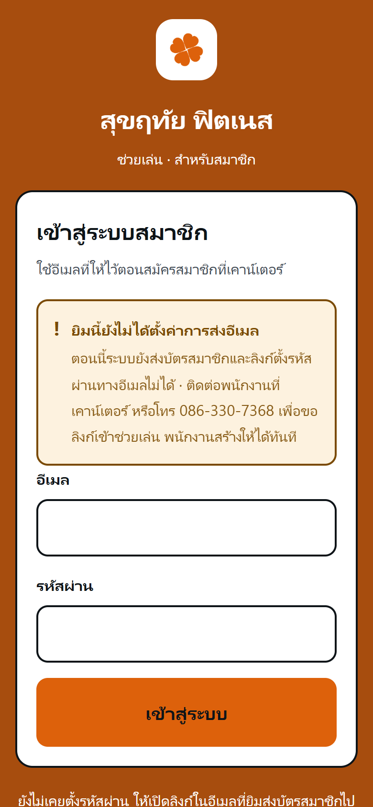

กล่องเหลืองเขียนว่า *"ยิมนี้ยังไม่ได้ตั้งค่าการส่งอีเมล · ตอนนี้ระบบยังส่งบัตรสมาชิกและลิงก์ตั้งรหัสผ่านทางอีเมลไม่ได้ · ติดต่อพนักงานที่เคาน์เตอร์ หรือโทร (เบอร์ยิม) เพื่อขอลิงก์เข้าช่วยเล่น พนักงานสร้างให้ได้ทันที"* — **นี่คือสถานการณ์ตอนเปิดใช้วันแรก** ถ้าเจ้าของยิมยังไม่ได้กรอกกล่องจดหมาย (ข้อ 2.5 ต่อ) · ลูกค้าที่โทรมาหรือเดินมาถาม ให้กด **"สร้างลิงก์เข้าช่วยเล่น"** ให้เขาได้เลย ไม่ต้องรอเรื่องอีเมล

> **อย่าตั้งรหัสผ่านของช่วยเล่นให้ลูกค้า และอย่าถามรหัสของเขา** ลูกค้าตั้งเองจากลิงก์ในอีเมลเสมอ · พนักงานไม่มีหน้าจอไหนเห็นหรือเปลี่ยนรหัสของสมาชิกได้เลย

<!-- pagebreak -->

### 1.14 (ต่อ) ป้าย QR ติดเครื่อง และหน้าจอเมื่อสมาชิกหมดอายุ

**ป้าย QR ที่ติดอยู่บนเครื่องออกกำลังกาย เปิดได้โดยไม่ต้องเข้าสู่ระบบ** ใครก็สแกนได้ รวมคนที่ยังไม่เป็นสมาชิก — หน้านั้นมีแค่วิธีใช้เครื่องเครื่องนั้น ไม่มีข้อมูลบุคคลอยู่เลย **ใช้ชวนคนสมัครได้**

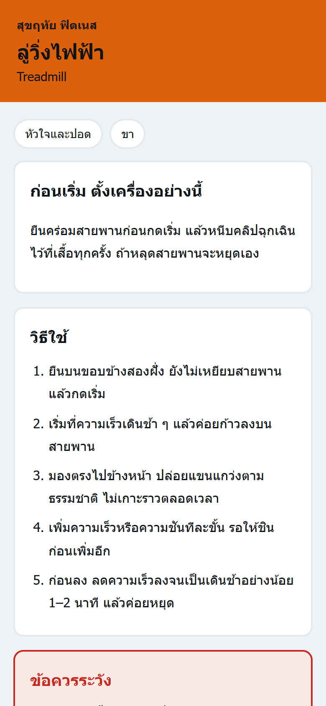

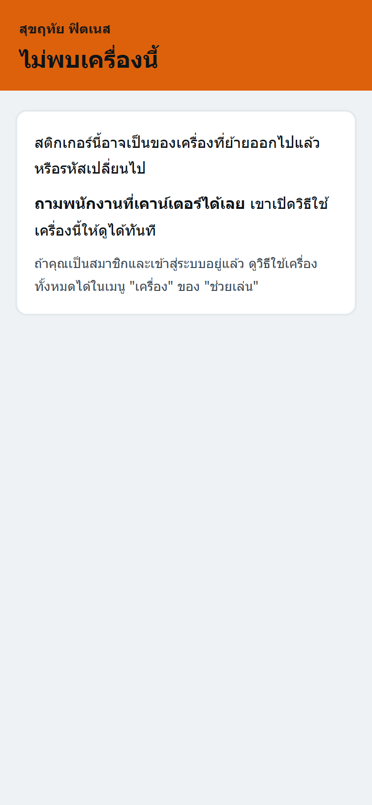

**ถ้าสแกนแล้วขึ้น "ไม่พบเครื่องนี้"** แปลว่าป้ายนั้นเป็นของเครื่องที่ย้ายออกไปแล้วหรือรหัสเปลี่ยนไป — หน้าจอบอกให้ถามพนักงาน **เปิดวิธีใช้เครื่องให้ลูกค้าดูจากเครื่องของคุณได้ทันที** แล้วแจ้งเจ้าของยิมให้พิมพ์ป้ายใหม่ (ข้อ 2.10)

**เมื่อแพ็กเกจของสมาชิกหมดอายุ** เขายังเข้า "ช่วยเล่น" ได้ แต่เจอหน้าเดียวคือหน้าแจ้งหมดอายุ

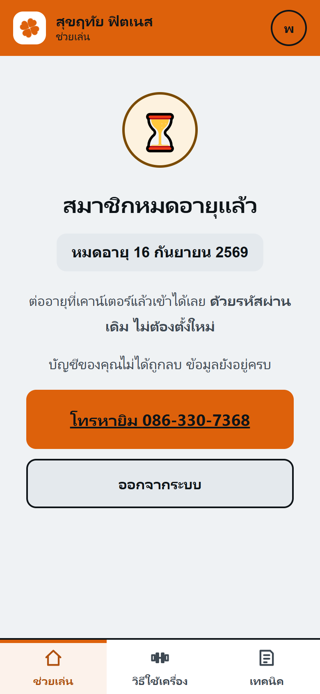

| จอขึ้นว่า | แปลว่า | บอกลูกค้าว่า |
|---|---|---|
| **สมาชิกหมดอายุแล้ว** + วันที่ | แพ็กเกจครบกำหนดตามปกติ | **ต่ออายุที่เคาน์เตอร์แล้วเข้าได้เลย ด้วยรหัสผ่านเดิม ไม่ต้องตั้งใหม่** |
| **สิทธิ์ถูกยกเลิก** (ไม่มีวันที่) | ยิมยกเลิกสิทธิ์ใบนั้น เช่น บันทึกเงินผิดแล้วกลับรายการ | **"ขอตรวจสอบให้ที่เคาน์เตอร์"** — อย่าเดาสาเหตุ เปิดประวัติการรับเงินของเขาดู (ข้อ 2.7) หรือเรียกเจ้าของยิม |

**ทั้งสองกรณีบัญชีของลูกค้าไม่ได้ถูกลบ** ข้อมูลและรหัสผ่านยังอยู่ · **สิทธิ์ถูกตรวจทุกครั้งที่เปิดหน้า** ไม่ใช่ตอนล็อกอิน ดังนั้นพอต่ออายุเสร็จที่เคาน์เตอร์ ให้เขากดโหลดหน้าใหม่ก็เข้าได้ทันที ไม่ต้องออกจากระบบแล้วเข้าใหม่

<!-- pagebreak -->

## ส่วนที่ 2 · เจ้าของยิม

### 2.1 ตั้งรหัสผ่านครั้งแรกจากลิงก์

**ตอนนี้มีสามทางที่จะได้รหัสผ่าน** — ใช้ทางที่ตรงกับสถานการณ์:

| สถานการณ์ | ใช้ทางไหน | ลิงก์อยู่ได้นาน |
|---|---|---|
| แอดมินคนแรกของยิม (ยังไม่มีใครเข้าระบบได้เลย) | **คำสั่งบนเครื่องเซิร์ฟเวอร์** — ทีมติดตั้งรันให้ (ข้อนี้) | 24 ชั่วโมง |
| พนักงานหรือแอดมินลืมรหัส **และยิมตั้งค่าอีเมลแล้ว** | ให้เขากด **"ลืมรหัสผ่าน"** ที่หน้าแรกเอง (ข้อ 1.1) | 30 นาที |
| ลืมรหัส **แต่ยิมยังไม่ได้ตั้งค่าอีเมล** หรืออีเมลของเขาใช้ไม่ได้ | คุณกด **"สร้างลิงก์ตั้งรหัสผ่าน"** ในหน้าผู้ใช้และสิทธิ์ (ข้อ 2.2) | 24 ชั่วโมง |

<!-- pagebreak -->

**รหัสผ่านของแอดมินคนแรกมาจากลิงก์ที่ออกจากเครื่องเซิร์ฟเวอร์** ทีมติดตั้งเป็นคนออกให้ด้วยคำสั่ง:

```
docker compose exec app npm --silent run admin:set-password-link -- อีเมลของคุณ
```

บรรทัดแรกที่ได้คือลิงก์หน้าตาแบบนี้ `https://srv1979069.hstgr.cloud/?setpw=<รหัสยาว ๆ>`


**วิธีใช้**

1. เปิดลิงก์ในเบราว์เซอร์ — ได้หน้า **"ตั้งรหัสผ่านของ &lt;อีเมล&gt;"** โดยไม่ต้องล็อกอินก่อน (ช่องบนคือรหัสผ่านใหม่ ช่องล่างคือพิมพ์ซ้ำอีกครั้ง)
2. พิมพ์รหัสผ่านใหม่สองครั้งให้ตรงกัน **อย่างน้อย 12 ตัวอักษร** — ใช้ประโยคที่จำได้ดีกว่าคำสั้น ๆ ที่มีสัญลักษณ์
3. กด **"บันทึกรหัสผ่าน"** → ขึ้น "ตั้งรหัสผ่านเรียบร้อย" → กด "ไปหน้าเข้าสู่ระบบ" แล้วเข้าด้วยรหัสที่เพิ่งตั้ง

**กฎของลิงก์ที่ต้องรู้**

- **ใช้ได้ครั้งเดียว** และ **หมดอายุใน 24 ชั่วโมง** · ออกใหม่แล้วอันเก่าตายทันที
- หมดอายุหรือกดพลาด ให้ทีมติดตั้งรันคำสั่งเดิมออกลิงก์ใหม่ได้ ไม่จำกัดจำนวนครั้ง
- คำสั่งนี้ใช้ได้กับ **บัญชีผู้ดูแลระบบเท่านั้น** บัญชีที่ถูกระงับและอีเมลที่ไม่มีอยู่จริงจะถูกปฏิเสธ · **ลิงก์สำหรับบัญชีพนักงาน ออกจากหน้าเว็บได้เลย** ไม่ต้องใช้เซิร์ฟเวอร์ (ข้อ 2.2)
- **ใครเปิดลิงก์นี้ได้ก็ตั้งรหัสผ่านของบัญชีนี้ได้** ส่งให้เจ้าของบัญชีโดยตรง อย่าส่งลงกลุ่ม ตั้งเสร็จแล้วลบข้อความทิ้ง
- ตั้งรหัสเสร็จ ระบบจะตัด session เดิมของบัญชีนั้นทุกเครื่อง และบันทึกไว้ในประวัติการใช้งานว่าลิงก์ถูกออกเมื่อไรและถูกใช้เมื่อไร
- ถ้าเปิดลิงก์แล้วขึ้น **"ลิงก์นี้ใช้ไม่ได้แล้ว"** แปลว่าหมดอายุ ถูกใช้ไปแล้ว หรือมีการออกลิงก์ใหม่ทับ — ขอลิงก์ใหม่

**หลังจากนี้ไม่ต้องใช้เซิร์ฟเวอร์อีก** รหัสผ่านของพนักงานทุกคน และของตัวคุณเอง ตั้งได้จากหน้า "ผู้ใช้และสิทธิ์" บนเว็บ

<!-- pagebreak -->

### 2.2 ผู้ใช้และสิทธิ์

หน้านี้ตอบว่า *ใครเข้าระบบได้และเข้าในฐานะอะไร* — คนละเรื่องกับหน้า "สมาชิก" ซึ่งเป็นรายชื่อคนที่มาออกกำลังกาย

**เพิ่มบัญชีพนักงาน**

1. กรอกอีเมล → เลือกสิทธิ์ **"พนักงาน — สแกนเช็คอินและสมัครสมาชิก"** หรือ **"ผู้ดูแลระบบ — จัดการทุกอย่าง"**
2. ตั้งรหัสผ่านให้เขาเลยก็ได้ (อย่างน้อย 12 ตัวอักษร) หรือเว้นว่างไว้ตั้งทีหลัง — **บัญชีที่ยังไม่มีรหัสผ่านเข้าระบบไม่ได้** และตารางจะขึ้นว่า "✕ ยังไม่ได้ตั้ง" ไม่ให้พนักงานไปยืนงงที่หน้าล็อกอิน
3. กด **"สร้างบัญชี"** แล้ว **บอกรหัสให้เขาแบบตัวต่อตัว ไม่ส่งลงกลุ่ม** — หรือ **เว้นช่องรหัสไว้เลย** แล้วกด "สร้างลิงก์ตั้งรหัสผ่าน" ในแถวของเขา ให้เขาตั้งเอง (วิธีนี้ดีกว่า เพราะไม่มีรหัสของใครไปอยู่ในแชต)

<!-- pagebreak -->

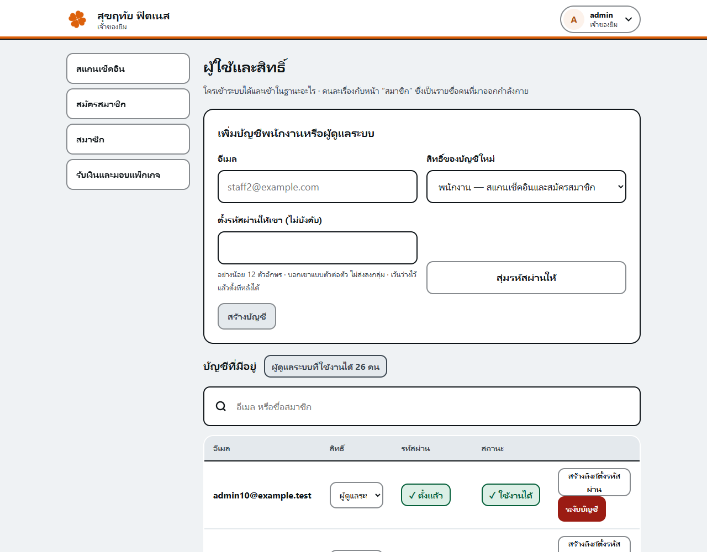

**พนักงานลืมรหัส — กด "สร้างลิงก์ตั้งรหัสผ่าน" ในแถวของเขา** (ปุ่ม "ตั้งรหัสใหม่" แบบเดิมถูกถอดออกแล้ว)

ระบบจะกางกล่องสีเหลืองขึ้นมาบนหน้าเดียวกัน ชื่อ **"ลิงก์ตั้งรหัสผ่านของ (อีเมล)"** พร้อมปุ่ม **"คัดลอกลิงก์"**

- **ส่งลิงก์นี้ให้เจ้าตัวโดยตรง** — ทางไลน์ส่วนตัวหรืออ่านให้ฟังก็ได้ (ลิงก์แสดงเป็นตัวอักษรอ่านออกโดยตั้งใจ เพื่อให้อ่านทางโทรศัพท์ได้) **อย่าโพสต์ลงกลุ่ม** ใครถือลิงก์นี้ตั้งรหัสของบัญชีนั้นได้
- **ใช้ได้ครั้งเดียว หมดอายุใน 24 ชั่วโมง** · กล่องบอกเวลาหมดอายุไว้ให้ · ออกใหม่ได้เรื่อย ๆ อันเก่าจะตายทันที
- ใช้ได้กับทั้งบัญชี **พนักงานและผู้ดูแลระบบ** · เป็นทางสำรองที่ทำงานได้แม้ยิมยังไม่ได้ตั้งค่าอีเมล
- **คุณไม่ได้เห็นรหัสผ่านของเขาและตั้งให้เขาไม่ได้อีกแล้ว** — เขาเป็นคนตั้งเองจากลิงก์ ทำให้ไม่มีรหัสของใครลอยอยู่ในแชตกลุ่ม
- เขาตั้งรหัสเสร็จ ระบบจะเตะบัญชีนั้นออกจากทุกเครื่อง ให้ล็อกอินใหม่ด้วยรหัสที่เพิ่งตั้ง

> **ถ้ายิมตั้งค่าอีเมลของระบบแล้ว ไม่ต้องใช้ปุ่มนี้ในกรณีปกติ** — ให้เขากด "ลืมรหัสผ่าน" ที่หน้าแรกเอง (ข้อ 1.1) เร็วกว่าและไม่ต้องรบกวนคุณ · เก็บปุ่มนี้ไว้ใช้ตอนอีเมลยังไม่พร้อม อีเมลเขาเข้าไม่ได้ หรือเขาอยู่ตรงหน้าคุณพอดี

**ระงับ / คืนสิทธิ์ / เปลี่ยนสิทธิ์**

- ปุ่ม **"ระงับ"** ปิดการเข้าใช้ทันทีโดยไม่ลบประวัติ · **"คืนสิทธิ์"** เปิดกลับ
- การเปลี่ยนสิทธิ์หรือระงับบัญชี **เตะคนนั้นออกจากระบบทันที** — บอกเขาก่อนกด
- ระบบไม่ยอมให้เหลือผู้ดูแลระบบ 0 คน จึงกันไม่ให้คุณระงับหรือลดสิทธิ์ตัวเองจนไม่มีใครดูแลระบบได้
- ถ้าคุณเปลี่ยนสิทธิ์หรือระงับบัญชีของตัวเอง ระบบจะให้คุณออกจากระบบด้วยเช่นกัน

หัวตารางบอกไว้ครบว่าแต่ละบัญชี: อีเมล · สิทธิ์ · รหัสผ่าน (✓ ตั้งแล้ว / ✕ ยังไม่ได้ตั้ง) · สถานะ (✓ ใช้งานได้ / ถูกระงับ) และมีตัวนับ **"ผู้ดูแลระบบที่ใช้งานได้"** ให้เห็นตลอด · ช่องค้นหาด้านบนพิมพ์อีเมลหรือชื่อสมาชิกก็ได้

**ทุกคนเปลี่ยนรหัสผ่านของตัวเองได้จากเมนูมุมขวาบน** (ข้อ 1.1 ต่อ) — ไม่ต้องมาขอคุณ และคุณไม่ต้องรู้รหัสของใคร

<!-- pagebreak -->

### 2.3 แพ็กเกจและราคา

เมนูมุมขวาบน → **"แพ็กเกจ"** → **"เพิ่มแพ็กเกจ"** หรือ "แก้ไข" ในแถวที่มีอยู่

- ตั้งได้: ชื่อแพ็กเกจ · ประเภท (**ไม่จำกัดครั้ง** หรือ **จำกัดจำนวนครั้ง**) · อายุแพ็กเกจเป็นวัน · จำนวนครั้ง · ราคา · สถานะ (ร่าง / เปิดขาย / ปิดการขาย)
- **แพ็กเกจที่ยังไม่กรอกราคาจะมอบให้ใครไม่ได้** และไม่ขึ้นในหน้ารับเงิน จะติดป้าย "มอบไม่ได้" ในรายการ
- **แพ็กเกจที่ขายจริงต้องอยู่ในสถานะ "เปิดขาย"** — สถานะ "ร่าง" และ "ปิดการขาย" จะไม่ขึ้นให้พนักงานเลือกทั้งในหน้าสมัครและหน้ารับเงิน ตั้งราคาแล้วอย่าลืมเปิดขายด้วย
- ถึงจะกดจากหน้าจอที่ค้างอยู่ ระบบก็ยังไม่ยอมให้ขาย และตอบกลับคนละข้อความตามสถานะ: **"แพ็กเกจนี้ยังไม่ได้เปิดขาย กรุณาเปิดขายก่อนที่หน้าแพ็กเกจ หรือเลือกแพ็กเกจอื่น"** (ร่าง) และ **"แพ็กเกจนี้ปิดการขายไปแล้ว กรุณาเลือกแพ็กเกจอื่น หรือเปิดขายอีกครั้งที่หน้าแพ็กเกจ"** (ปิดการขาย) · ไม่มีรายการขายหรือยอดเงินเกิดขึ้นเมื่อถูกปฏิเสธ
- **ปิดการขายไม่กระทบสิทธิ์ที่ลูกค้าจ่ายไปแล้ว** คนที่ถือแพ็กเกจนั้นอยู่ยังเข้ายิมและสแกนได้ตามปกติจนหมดอายุ การปิดการขายมีผลแค่ว่าขายใบใหม่ไม่ได้เท่านั้น — ใช้เมื่อเลิกขายราคานี้แล้ว แทนการลบแพ็กเกจทิ้ง
- **ราคา 0 บาทคือแพ็กเกจฟรีจริง** มอบได้ และไม่กระทบยอดขาย
- แก้ราคาแล้วไม่กระทบสิทธิ์ที่มอบไปแล้ว มีผลกับรายการที่มอบหลังจากนั้น

<!-- pagebreak -->

### 2.4 ข้อมูลยิม

เมนูมุมขวาบน → **"ข้อมูลยิม"** — ทุกอย่างในหน้านี้แก้ได้เอง ไม่มีค่าไหนถูกฝังไว้ในโค้ด

- **ชื่อยิม (ไทย/อังกฤษ) · ที่อยู่ · อำเภอ จังหวัด · เบอร์โทรหลักและสำรอง** — ชื่อ อำเภอ/จังหวัด และเบอร์โทร **จะไปขึ้นบนบัตรสมาชิกทุกใบ**
- **เบอร์โทรที่ขึ้นบนบัตร** ตั้งที่ช่อง **"เบอร์ที่แสดงบนบัตรและหน้าสาธารณะ"** ในหน้านี้ เลือกได้ 3 แบบ: **เบอร์หลัก (ค่าเริ่มต้น)** · เบอร์สำรอง · ไม่แสดงเบอร์ — ตัดสินใจเรื่องนี้ **ก่อนออกบัตรใบแรก** เพราะบัตรเป็นรูปที่ลูกค้าเก็บไว้และส่งต่อกันได้ ถ้าไม่อยากให้เบอร์ติดไปกับรูป ให้เลือก "ไม่แสดงเบอร์"
- **การเช็คอิน → "สแกนซ้ำภายในกี่นาทีถือเป็นครั้งเดียวกัน"** ค่าเริ่มต้น 5 นาที (ตั้งได้ 1 นาที ถึง 12 ชั่วโมง) — ค่านี้คือสิ่งที่กันการหักสิทธิ์ซ้ำเวลาบัตรถูกสแกนซ้ำโดยบังเอิญ ซึ่งเกิดบ่อยกับบัตรถาวร
- **เวลาเปิดทำการ** รายวัน และปุ่มยืนยันว่าเวลาถูกต้องแล้ว
- แก้ชื่อยิมหรือเบอร์แล้ว **บัตรใบเก่าที่ลูกค้าถืออยู่ยังใช้สแกนได้ตามปกติ** (ข้อมูลบนรูปที่ส่งไปแล้วจะยังเป็นของเดิม ถ้าอยากให้รูปตรงกับข้อมูลใหม่ ต้องส่งบัตรซ้ำให้เขาโหลดใหม่)

### 2.5 ตั้งค่ายิม — โลโก้และสีของยิม

เมนูมุมขวาบน → **"ตั้งค่ายิม"** คือที่ที่ยิมใส่โลโก้และสีของตัวเองลงในระบบ **มีผลกับหัวแอป ปุ่ม หน้าเข้าสู่ระบบ และบัตรสมาชิก**


หน้านี้แบ่งเป็น 4 กล่อง และ **ไม่มีอะไรถูกบันทึกจนกว่าจะกดปุ่มในแถบล่างจอ** — แถบนั้นบอกด้วยว่าแก้ไปกี่อย่างแล้ว ("แก้ไขแล้ว N อย่าง · ยังไม่ได้บันทึก") และมีปุ่ม **"คืนค่าเดิม"** ให้ทิ้งที่แก้ทั้งหมด

**ข้อมูลยิม (กล่องบนสุด)** — ชื่อยิม เบอร์โทร และที่อยู่ แสดงให้ดูเฉย ๆ **แก้ที่หน้า "ข้อมูลยิม" (ข้อ 2.4)** เพราะใช้ร่วมกับเวลาเปิดทำการ เก็บไว้ที่เดียวเพื่อไม่ให้ชื่อบนบัตรกับบนหน้าจอเพี้ยนจากกัน · ช่อง **"ชื่อย่อบนบัตร"** แก้ได้ที่นี่ 2–3 ตัวอักษร ใช้แทนโลโก้เมื่อยังไม่ได้อัปโหลด เว้นว่างไว้ระบบจะย่อชื่อยิมให้เอง

<!-- pagebreak -->

#### ตั้งค่ายิม · โลโก้

กด **"เลือกไฟล์โลโก้"** — รับ **PNG (พื้นใสดีที่สุด) หรือ JPG ไม่เกิน 2 MB** ระบบย่อขนาดให้เองและเก็บเป็น PNG เพื่อรักษาพื้นใส


- อัปโหลดแล้วได้กล่อง **"โลโก้ปัจจุบัน"** พร้อมปุ่ม **"เปลี่ยนโลโก้"** และ **"เอาออก"**
- ใต้รูปบอกว่าบนบัตรโลโก้จะ **มีแผ่นขาวรองให้** (เมื่อสีโลโก้ใกล้กับสีหัวบัตร) หรือ **วางบนหัวบัตรได้เลย** — ระบบตัดสินให้เอง ไม่ต้องตั้งค่า
- **ยังไม่มีโลโก้ก็เริ่มใช้ได้** บัตรจะขึ้นชื่อย่อในกรอบสีแบรนด์แทน อัปโหลดทีหลังแล้วบัตรใบเดิมจะเปลี่ยนตามเองเมื่อส่งใหม่

**ถ้าไฟล์ไม่ผ่าน** ขึ้นกล่องแดง **"อัปโหลดโลโก้ไม่สำเร็จ"** พร้อมเหตุผล เช่น *"ไฟล์โลโก้ใหญ่เกิน 2 MB กรุณาย่อรูปก่อนอัปโหลด"* หรือ *"ไฟล์โลโก้นี้เปิดไม่ได้ อาจอัปโหลดไม่ครบหรือไฟล์เสียหาย กรุณาเลือกไฟล์ PNG หรือ JPG อีกครั้ง"* · **โลโก้เดิมไม่หาย** ยังอยู่ครบตามเดิม เลือกไฟล์ใหม่ได้ทันที


<!-- pagebreak -->

#### ตั้งค่ายิม · สีของยิม

มีสองทางเลือก ใช้ทางไหนก็ได้

1. **กดเลือกจากแถบ "สีเด่นจากโลโก้"** — ระบบดึงสีเด่นจากไฟล์โลโก้มาให้ 3–4 สีพร้อมรหัสสี และ **ต่อท้ายด้วยสีเขียวเริ่มต้นของระบบเสมอ** เผื่ออยากกลับไปใช้ของเดิม
2. **จิ้มสีเอง** ที่ช่อง **"สีหลัก"** (ใส่รหัสแบบ `#RRGGBB` หรือกดช่องสีแล้วเลือก)

**สีรอง** เว้นว่างไว้ได้ กด **"ให้ระบบคำนวณ"** แล้วระบบคิดให้จากสีหลัก · สีรองใช้กับปุ่มตอนกด แถบล่างบัตร และพื้นหน้าเข้าสู่ระบบ

**ติ๊ก "ทำหัวแอปเป็นสีแบรนด์"** — ค่าเริ่มต้นคือหัวแอปสีขาวมีเส้นสีแบรนด์ใต้ ซึ่งปลอดภัยกับโลโก้ทุกแบบมากกว่า ติ๊กช่องนี้ถ้าอยากให้หัวแอปเป็นสีเต็มแถบ

**ตารางตัวเลขใต้ช่องสี — อ่านก่อนกดบันทึก**

ห้าแถวนี้คือค่าความต่างของสีตัวอักษรกับพื้นจริง ๆ ที่จะไปอยู่บนจอและบนบัตร **ตัวเลขยิ่งสูงยิ่งอ่านง่าย** เกณฑ์คือ 4.5:1 สำหรับตัวอักษร และ 3:1 สำหรับเส้นขอบ แถวไหนต่ำกว่าเกณฑ์จะขึ้นสีแดง

| แถว | หมายถึงตรงไหน |
|---|---|
| ตัวอักษรบนปุ่มและหัวบัตร | ตัวหนังสือบนปุ่มสีหลักและบนแถบหัวบัตร |
| ตัวอักษรสีแบรนด์บนพื้นขาว | ตัวหนังสือสีแบรนด์บนพื้นขาวของหน้าจอ |
| ตัวอักษรบนป้ายสีอ่อน | ป้ายเล็ก ๆ ที่ใช้พื้นอ่อนของสีแบรนด์ |
| เส้นขอบช่องกรอกบนพื้นหน้า | เส้นรอบช่องกรอกข้อมูล |
| ตัวอักษรบนสีรอง (แถบล่างบัตร) | แถบล่างของบัตรสมาชิก |

ถ้าสีที่เลือกอ่อนหรือเข้มเกินไป ระบบขึ้นกล่องเตือนอธิบายให้ เช่น สีอ่อนมากจะทำให้โลโก้จมหายบนหัวบัตร หรือสีเกือบดำจะทำให้บัตรดูเป็นขาวดำ **ระบบไม่ห้ามใช้** เพราะเป็นป้ายของยิมเอง แต่บอกให้รู้ก่อนตัดสินใจ · บางกรณีระบบปรับสีพื้นให้เข้มขึ้นเล็กน้อยเฉพาะตอนใช้เป็นพื้นปุ่มและหัวบัตร แล้วแจ้งไว้ในกล่องเตือน สีที่เลือกยังอยู่ครบในที่อื่น

#### ข้อมูลติดต่อท้ายบัตร

**LINE ID** พิมพ์ต่อท้ายเบอร์โทรที่ท้ายบัตร เว้นว่างไว้ก็ได้ · เบอร์โทรและที่อยู่แสดงให้ดู แก้ที่หน้า "ข้อมูลยิม" · **ช่องที่เว้นว่างจะไม่ขึ้นบนบัตร**

<!-- pagebreak -->

#### ตั้งค่ายิม · พรีวิวด้านขวา — ดูก่อนกดบันทึก

พรีวิวเปลี่ยนตามทันทีที่เลือกสี **แต่แอปจริงยังไม่เปลี่ยนจนกว่าจะกดบันทึก** มีให้ดูสามอย่าง: **บัตรสมาชิก 1080 × 1350** · **หัวแอป** · **ปุ่มและป้าย** (บนมือถือ พรีวิวขึ้นก่อนฟอร์ม)

**ป้าย "ใช้งานอยู่ / หมดอายุ" และผลการสแกนไม่เปลี่ยนตามสีแบรนด์** เพราะสองอย่างนั้นสื่อว่าผ่านหรือไม่ผ่าน ไม่ใช่เรื่องแบรนด์ — เขียว/แดงจึงคงที่ไม่ว่ายิมจะเลือกสีอะไร

#### กดบันทึกแล้วเกิดอะไรขึ้น

ขึ้นข้อความ **"บันทึกการตั้งค่ายิมแล้ว · บัตรใบใหม่ทุกใบจะใช้สีนี้"**


**เปลี่ยนทันที**

- หัวแอป ปุ่ม และหน้าเข้าสู่ระบบ ของทุกเครื่องที่โหลดหน้าใหม่
- บัตรที่ออกใหม่หลังจากนี้
- **บัตรใบเดิมเมื่อถูกโหลดใหม่** — กด "บันทึกรูปบัตร" หรือส่งลิงก์ "ส่งบัตรซ้ำ" จะได้บัตรหน้าตาใหม่

**ไม่เปลี่ยน**

- **QR และเลขที่บัตรไม่ขยับ** บัตรที่ลูกค้าถืออยู่ยังสแกนผ่านเหมือนเดิม **ไม่ต้องออกบัตรใหม่ให้ใครทั้งนั้น**
- **QR ยังเป็นดำบนขาวเสมอ** ไม่ว่าจะเลือกสีอะไร เพราะ QR ที่ย้อมสีคือ QR ที่กล้องอ่านไม่ติดบนจอมือถือที่หรี่แสง
- **รูปบัตรที่ส่ง LINE ไปแล้วยังเป็นรูปเก่า** รูปในแชตของลูกค้าไม่เปลี่ยนตามระบบ ถ้าอยากให้เขาได้ใบสีใหม่ต้องส่งให้ใหม่ (ข้อ 1.4) ซึ่ง **ไม่จำเป็นต่อการใช้งาน** ใบเก่ายังเข้ายิมได้ปกติ
- สิทธิ์ ประวัติเช็คอิน และยอดขาย ไม่เกี่ยวกับการเปลี่ยนสีเลย

> **ถ้าเปิดหน้านี้ค้างไว้สองเครื่องแล้วต่างคนต่างกดบันทึก** เครื่องที่กดทีหลังจะขึ้นว่า *"มีคนแก้ตั้งค่ายิมไปแล้วระหว่างที่คุณเปิดหน้านี้ กรุณาโหลดหน้าใหม่แล้วลองอีกครั้ง"* — กันไม่ให้ค่าของอีกคนถูกทับเงียบ ๆ โหลดหน้าใหม่แล้วแก้ซ้ำได้เลย

<!-- pagebreak -->

### 2.5 (ต่อ) ตั้งค่ายิม · แท็บ "อีเมลของระบบ"

หน้า **"ตั้งค่ายิม"** มีสองแท็บ: **"ยิมและแบรนด์"** (โลโก้ สี ที่อธิบายไว้ข้างบน) และ **"อีเมลของระบบ"** — **เป็นแท็บ ไม่ใช่เมนูแยก** ถ้าหาไม่เจอให้มองแถวใต้หัวข้อ "ตั้งค่ายิม"

**ระบบใช้กล่องจดหมายของยิมส่งอะไรบ้าง** มีสองอย่างเท่านั้น: **บัตรสมาชิกที่ส่งให้ลูกค้าที่กรอกอีเมลไว้** (ข้อ 1.3, 1.4) และ **ลิงก์ลืมรหัสผ่านของพนักงาน** (ข้อ 1.1) · ถ้าไม่ตั้งค่า ทั้งสองอย่างนี้ใช้ไม่ได้ ที่เหลือทั้งระบบทำงานปกติ

**ถ้ายังไม่ได้ตั้งค่า** แท็บจะมีจุดสีส้มเตือน และแถบบนสุดเขียนเป็นผลที่เกิดขึ้นจริง ไม่ใช่ศัพท์เทคนิค

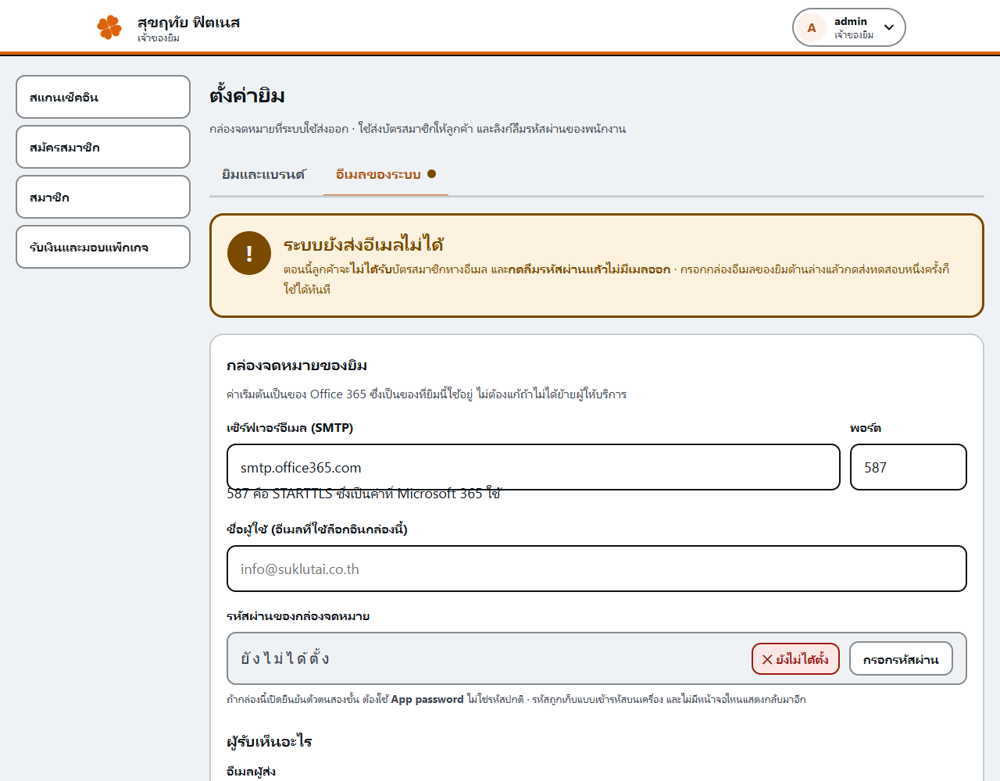

| แถบบนสุดเขียนว่า | แปลว่า |
|---|---|
| ✓ **ระบบส่งอีเมลได้** | ส่งทดสอบผ่านแล้ว · บอกเวลาที่ส่งทดสอบสำเร็จล่าสุดไว้ด้วย |
| ! **ระบบยังส่งอีเมลไม่ได้** | ยังกรอกไม่ครบ — *"ลูกค้าจะไม่ได้รับบัตรสมาชิกทางอีเมล และกดลืมรหัสผ่านแล้วไม่มีเมลออก"* |
| ! **ส่งเมลทดสอบไม่สำเร็จ** | กรอกครบแล้วแต่ส่งไม่ออก → อ่านหน้าวินิจฉัยที่ขึ้นด้านล่าง |
| **กำลังส่งเมลทดสอบ…** | รอไม่เกิน 30 วินาที **ไม่ต้องกดซ้ำ** |

<!-- pagebreak -->

**กรอกอะไรบ้าง** (ค่าของ Office 365 ซึ่งเป็นของที่ยิมนี้ใช้อยู่ ใส่มาให้แล้ว ไม่ต้องแก้ถ้าไม่ได้ย้ายผู้ให้บริการ)

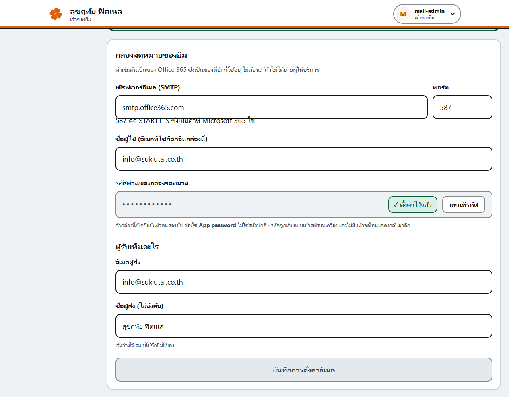

| ช่อง | ใส่อะไร |
|---|---|
| **เซิร์ฟเวอร์อีเมล (SMTP)** | `smtp.office365.com` |
| **พอร์ต** | `587` เท่านั้น (587 คือ STARTTLS ซึ่งเป็นค่าที่ Microsoft 365 ใช้) |
| **ชื่อผู้ใช้** | อีเมลที่ใช้ล็อกอินกล่องนั้น เช่น `info@suklutai.co.th` |
| **รหัสผ่านของกล่องจดหมาย** | รหัสของกล่องนั้น — ถ้ากล่องเปิดยืนยันตัวตนสองขั้น **ต้องใช้ App password 16 ตัว** |
| **อีเมลผู้ส่ง** | **ต้องเป็นอีเมลเดียวกับชื่อผู้ใช้** ไม่งั้นระบบไม่ยอมให้กดบันทึกและขึ้นคำเตือน |
| **ชื่อผู้ส่ง (ไม่บังคับ)** | เว้นว่างไว้ ระบบใช้ชื่อยิมให้เอง |

- **ช่องรหัสผ่านไม่ใช่ช่องพิมพ์ธรรมดา** — ปกติเป็นป้ายบอกว่า "✓ ตั้งค่าไว้แล้ว" หรือ "✕ ยังไม่ได้ตั้ง" กับปุ่ม **"กรอกรหัสผ่าน" / "แทนที่รหัส"** ต้องกดปุ่มก่อนจึงพิมพ์ได้ · ระหว่างพิมพ์มีปุ่ม "ดูรหัส" ให้ตรวจตัวอักษร
- **ระบบไม่แสดงรหัสกลับมาอีกเลยหลังบันทึก** ไม่ว่าจากหน้าไหน · รหัสถูกเก็บแบบเข้ารหัสไว้บนเครื่อง
- ปุ่ม **"บันทึกการตั้งค่าอีเมล"** จะกดไม่ได้จนกว่าจะมีการแก้ค่าจริง ๆ และ **ต้องบันทึกก่อนจึงจะกดส่งทดสอบได้** (ใต้ปุ่มทดสอบจะเขียนบอกว่า "บันทึกก่อน แล้วจึงกดส่งทดสอบได้")
- ถ้าขึ้นกล่องแดงว่า **"เครื่องนี้ยังไม่พร้อมเก็บรหัสผ่านอย่างปลอดภัย"** แปลว่าเครื่องยังไม่ได้ตั้งค่า `SETTINGS_ENC_KEY` — ทุกช่องจะกรอกไม่ได้ **แจ้งทีมติดตั้ง** ไม่ใช่เรื่องที่แก้จากหน้าเว็บ

> **รหัสผ่านกล่องจดหมายและ App password ห้ามส่งลงกลุ่มและห้ามพิมพ์ไว้ในคู่มือ** ให้รับส่งกันทางช่องทางส่วนตัวเท่านั้น ใครถือรหัสนี้ส่งอีเมลในนามยิมได้

<!-- pagebreak -->

#### อีเมลของระบบ · ปุ่ม "ส่งเมลทดสอบ"

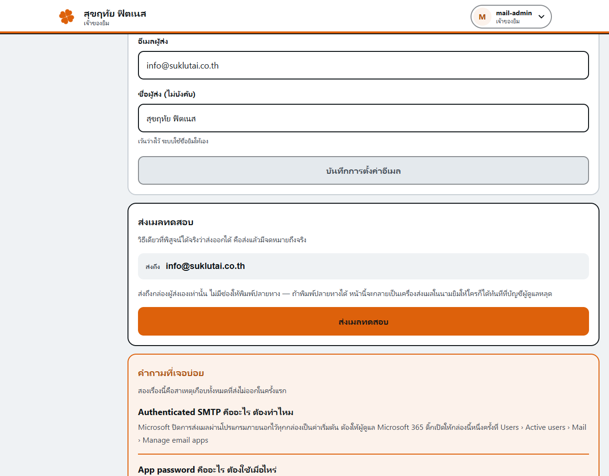

**วิธีเดียวที่พิสูจน์ได้จริงว่าส่งออกได้ คือส่งแล้วมีจดหมายถึงจริง** — ปุ่มนี้ส่งจดหมายจริงหนึ่งฉบับ แล้วรายงานสิ่งที่เซิร์ฟเวอร์อีเมลตอบกลับมาตรง ๆ

- **ส่งถึงกล่องของผู้ส่งเองเท่านั้น ไม่มีช่องให้พิมพ์ปลายทาง** — ตั้งใจให้เป็นแบบนี้ ถ้าพิมพ์ปลายทางได้ หน้านี้จะกลายเป็นเครื่องส่งเมลในนามยิมให้ใครก็ได้ทันทีที่บัญชีผู้ดูแลหลุด
- กดได้ **5 ครั้งต่อ 10 นาที** ต่อหนึ่งบัญชี
- สำเร็จจะขึ้นกล่องเขียว **"ส่งเมลทดสอบแล้ว"** — ให้ไปเปิดกล่องจดหมายจริง มองหาหัวข้อที่ขึ้นต้นว่า **"ทดสอบการส่งอีเมลของ…"** · **ครั้งแรกอาจไปอยู่ในจดหมายขยะ ถ้าเจอที่นั่นให้กดย้ายมากล่องหลัก** (สำคัญ เพราะบัตรของลูกค้าจะเดินทางเส้นเดียวกัน)

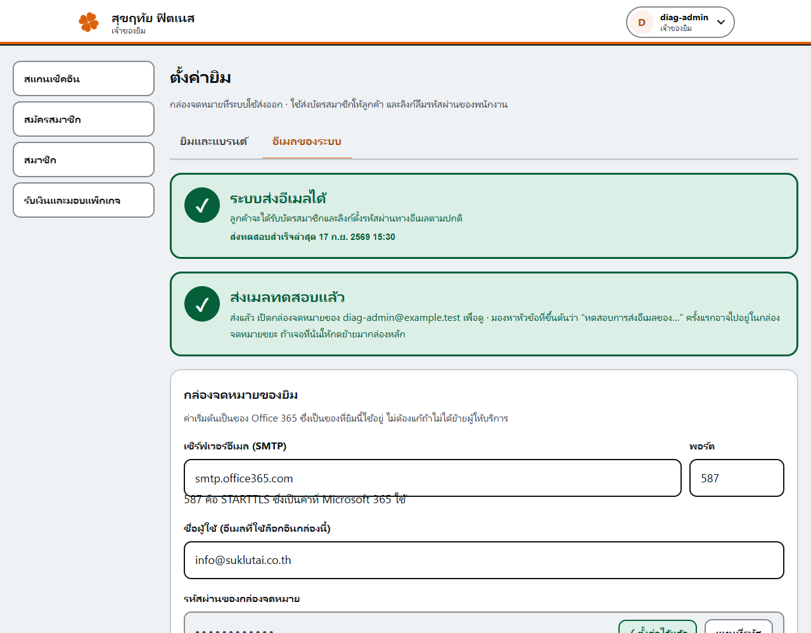

<!-- pagebreak -->

#### อีเมลของระบบ · เมื่อส่งไม่ออก — หน้าวินิจฉัย 4 แบบ

ถ้าส่งไม่สำเร็จ ระบบจะกางกล่องบอก **สิ่งที่เกิดขึ้น → แปลว่าอะไร → คุณต้องกดอะไร** และพับข้อความดิบจากเซิร์ฟเวอร์ไว้ล่างสุดสำหรับส่งต่อให้ฝ่ายไอที · กล่องนี้ค้างอยู่จนกว่าจะส่งทดสอบผ่าน โหลดหน้าใหม่ก็ไม่หาย

**แบบที่ 1 · กล่องนี้ยังไม่ได้เปิดให้โปรแกรมส่งเมลแทน** (`SMTP 535 5.7.139`) — **เจอบ่อยที่สุดในการตั้งค่าครั้งแรก**

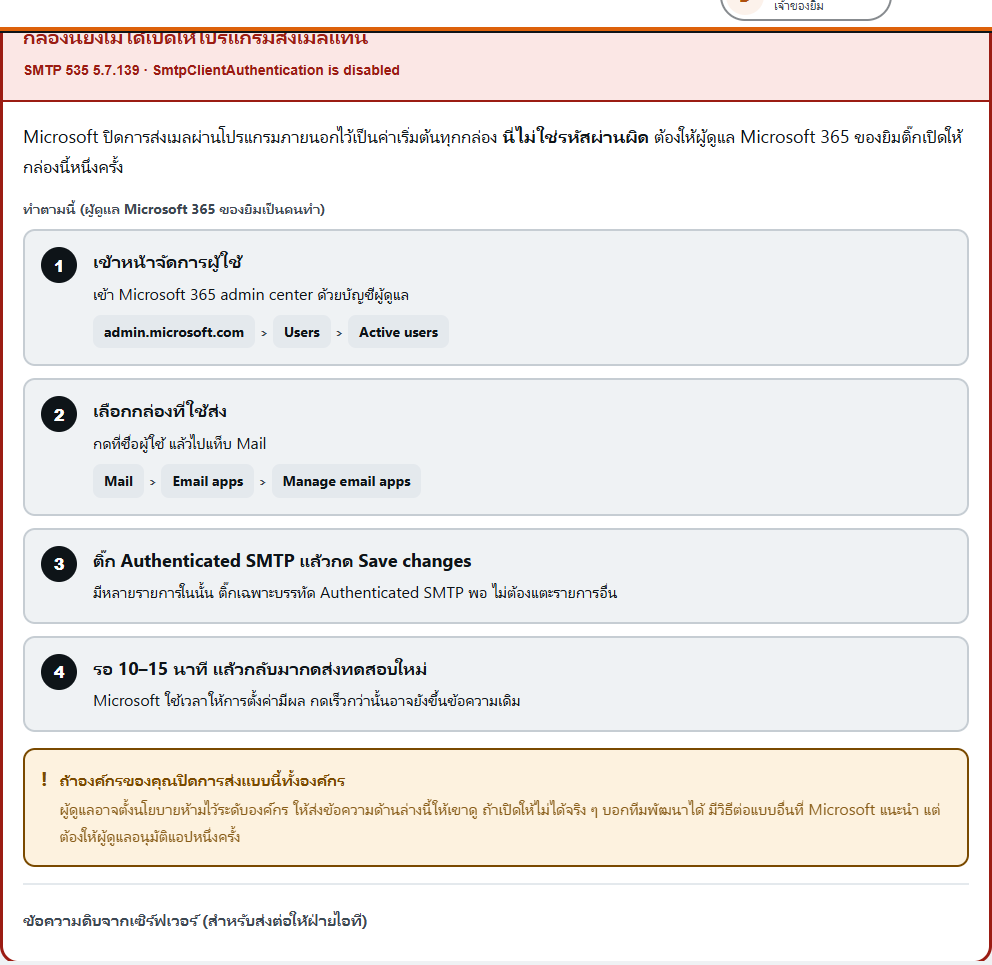

Microsoft **ปิดการส่งเมลผ่านโปรแกรมภายนอกไว้เป็นค่าเริ่มต้นทุกกล่อง** — **นี่ไม่ใช่รหัสผ่านผิด** ผู้ดูแล Microsoft 365 ของยิมต้องเปิดให้หนึ่งครั้ง:

1. เข้า **admin.microsoft.com** › Users › Active users ด้วยบัญชีผู้ดูแล
2. กดที่ชื่อผู้ใช้ของกล่องที่ใช้ส่ง → แท็บ **Mail** › Email apps › **Manage email apps**
3. **ติ๊ก Authenticated SMTP แล้วกด Save changes** — ติ๊กเฉพาะบรรทัดนี้พอ ไม่ต้องแตะรายการอื่น
4. **รอ 10–15 นาที แล้วกลับมากดส่งทดสอบใหม่** — ข้อที่คนข้ามบ่อยที่สุด กดเร็วกว่านั้นจะขึ้นข้อความเดิมแล้วเข้าใจผิดว่าทำไม่สำเร็จ

ถ้าองค์กรตั้งนโยบายห้ามไว้ทั้งองค์กร ให้ส่งข้อความดิบท้ายกล่องให้ผู้ดูแลดู · เปิดให้ไม่ได้จริง ๆ ให้บอกทีมพัฒนา มีวิธีต่อแบบอื่นที่ Microsoft แนะนำ แต่ต้องให้ผู้ดูแลอนุมัติแอปหนึ่งครั้ง

<!-- pagebreak -->

**แบบที่ 2 · Microsoft ไม่รับรหัสผ่านนี้** (`SMTP 535 5.7.3`)

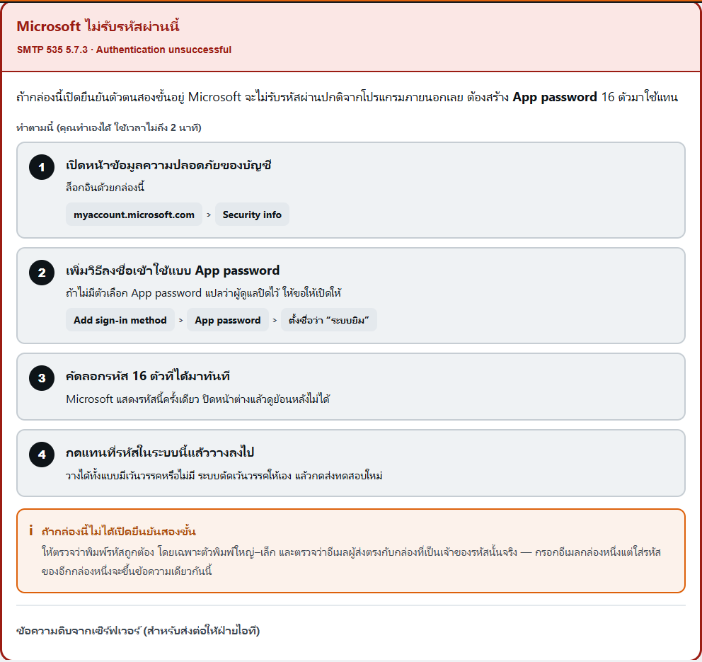

ถ้ากล่องเปิดยืนยันตัวตนสองขั้น Microsoft จะไม่รับรหัสผ่านปกติจากโปรแกรมภายนอกเลย ต้องใช้ **App password 16 ตัว** — **คุณทำเองได้ ไม่ถึง 2 นาที**

1. ล็อกอินด้วยกล่องนั้นที่ **myaccount.microsoft.com** › **Security info**
2. **Add sign-in method** › **App password** › ตั้งชื่อว่า "ระบบยิม" (ถ้าไม่มีตัวเลือกนี้ แปลว่าผู้ดูแลปิดไว้ ให้ขอเปิด)
3. **คัดลอกรหัส 16 ตัวทันที** Microsoft แสดงครั้งเดียว ปิดหน้าต่างแล้วดูย้อนหลังไม่ได้
4. กลับมากด **"แทนที่รหัส"** ในหน้านี้แล้ววางลงไป (วางทั้งที่มีเว้นวรรคได้ ระบบตัดให้เอง) → บันทึก → ส่งทดสอบใหม่

ถ้ากล่องนี้ไม่ได้เปิดสองขั้น ให้ตรวจตัวพิมพ์ใหญ่–เล็ก และตรวจว่า **อีเมลผู้ส่งกับชื่อผู้ใช้เป็นกล่องเดียวกัน** — กรอกคนละกล่องจะขึ้นข้อความเดียวกันนี้เป๊ะ

<!-- pagebreak -->

**แบบที่ 3 · ต่อเซิร์ฟเวอร์อีเมลไม่ได้** (`ETIMEDOUT / ECONNREFUSED`)

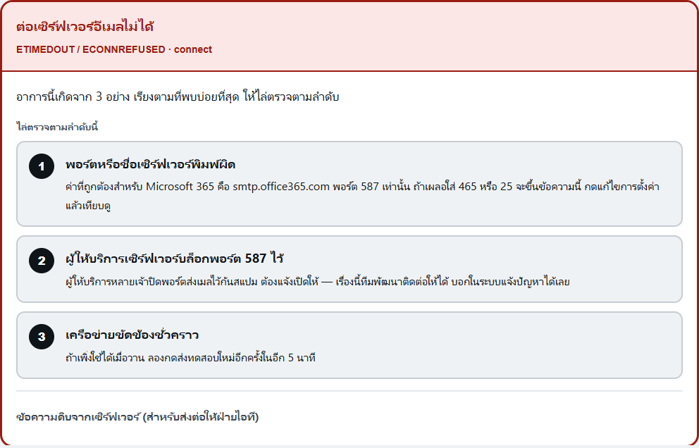

ไล่ตรวจตามลำดับนี้: **(1)** พิมพ์ชื่อเซิร์ฟเวอร์หรือพอร์ตผิด — ต้องเป็น `smtp.office365.com` พอร์ต `587` เท่านั้น ใส่ 465 หรือ 25 จะขึ้นข้อความนี้ · **(2)** ผู้ให้บริการเซิร์ฟเวอร์บล็อกพอร์ต 587 ไว้กันสแปม ต้องแจ้งเปิด — **บอกในระบบแจ้งปัญหาได้ ทีมพัฒนาติดต่อให้** · **(3)** เครือข่ายขัดข้องชั่วคราว ถ้าเมื่อวานยังใช้ได้ ลองใหม่ในอีก 5 นาที

<!-- pagebreak -->

**แบบที่ 4 · เซิร์ฟเวอร์นี้ไม่รองรับการเข้ารหัส** (`STARTTLS not supported · ไม่ได้ส่งรหัสผ่านออกไป`)

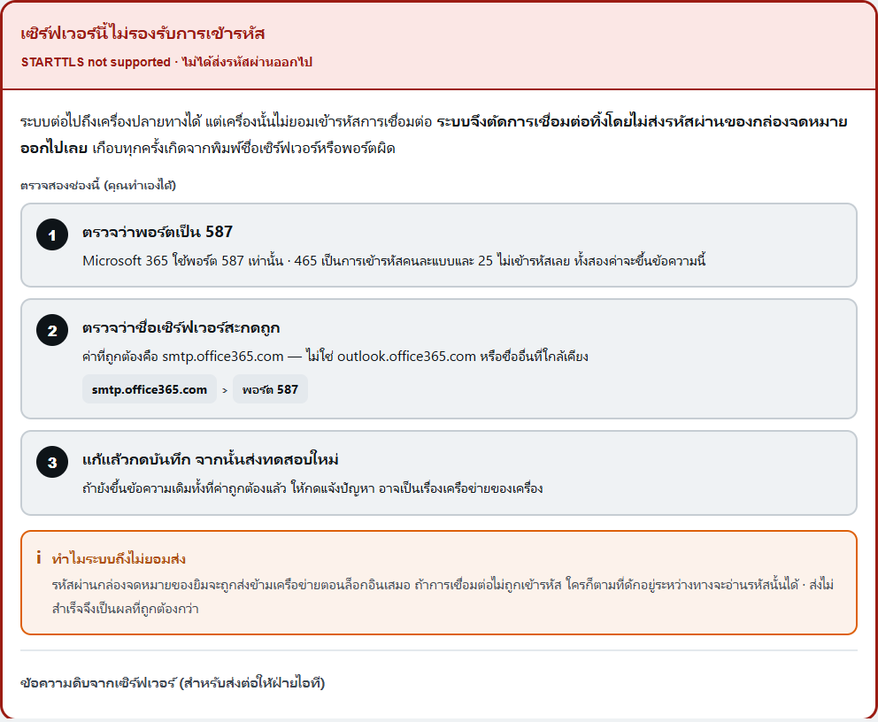

ระบบต่อไปถึงเครื่องปลายทางได้ แต่เครื่องนั้นไม่ยอมเข้ารหัสการเชื่อมต่อ **ระบบจึงตัดการเชื่อมต่อทิ้งโดยไม่ส่งรหัสผ่านของกล่องจดหมายออกไปเลย** — เกือบทุกครั้งเกิดจากพิมพ์ชื่อเซิร์ฟเวอร์หรือพอร์ตผิด **คุณแก้เองได้**

1. **ตรวจว่าพอร์ตเป็น 587** — Microsoft 365 ใช้พอร์ตนี้เท่านั้น · ใส่ 465 (เข้ารหัสคนละแบบ) หรือ 25 (ไม่เข้ารหัสเลย) จะขึ้นข้อความนี้
2. **ตรวจว่าชื่อเซิร์ฟเวอร์สะกดถูก** — ต้องเป็น `smtp.office365.com` **ไม่ใช่** `outlook.office365.com` หรือชื่ออื่นที่ใกล้เคียง
3. **แก้แล้วกดบันทึก จากนั้นส่งทดสอบใหม่** — ถ้ายังขึ้นข้อความเดิมทั้งที่ค่าถูกต้องแล้ว ให้กดแจ้งปัญหา อาจเป็นเรื่องเครือข่ายของเครื่อง

> **ทำไมระบบถึงไม่ยอมส่ง** (กล่องนี้อยู่บนจอด้วย) รหัสผ่านกล่องจดหมายของยิมจะถูกส่งข้ามเครือข่ายตอนล็อกอินเสมอ ถ้าการเชื่อมต่อไม่ถูกเข้ารหัส ใครก็ตามที่ดักอยู่ระหว่างทางจะอ่านรหัสนั้นได้ · **ส่งไม่สำเร็จจึงเป็นผลที่ถูกต้องกว่า** — อย่าพยายามหาทางปิดการเข้ารหัสเพื่อให้ส่งผ่าน

<!-- pagebreak -->

**แบบที่ 5 (พบน้อย) · ส่งไม่สำเร็จ และยังไม่ทราบสาเหตุ**

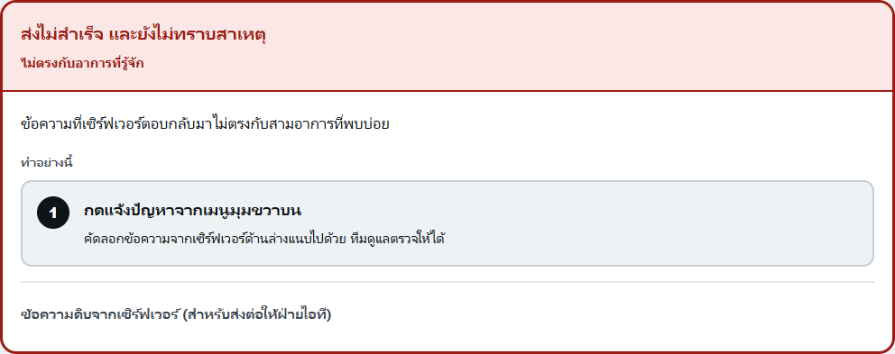

เซิร์ฟเวอร์ตอบมาไม่ตรงกับสี่อาการข้างบน ให้ **กดแจ้งปัญหาจากเมนูมุมขวาบน พร้อมคัดลอก "ข้อความดิบจากเซิร์ฟเวอร์" ท้ายกล่องแนบไปด้วย** (ข้อ 1.13) — หน้าจอนี้มีไว้เพื่อไม่ให้เจอกล่องแดงเปล่า ๆ ที่ไม่บอกว่าต้องทำอะไรต่อ

อีกแบบที่เจอได้คือ **"กล่องนี้ส่งในนามอีเมลผู้ส่งที่กรอกไว้ไม่ได้"** (`550 5.7.60`) แก้ด้วยการทำให้อีเมลผู้ส่งกับชื่อผู้ใช้เป็นกล่องเดียวกัน

#### พนักงานเห็นแท็บนี้อย่างไร

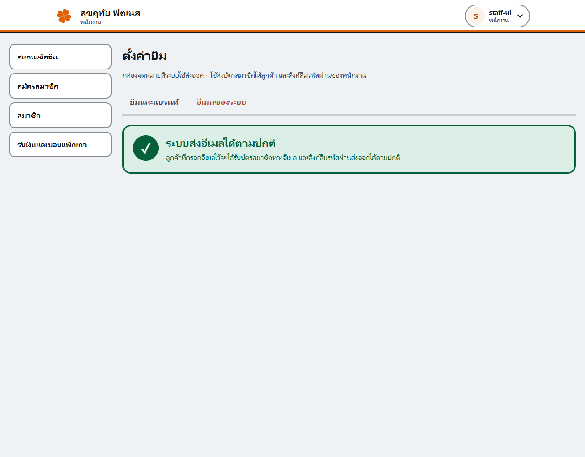

พนักงานเปิดแท็บนี้ได้ แต่เห็น **ประโยคเดียว** — *"ระบบส่งอีเมลได้ตามปกติ"* หรือ *"ระบบยังส่งอีเมลไม่ได้ · แจ้งเจ้าของยิมให้ตั้งค่าให้"* · **ไม่เห็นชื่อเซิร์ฟเวอร์ ชื่อผู้ใช้ หรืออะไรเกี่ยวกับรหัสผ่านเลย** เพราะคำถามที่พนักงานเจอหน้าเคาน์เตอร์มีข้อเดียว คือ "ลูกค้าได้บัตรทางอีเมลไหม"

<!-- pagebreak -->

### 2.6 ออกบัตรใหม่ — ใช้เมื่อบัตรหลุดไปถึงคนอื่น

เมนู "สมาชิก" → เปิดคนนั้น → **"ดูบัตร"** → กล่อง "บัตรใบนี้" → **"เมนูเพิ่มเติม"** → **"ออกบัตรใหม่"**

หน้ายืนยันจะไล่ผลลัพธ์ให้อ่านทีละข้อก่อน: บัตรใบเดิมจะสแกนไม่ผ่านอีกเลย (รวมถึงที่ลูกค้าถืออยู่) · ระบบสร้างใบใหม่ให้ทันทีโดยใช้รูปถ่ายและแพ็กเกจเดิม · **คุณต้องส่งรูปใบใหม่ให้ลูกค้า** · สิทธิ์คงเหลือและประวัติเช็คอินไม่เปลี่ยน

**ต้องเขียนเหตุผลทุกครั้ง** (มีตัวเลือกให้เลือก เช่น "ลูกค้าแจ้งว่าบัตรหลุดไปถึงคนอื่น" / "ลูกค้าทำรูปหาย ขอใหม่" / "พบการใช้บัตรซ้ำผิดปกติ") เหตุผลถูกบันทึกในประวัติเพื่อให้ตรวจย้อนหลังได้ · **การกระทำนี้ย้อนกลับไม่ได้**

> ลูกค้าแค่ทำรูปหาย ให้ใช้ "ส่งบัตรซ้ำ" (ข้อ 1.9) การออกบัตรใหม่ทุกครั้งที่ลูกค้าทำรูปหาย จะทำให้ลูกค้าที่ยังถือใบเก่าอยู่เข้ายิมไม่ได้โดยไม่จำเป็น

<!-- pagebreak -->

### 2.7 ประวัติ ยอดขาย และสลิป

**ประวัติเช็คอิน** (เมนูมุมขวาบน) — ดูว่าใครเข้ายิมเมื่อไร และใครถูกปฏิเสธเพราะอะไร กรองตามวันที่และค้นหาด้วยชื่อหรือรหัสสมาชิกได้ · มีชุด **"ไม่ถูกต้อง"** แยกไว้ต่างหากสำหรับรายการที่สแกนแล้วระบุตัวสมาชิกไม่ได้ เช่น QR ปลอมหรืออ่านไม่ออก เพื่อไม่ให้กลบประวัติการเข้าใช้จริง · ด้านล่างมีสรุปรายวัน: เข้าใช้บริการ / ซ้ำ / ถูกปฏิเสธ

**ยอดขายรายวัน** — ใช้เทียบกับรายการเงินเข้าบัญชีจริง **นับเฉพาะที่รับเงินจริง ไม่รวมแพ็กเกจที่แถมให้**

**ประวัติการรับเงิน (รายคน) — ที่เก็บสลิป** อยู่ท้ายหน้าบัตรของสมาชิกแต่ละคน: เมนู "สมาชิก" → เปิดคนนั้น → **"ดูบัตร"** → เลื่อนลงล่างสุด ไม่ต้องไปหาที่แท็บไหนอีก


- แต่ละบรรทัดบอก **แพ็กเกจ · วันเวลา · วิธีรับเงิน · ชื่อคนที่บันทึก · ยอดเงิน · สถานะ**
- มีสลิปแนบไว้จะมีปุ่ม **"ดูสลิป"** กดแล้วรูปเปิดในหน้าเดียวกัน (กดที่รูปเพื่อเปิดขนาดเต็ม) — อยู่บรรทัดเดียวกับยอดเงิน เพื่อให้เทียบรูปกับยอดได้โดยไม่ต้องสลับหน้า · รายการที่ไม่มีสลิปจะขึ้นว่า "ไม่มีสลิป"
- รายการที่แถมให้จะขึ้นยอด **0 ฿** และไม่ถูกนับเข้ายอดขาย

> **แท็บ "ตรวจสลิป" ถูกถอดออกแล้ว** (ตั้งแต่ระบบรุ่นนี้) คิวนั้นเคยไว้ตรวจสลิปที่ลูกค้าอัปโหลดเองจากแอปสมาชิก ซึ่งไม่มีอีกแล้ว ส่วนสลิปที่พนักงานแนบตอนรับเงินที่เคาน์เตอร์ ไม่ต้องอนุมัติ — บันทึกแล้วสิทธิ์ให้ทันที และเก็บไว้ที่ประวัติการรับเงินของคนนั้น · ถ้าเจอคำสั่งซื้อเก่าค้างสถานะ "รอตรวจสอบ" จากระบบเดิม จะเห็นในประวัติการรับเงินของสมาชิกคนนั้นพร้อมสลิป ถ้าตรวจแล้วว่าเขาโอนมาจริง ให้มอบแพ็กเกจให้ที่หน้า "รับเงินและมอบแพ็กเกจ" ตามปกติ

<!-- pagebreak -->

### 2.7 (ต่อ) การแก้ไขข้อมูลสมาชิก — มุมของเจ้าของยิม

**พนักงานแก้ชื่อ เบอร์ อีเมล วันเกิด และผู้ติดต่อฉุกเฉินของสมาชิกได้เอง** จากปุ่ม "แก้ไขข้อมูลสมาชิก" บนหน้าบัตร — ขั้นตอนทั้งหมดอยู่ที่ **ข้อ 1.4 (ต่อ)** ซึ่งพนักงานต้องอ่าน

**สิ่งที่คุณควรรู้ในฐานะเจ้าของยิม**

- **เปิดให้พนักงานทำได้โดยตั้งใจ** — อีเมลผิดหนึ่งตัวแปลว่าบัตร (รูป QR ที่ใช้เข้ายิมแทนตัวลูกค้า) ไปอยู่ในกล่องจดหมายคนแปลกหน้า และต้องแก้ให้จบขณะลูกค้ายังยืนอยู่ตรงนั้น · **สิ่งที่ทำให้ปลอดภัยไม่ใช่การจำกัดสิทธิ์ แต่คือบันทึกการแก้ไขที่เขียนทุกครั้ง** ว่าใครแก้อะไรเมื่อไหร่
- **การระงับสมาชิกยังเป็นของคุณคนเดียว** เพราะเป็นการตัดสินใจ ไม่ใช่การแก้คำผิด
- **ถ้าเปลี่ยนอีเมลทั้งที่ส่งบัตรไปแล้ว ระบบบังคับให้เลือก** ว่าจะ "ออกบัตรใหม่ · ฆ่าบัตรใบเดิม" หรือ "ไม่ต้องออกบัตรใหม่" — สอนพนักงานให้ถามลูกค้าก่อนเลือก **ถ้าอีเมลเดิมไม่ใช่ของลูกค้า ต้องออกบัตรใหม่เสมอ**
- หลังแก้อีเมล ระบบถือว่าอีเมลใหม่ยังไม่เคยได้รับบัตร จึงขึ้นแถบแดงบนหน้าบัตรจนกว่าจะกดส่งอีกครั้ง — ใช้แถบนี้ตามงานค้างได้
- **การเปลี่ยนอีเมลคือการเปลี่ยนบัญชีที่ลูกค้าใช้เข้า "ช่วยเล่น"** ด้วย · ล้างช่องอีเมลทิ้ง เท่ากับตัดบัญชีเดิมออกจากสมาชิกรายนั้น · ส่วน **บัตร QR รหัสสมาชิก สิทธิ์ และประวัติทั้งหมดไม่กระทบ**
- **ยังไม่มีหน้าจอให้ดูประวัติการแก้ไขจากเว็บ** ระบบเก็บไว้ในฐานข้อมูลครบทุกครั้ง ถ้าต้องการย้อนดูว่าใครแก้อะไร ขอจากทีมติดตั้งได้

<!-- pagebreak -->

### 2.8 ก่อนให้ลูกค้าจริงใช้ — รายการที่ควรทำให้ครบ

1. ตั้งรหัสผ่านของตัวเองจากลิงก์ (ข้อ 2.1) และเข้าระบบได้แล้ว
2. กรอก **ข้อมูลยิม** ให้ครบ — ชื่อ อำเภอ/จังหวัด เบอร์โทร และเลือกว่าจะให้เบอร์ไหนขึ้นบนบัตร **ทำก่อนออกบัตรใบแรก** เพราะข้อมูลนี้ถูกวาดลงบนรูปบัตรที่ส่งให้ลูกค้า
3. **อัปโหลดโลโก้และเลือกสีของยิมที่หน้า "ตั้งค่ายิม" ก่อนออกบัตรใบแรก** (ข้อ 2.5) — บัตรที่ส่งเข้าแชตลูกค้าไปแล้วจะไม่เปลี่ยนตามเมื่อแก้สีทีหลัง ต้องส่งใหม่ให้ทีละคน · ทำครั้งเดียวตอนนี้ง่ายกว่ามาก
4. ตั้ง **แพ็กเกจและราคา** ให้ครบทุกตัวที่ขายจริง แล้ว **กดเปิดขาย** (แพ็กเกจที่ไม่มีราคา หรือยังเป็น "ร่าง" จะไม่ขึ้นให้พนักงานเลือก)
5. ตั้งค่า **"สแกนซ้ำภายในกี่นาที"** และ **เวลาเปิดทำการ**
6. **ตั้งค่าแท็บ "อีเมลของระบบ" แล้วกดส่งเมลทดสอบจนขึ้นเขียว** (ข้อ 2.5 ต่อ) — เผื่อเวลาไว้ เพราะถ้าติด Authenticated SMTP ต้องรอ Microsoft 10–15 นาที · **ทำก่อนวันเปิดจริง ไม่ใช่เช้าวันนั้น** · ยังไม่ตั้งก็เปิดร้านได้ แต่ลูกค้าจะไม่ได้บัตรทางอีเมลและพนักงานกด "ลืมรหัสผ่าน" แล้วจะไม่มีเมลออก
7. ไปเปิดกล่องจดหมายจริง ดูว่าเมลทดสอบถึง **และถ้าอยู่ในจดหมายขยะให้ย้ายมากล่องหลัก** — บัตรของลูกค้าเดินเส้นทางเดียวกัน
8. สร้าง **บัญชีพนักงาน** ให้คนที่ยืนเคาน์เตอร์ แล้วให้เขาตั้งรหัสเองจาก **"สร้างลิงก์ตั้งรหัสผ่าน"** (ข้อ 2.2) · บอกเขาด้วยว่าเปลี่ยนรหัสเองได้จากเมนูมุมขวาบน
9. **ซ้อมกับพนักงานจริง 1 รอบ**: สมัครสมาชิกตัวอย่าง 1 คน → ส่งบัตรเข้า LINE จริง → ให้เปิดรูปจากมือถือแล้วสแกนจริง → ต่ออายุ 1 ครั้ง → ลอง "ส่งบัตรซ้ำ" และ **อธิบายให้ชัดว่าต่างจาก "ออกบัตรใหม่" อย่างไร**
10. **สอนพนักงานเรื่องแก้ข้อมูลสมาชิก** (ข้อ 1.4 ต่อ) — โดยเฉพาะว่าถ้าแก้อีเมลแล้วระบบถามเรื่องออกบัตรใหม่ **ต้องถามลูกค้าก่อนว่าอีเมลเดิมเป็นของเขาหรือเปล่า** ลองแก้ชื่อสมาชิกตัวอย่าง 1 ครั้งให้เขาเห็นหน้าจอจริง
11. ชี้ให้พนักงานเห็นกล่อง **"รูปถ่ายของสมาชิก"** ใต้รูปบัตร และบอกว่าถ้าบัตรขึ้นเป็นภาพเงา ให้ถ่ายใหม่ตรงนั้น **ไม่ใช่กดออกบัตรใหม่** (ข้อ 1.5)
12. บอกพนักงานเรื่องการต่ออายุว่า **นับวันใหม่จากวันที่กดบันทึก** และให้อ่านบรรทัด "หมดอายุเดิม → หมดอายุใหม่" ให้ลูกค้าฟังก่อนกด (ข้อ 1.9)
13. ให้พนักงานลอง **แจ้งปัญหา** 1 ครั้งจากหน้าจอจริง แล้วคุณเปิดดูที่ "เรื่องที่แจ้งไว้" (ข้อ 2.9) — ซ้อมครั้งเดียวพอ แต่ต้องซ้อม ไม่งั้นวันที่มีปัญหาจริงจะไม่มีใครกด
14. บอกพนักงานว่า **คู่มือเล่มนี้เปิดได้จากเมนูมุมขวาบน → "คู่มือการใช้งาน"** ไม่ต้องหาไฟล์ในไลน์
15. ลบสมาชิกตัวอย่างหรือทำเครื่องหมายไว้ ไม่ให้ปนกับข้อมูลจริง

<!-- pagebreak -->

**สองข้อที่ต้องลองกับของจริง ทำแทนกันไม่ได้**

- **ส่งบัตรทาง LINE จริงแล้วสแกนกลับ** — กด "บันทึกรูปบัตร" แล้วส่งไฟล์นั้นให้ตัวเองทาง LINE **แบบรูปปกติ (ไม่ใช่ส่งเป็นไฟล์)** เปิดจากแชตบนอีกเครื่องแล้วสแกน ลองทั้งเต็มจอและตอนหรี่แสงจอ ถ้าอ่านไม่ออกให้แจ้งทีมทันที เพราะนี่คือทางที่ลูกค้าจะได้บัตรจริง
- **เปิดกล้องบนเครื่องที่จะใช้จริง** — เปิดหน้า "สแกนเช็คอิน" บนมือถือ แท็บเล็ต และคอมที่มีเว็บแคมที่ยิมจะใช้ กด "เปิดกล้อง" ดูว่าขออนุญาตแล้วภาพขึ้น และลองกดปฏิเสธสิทธิ์กล้องหนึ่งครั้งเพื่อดูว่าปุ่ม "พิมพ์รหัสเอง" ใช้แทนได้ (ข้อ 1.8)

<!-- pagebreak -->

### 2.9 เรื่องที่แจ้งไว้ — อ่านปัญหาที่พนักงานกดแจ้ง

เมนูมุมขวาบน → **"เรื่องที่แจ้งไว้"** (เฉพาะเจ้าของยิม) รวมทุกเรื่องที่พนักงานกดแจ้งจากหน้าจอ พร้อมภาพตอนที่กด


**สถานะมี 4 แบบ** กรองด้านบนได้

| สถานะ | ใช้เมื่อ |
|---|---|
| **ใหม่** | ยังไม่มีใครอ่าน — เรื่องใหม่ขอบหนาให้สังเกตได้ |
| **กำลังดู** | รับเรื่องแล้ว กำลังหาทางแก้หรือส่งต่อทีม |
| **แก้แล้ว** | จบแล้ว |
| **ไม่ใช่ปัญหา** | เข้าใจผิด ใช้งานถูกอยู่แล้ว หรือแจ้งซ้ำ |

**เปิดดูรายละเอียด** กด "เปิดดู" จะเห็น **เลขเรื่อง · เวลาที่แจ้ง · ผู้แจ้ง · หน้าที่เกิด · สิ่งที่ผู้แจ้งเขียนมา · ภาพหน้าจอตอนที่กด**


ในกล่อง **"จัดการเรื่องนี้"** เปลี่ยน **สถานะ** ได้ และเขียน **"บันทึกภายใน"** ไว้เตือนตัวเองหรือบอกทีม — **ผู้แจ้งไม่เห็นข้อความนี้** · ปุ่ม **"ลบเรื่องนี้"** อยู่ล่างสุด **ลบแล้วภาพหน้าจอถูกลบออกจากเครื่องด้วย ย้อนกลับไม่ได้**

> **ภาพหน้าจออาจติดชื่อและรูปของสมาชิก** ระบบจึงเปิดให้ **เฉพาะบัญชีเจ้าของยิม** ดูได้ พนักงานที่เป็นคนแจ้งเองก็เปิดดูรายการนี้ไม่ได้ · และ **ระบบบันทึกทุกครั้งที่มีคนเปิดดูภาพ** ว่าใครเปิดเมื่อไร — เปิดดูเท่าที่จำเป็นต่อการแก้ปัญหา และลบเรื่องที่จบแล้วเป็นระยะ · เรื่องที่ไม่มีภาพจะบอกว่า "เรื่องนี้ไม่มีภาพ — จับภาพไม่สำเร็จ หรือผู้แจ้งเลือกไม่ส่งภาพมา"

**ของเก่าไม่ต้องเก็บไว้ตลอด** ระบบล้างเรื่องและภาพที่เก่ากว่า **180 วัน** ให้เองทุกวัน — ถ้าอยากให้เก็บสั้นหรือยาวกว่านี้ บอกทีมได้

<!-- pagebreak -->

### 2.10 เครื่องและโปรแกรมใน "ช่วยเล่น" — หน้าจอของเจ้าของยิม

**ตั้งค่ายิม → แท็บ "เครื่องและโปรแกรม"** (เฉพาะเจ้าของยิม พนักงานไม่เห็นแท็บนี้) — ทุกอย่างที่สมาชิกอ่านในพอร์ทัลและบนหน้าที่เปิดจาก QR ข้างเครื่อง แก้ได้จากหน้านี้เอง **ไม่ต้องรอทีมพัฒนา**

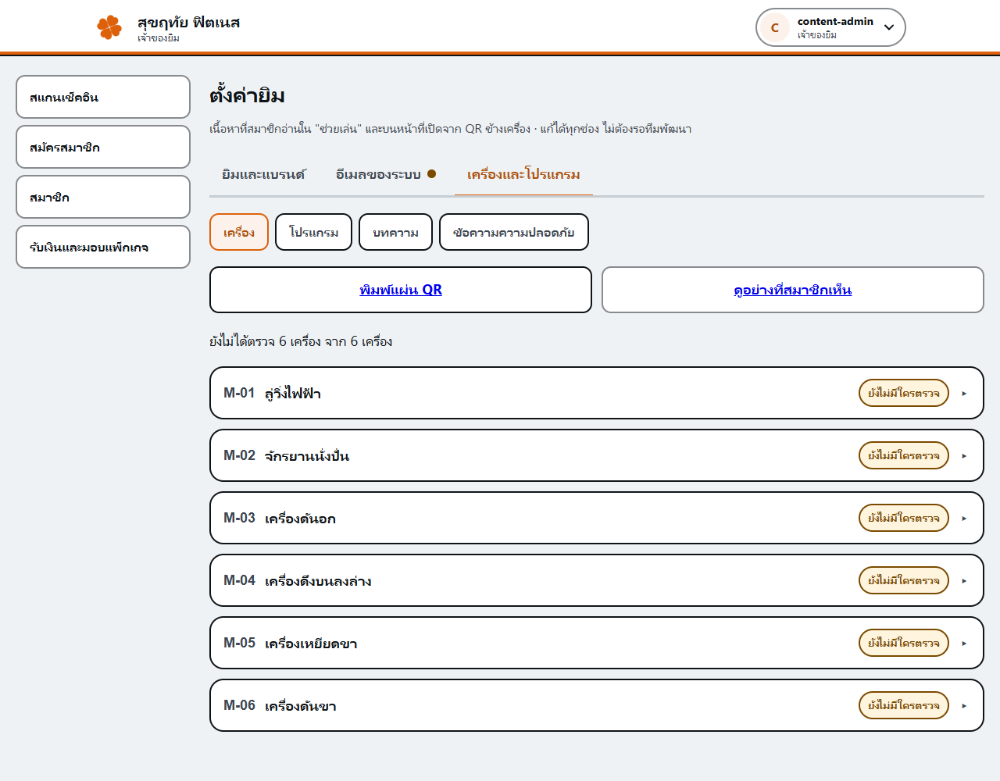

**สี่ส่วนบนสุด** — เครื่อง · โปรแกรม · บทความ · ข้อความความปลอดภัย · ใต้ปุ่มมีบรรทัดสรุปว่า **"ยังไม่ได้ตรวจ N เครื่อง จาก M เครื่อง"** ใช้ไล่งานได้ว่าเหลืออะไร

**ปุ่มลัดสองปุ่ม** — **"พิมพ์แผ่น QR"** (ข้อ 2.10 ต่อ) และ **"ดูอย่างที่สมาชิกเห็น"** ที่เปิดพอร์ทัลในแท็บใหม่ ใช้ตรวจหลังแก้ทุกครั้ง

**รายการปิดอยู่เสมอจนกว่าจะกดกาง** แต่ละแถวบอกสองอย่าง: รหัสกับชื่อเครื่อง และ **ป้ายว่า "ยังไม่มีใครตรวจ" หรือ "ตรวจแล้วโดย (อีเมล)"**

<!-- pagebreak -->

#### 2.10 (ต่อ 1) แก้เนื้อหาเครื่องทีละเครื่อง

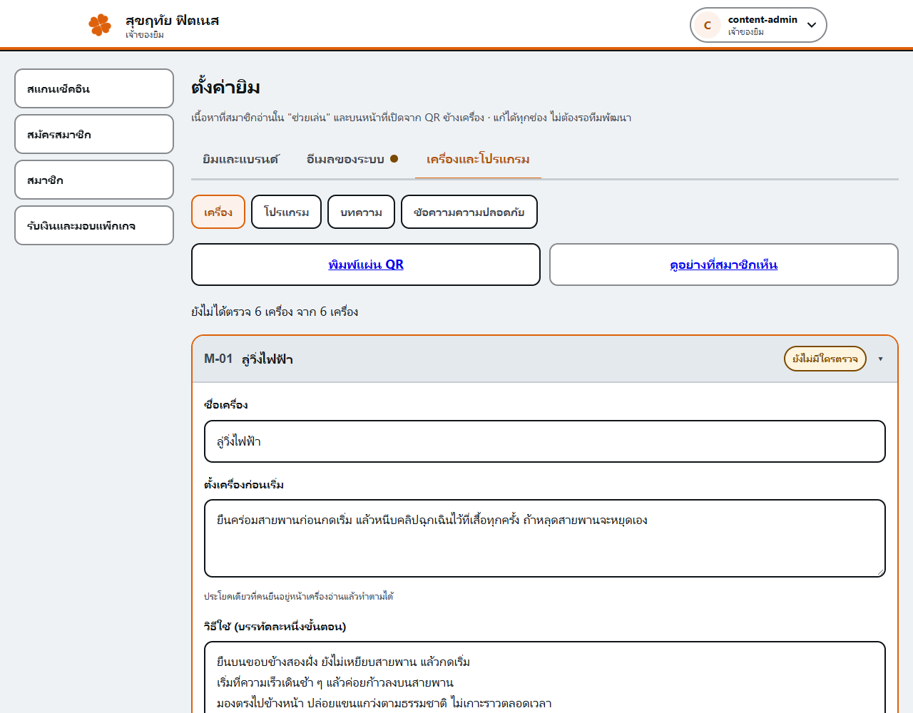

กดที่แถวเพื่อกาง แล้วแก้ได้ทุกช่อง:

| ช่อง | ใส่อะไร |
|---|---|
| **ชื่อเครื่อง** | ชื่อที่ลูกค้าเรียก ไม่ใช่ชื่อรุ่นของผู้ผลิต |
| **ตั้งเครื่องก่อนเริ่ม** | ประโยคเดียวที่คนยืนอยู่หน้าเครื่องอ่านแล้วทำตามได้ |
| **วิธีใช้** | **บรรทัดละหนึ่งขั้นตอน** สูงสุด 12 ข้อ — ขึ้นบรรทัดใหม่คือข้อถัดไป |
| **ข้อควรระวัง** | บรรทัดละหนึ่งข้อ |
| **ควรหนักแค่ไหน** | **วิธีให้ลูกค้าหาน้ำหนักเอง ไม่ใช่ตัวเลขตายตัว** — คนละคนกันน้ำหนักไม่เท่ากัน |
| **คลิปวิดีโอ** | ลิงก์ YouTube + ชื่อคลิป + ชื่อช่อง · **ปล่อยว่างได้ หน้าเครื่องจะไม่มีส่วนคลิป** |
| **รูปเครื่อง** | รูปที่ขึ้นบนหน้าที่ลูกค้าเปิดจาก QR |

**เปลี่ยนคลิปเมื่อไหร่** คลิปเป็นของช่องอื่นบน YouTube **เจ้าของช่องลบเมื่อไหร่ก็ได้** ถ้าลูกค้าแจ้งว่าเปิดไม่ได้ ให้วางลิงก์ใหม่ตรงช่องนี้แล้วกดบันทึก — วางลิงก์จากแถบที่อยู่ของ YouTube ได้ทุกแบบ

<!-- pagebreak -->

#### 2.10 (ต่อ 2) อัปโหลดรูปเครื่อง และปุ่ม "ตรวจแล้ว"

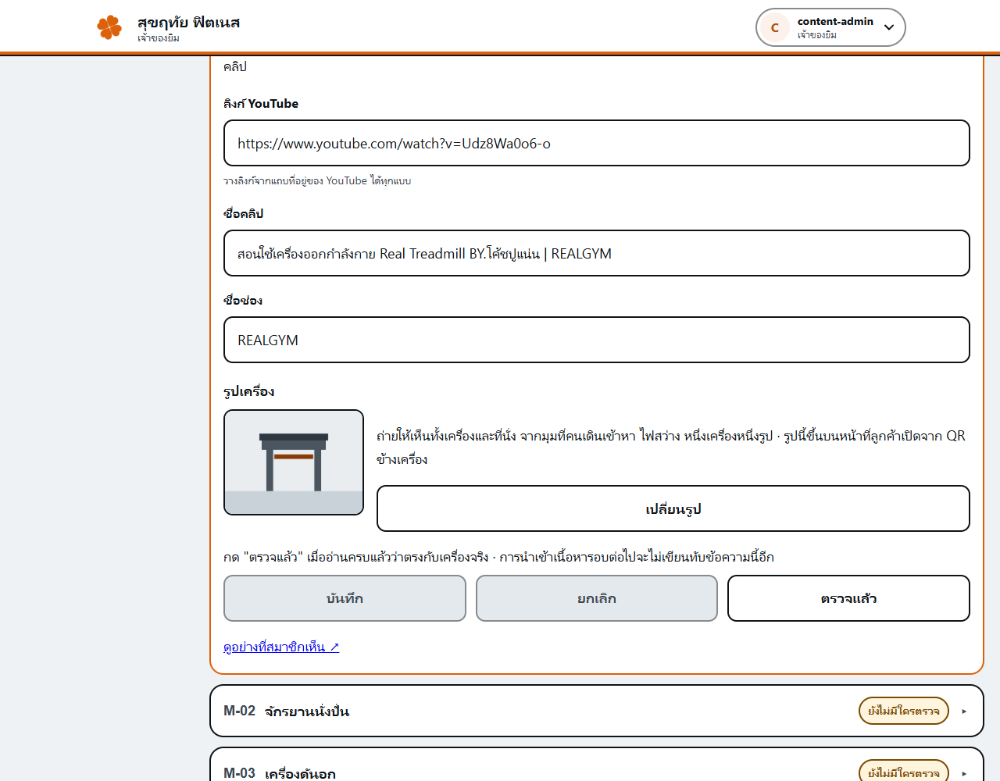

**อัปโหลดรูปเครื่อง** กด **"เปลี่ยนรูป"** (หรือ "เลือกรูปจากเครื่อง" ถ้ายังไม่มีรูป) แล้วเลือกไฟล์จากมือถือหรือคอม — รูปขึ้นทันทีเมื่ออัปโหลดเสร็จ ไม่ต้องกดบันทึกซ้ำ

> **ถ่ายอย่างไรให้ใช้ได้** ให้เห็น **ทั้งเครื่องและที่นั่ง** จากมุมที่คนเดินเข้าหา · ไฟในยิมสว่าง ไม่ต้องจัดฉาก · **หนึ่งเครื่องหนึ่งรูป** · ถ่ายด้วยมือถือก็พอ · รูปนี้ขึ้นบนหน้าที่ลูกค้าเปิดจาก QR ข้างเครื่อง จึงควรเป็นเครื่องจริงของยิม ไม่ใช่รูปจากอินเทอร์เน็ต

**ปุ่มท้ายแถวมีสามปุ่ม: บันทึก · ยกเลิก · ตรวจแล้ว**

- **"บันทึก"** เก็บสิ่งที่แก้ · **"ยกเลิก"** ทิ้งสิ่งที่แก้แล้วปิดแถว
- **"ตรวจแล้ว"** กดเมื่ออ่านครบแล้วว่าตรงกับเครื่องจริงของยิม → ป้ายเปลี่ยนเป็น **"ตรวจแล้วโดย (อีเมลของคุณ)"** พร้อมวันที่ · **และการนำเข้าเนื้อหารอบต่อไปจะไม่เขียนทับข้อความนี้อีก** — นี่คือสิ่งที่ปุ่มนี้ทำจริง ไม่ใช่แค่ติ๊กให้สวย
- ใต้ปุ่มมีลิงก์ **"ดูอย่างที่สมาชิกเห็น ↗"** เปิดหน้านั้นในแท็บใหม่เพื่อตรวจของจริง

<!-- pagebreak -->

#### 2.10 (ต่อ 3) โปรแกรม บทความ และข้อความความปลอดภัย

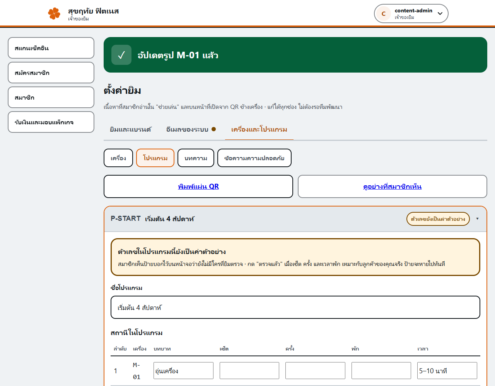

<!-- pagebreak -->

#### 2.10 (ต่อ 3ก) โปรแกรม — หกบรรทัดที่สมาชิกอ่านก่อนเริ่ม

**โปรแกรม — เริ่มที่กลุ่ม "โปรแกรมนี้คืออะไร" หกช่อง**

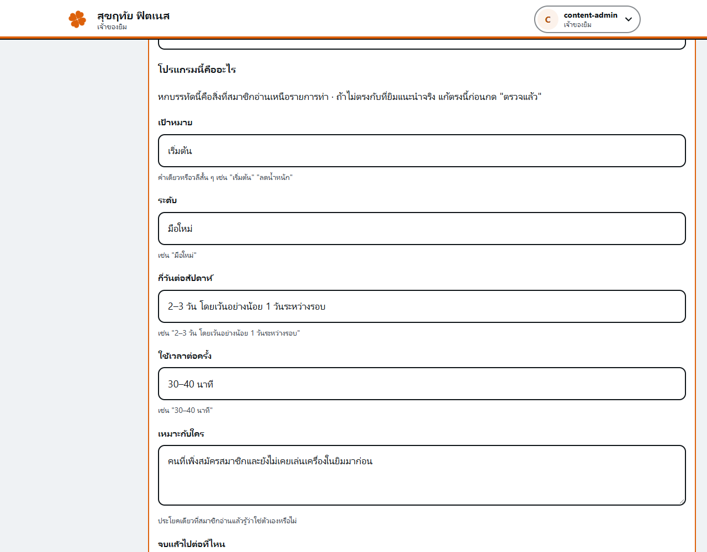

| ช่อง | ใส่อะไร |
|---|---|
| **เป้าหมาย** | คำเดียวหรือวลีสั้น ๆ เช่น "เริ่มต้น" "ลดน้ำหนัก" |
| **ระดับ** | เช่น "มือใหม่" |
| **กี่วันต่อสัปดาห์** | เช่น "2–3 วัน โดยเว้นอย่างน้อย 1 วันระหว่างรอบ" |
| **ใช้เวลาต่อครั้ง** | เช่น "30–40 นาที" |
| **เหมาะกับใคร** | ประโยคเดียวที่สมาชิกอ่านแล้วรู้ว่าใช่ตัวเองหรือไม่ |
| **จบแล้วไปต่อที่ไหน** | บอกให้ชัดว่าให้ปรึกษาพนักงานก่อนหรือไม่ |

**หกบรรทัดนี้คือสิ่งที่สมาชิกอ่านเหนือรายการท่า** — เป็นคำแนะนำในนามของยิม ไม่ใช่ข้อความที่ทีมเขียนมาให้เฉย ๆ · **ถ้าไม่ตรงกับที่ยิมแนะนำจริง แก้ให้ตรงก่อนกด "ตรวจแล้ว"** เพราะ **กดแล้วการนำเข้าเนื้อหารอบต่อไปจะไม่เขียนทับข้อความชุดนี้อีก** — สิ่งที่ค้างผิดไว้ตอนกด จะค้างผิดต่อไป

<!-- pagebreak -->

#### 2.10 (ต่อ 3ข) ตารางสถานี บทความ และข้อความความปลอดภัย

**โปรแกรม** — ตารางสถานีเรียงตามลำดับ แก้ได้ทั้ง **เครื่อง · บทบาท · เซ็ต · ครั้ง · พัก · เวลา** · เว้นช่องว่างได้ (เครื่องคาร์ดิโอมักใส่แค่ "เวลา" ส่วนเครื่องมีน้ำหนักใส่เซ็ตกับครั้ง) · มีช่อง "เพิ่มน้ำหนักเมื่อไหร่" และ "หมายเหตุจากเทรนเนอร์"

> **จนกว่าจะกด "ตรวจแล้ว" สมาชิกเห็นป้าย "ตัวเลขเป็นค่าตัวอย่าง"** บนหน้าจอของเขา — ป้ายนี้หายทันทีที่คุณกด และหายเพราะ **คุณ** ยืนยันว่าเซ็ต ครั้ง และเวลาพักเหมาะกับลูกค้าของยิมนี้จริง ไม่ใช่เพราะทีมเขียนมาให้ · **ถ้ายังไม่แน่ใจ อย่าเพิ่งกด** ป้ายนั้นทำหน้าที่ของมันได้ดีกว่าตัวเลขที่ไม่มีใครรับรอง

**บทความ** — แก้ชื่อเรื่องและเนื้อหาได้ **บรรทัดละหนึ่งย่อหน้า** · มีปุ่ม "ตรวจแล้ว" เหมือนกัน

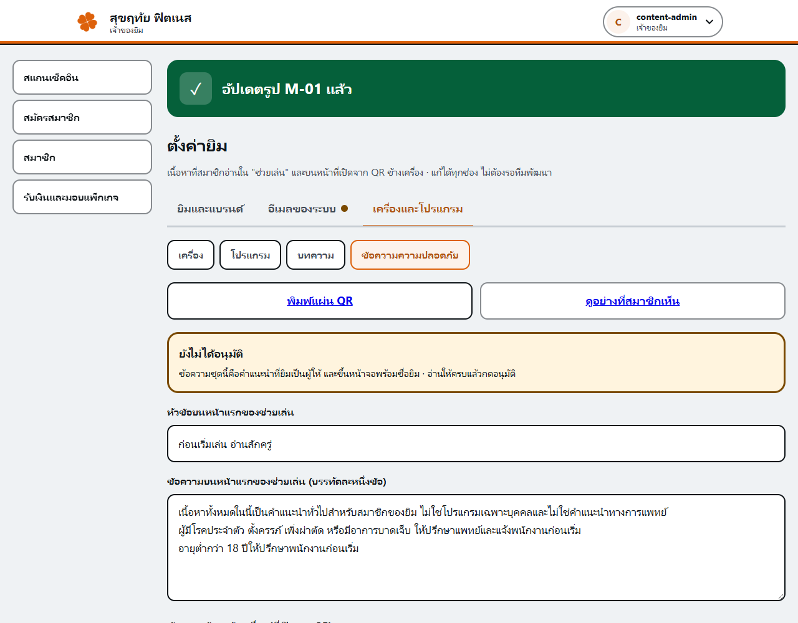

**ข้อความความปลอดภัย** — สามชุด: **หน้าแรกของช่วยเล่น · ท้ายหน้าเครื่องที่เปิดจาก QR · ก่อนเริ่มโปรแกรม**

- ข้อความชุดนี้ **ขึ้นหน้าจอพร้อมชื่อยิม** จึงเป็นคำแนะนำที่ยิมเป็นผู้ให้ ไม่ใช่ของทีมพัฒนา
- อ่านให้ครบแล้วกด **"อนุมัติข้อความชุดนี้"** — ระบบ **บันทึกชื่อผู้อนุมัติและวันที่ไว้เป็นหลักฐาน** ว่ายิมตรวจแล้ว
- แก้ข้อความเองได้ทุกบรรทัดก่อนอนุมัติ · แก้ทีหลังก็ได้ แล้วกดอนุมัติใหม่

**ลำดับที่แนะนำสำหรับรอบแรก** เปิดทีละเครื่อง → อ่าน → แก้ให้ตรงกับเครื่องจริง → อัปโหลดรูป → กด "ตรวจแล้ว" → ทำครบ 6 เครื่องแล้วค่อยไปที่โปรแกรม บทความ และข้อความความปลอดภัย · **ใช้บรรทัด "ยังไม่ได้ตรวจ N เครื่อง" เป็นตัวนับงานที่เหลือ**

<!-- pagebreak -->

#### 2.10 (ต่อ 4) พิมพ์แผ่น QR ติดเครื่อง

กดปุ่ม **"พิมพ์แผ่น QR"** ที่หัวแท็บ (หรือเปิด `https://srv1979069.hstgr.cloud/api/machines/qr-sheet` ขณะล็อกอินเป็นเจ้าของยิม)

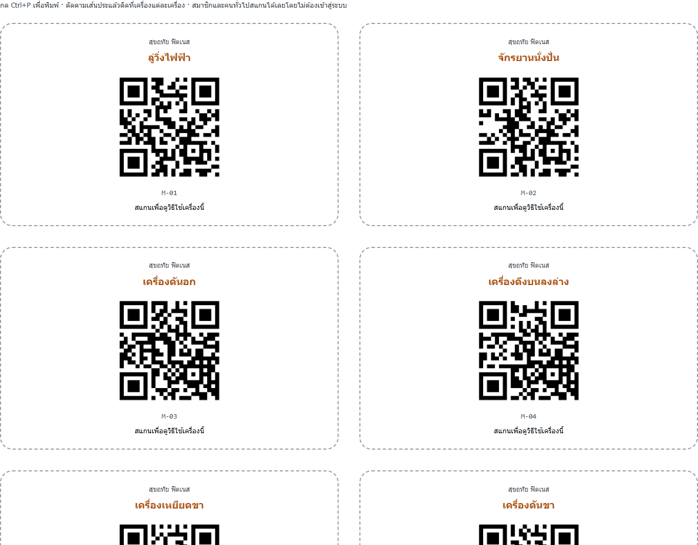

- ได้หน้ากระดาษ A4 การ์ดเครื่องละใบ มี **ชื่อเครื่อง · QR · รหัสเครื่อง (M-01 ถึง M-06)** · **กด Ctrl+P เพื่อพิมพ์** แล้วตัดตามเส้นประ
- ติดที่เครื่องในระดับสายตา ตรงที่คนยืนอ่านได้โดยไม่ต้องก้ม · เคลือบพลาสติกหรือใส่ซองใสจะอยู่ได้นานกว่า
- **QR ชี้ไปที่หน้าเครื่องซึ่งเปิดได้โดยไม่ต้องล็อกอิน** ใครสแกนก็เห็นวิธีใช้เครื่องนั้น — ตั้งใจให้เป็นแบบนี้ เพราะคนที่ยังไม่เป็นสมาชิกก็ควรอ่านวิธีใช้เครื่องที่เขากำลังจะขึ้นได้
- พิมพ์ใหม่เมื่อ **เปลี่ยนชื่อยิม เปลี่ยนสี เปลี่ยนชื่อเครื่อง หรือเพิ่ม/ย้ายเครื่อง** — แผ่นนี้สร้างสดจากข้อมูลล่าสุดทุกครั้งที่เปิด
- **ถ้าเปิดแล้วเจอหน้าเข้าสู่ระบบ** แปลว่าเซสชันหมดอายุ ให้ล็อกอินก่อนแล้วกดปุ่มนี้ใหม่

<!-- pagebreak -->

## ภาคผนวก ก · ข้อความบนจอที่พบบ่อย

| ข้อความ | อยู่ที่ไหน | ความหมาย |
|---|---|---|
| อีเมลหรือรหัสผ่านไม่ถูกต้อง เหลืออีก N ครั้งก่อนถูกล็อก 15 นาที | หน้าเข้าสู่ระบบ | เข้าไม่ได้ ไม่ว่าด้วยเหตุใด · ครบ 5 ครั้งจะถูกล็อก 15 นาที |
| บัญชีนี้ถูกระงับ กรุณาติดต่อผู้ดูแลระบบ | หน้าเข้าสู่ระบบ | เจ้าของยิมปิดบัญชีไว้ |
| ลิงก์นี้ใช้ไม่ได้แล้ว | หน้าตั้งรหัสผ่านจากลิงก์ | หมดอายุ (ลิงก์จาก "ลืมรหัสผ่าน" 30 นาที · ลิงก์ที่เจ้าของยิมสร้าง 24 ชม.) ถูกใช้ไปแล้ว หรือมีลิงก์ใหม่ออกทับ — ขอลิงก์ใหม่ |
| ยังไม่มีรูปถ่ายของสมาชิกรายนี้ | หน้าบัตรสมาชิก | ไม่เคยถ่ายรูปไว้ บัตรออกได้แต่เทียบหน้าตอนสแกนไม่ได้ ควรถ่ายเพิ่ม |
| รูปถ่ายของสมาชิกรายนี้ใช้ไม่ได้ กรุณาถ่ายใหม่ | หน้าบัตรสมาชิก | ไฟล์รูปเสีย บัตรขึ้นเป็นภาพเงา ถ่ายใหม่ที่กล่องด้านล่าง **ไม่ต้องออกบัตรใหม่** (ข้อ 1.5) |
| ไฟล์รูปนี้เปิดไม่ได้ อาจอัปโหลดไม่ครบหรือไฟล์เสียหาย… | ตอนถ่าย/เลือกรูป | ระบบไม่รับไฟล์นี้ ถ่ายใหม่หรือเลือกไฟล์อื่น แล้วกดบันทึกต่อได้ ไม่เกิดสมาชิกซ้ำ |
| บันทึกรูปถ่ายใหม่แล้ว บัตรใบเดิมยังใช้ได้ ไม่ต้องออกใหม่ | หน้าบัตรสมาชิก | เปลี่ยนรูปสำเร็จ QR และเลขที่บัตรไม่เปลี่ยน |
| ลิงก์ดาวน์โหลดบัตรใบเดิม ใช้ได้ถึง … | หน้าบัตรสมาชิก | ลิงก์ส่งบัตรซ้ำ 7 วัน **เป็นบัตรใบเดิม ไม่ใช่ใบใหม่** |
| ออกบัตรใหม่แล้ว บัตรใบเดิมใช้ไม่ได้ทันที | หน้าบัตรสมาชิก | ต้องส่งรูปใบใหม่ให้ลูกค้าทันที |

<!-- pagebreak -->

## ภาคผนวก ก (ต่อ)

| ข้อความ | อยู่ที่ไหน | ความหมาย |
|---|---|---|
| พร้อมสแกน | จอสแกน | ยังไม่มีใครเช็คอิน ให้ลูกค้ายื่นบัตรเข้ากรอบได้ |
| เช็คอินไปแล้วเมื่อไม่นานนี้ ไม่ได้หักสิทธิ์ซ้ำ | จอสแกน | สแกนซ้ำในช่วงเวลาที่ตั้งไว้ ให้เข้าได้ตามปกติ · **แถบเป็นสีกลาง ไม่ใช่สีแดง** ไม่ใช่การปฏิเสธ (ข้อ 1.7) |
| บัตรใบนี้ถูกยกเลิกแล้ว กรุณาส่งบัตรใบใหม่ให้สมาชิก | จอสแกน | มีการออกบัตรใหม่ · ถ้าลูกค้ายืนยันว่าไม่เคยได้รับ **ให้แจ้งเจ้าของยิม** |
| แพ็กเกจหมดอายุหรือใช้ครบจำนวนครั้งแล้ว | จอสแกน | พาไปต่ออายุที่ "รับเงินและมอบแพ็กเกจ" ไม่ต้องออกบัตรใหม่ |
| แพ็กเกจนี้ยังไม่ได้เปิดขาย กรุณาเปิดขายก่อนที่หน้าแพ็กเกจ หรือเลือกแพ็กเกจอื่น | หน้ารับเงิน / หน้าสมัคร | แพ็กเกจยังเป็น "ร่าง" — เลือกตัวอื่น หรือให้เจ้าของยิมกดเปิดขาย (ข้อ 1.9, 2.3) |
| แพ็กเกจนี้ปิดการขายไปแล้ว กรุณาเลือกแพ็กเกจอื่น หรือเปิดขายอีกครั้งที่หน้าแพ็กเกจ | หน้ารับเงิน / หน้าสมัคร | เจ้าของยิมเลิกขายราคานี้แล้ว — เลือกแพ็กเกจปัจจุบันแทน **สิทธิ์ที่ลูกค้าถืออยู่ไม่กระทบ** |
| แพ็กเกจนี้ยังไม่ได้กำหนดราคา กรุณากรอกราคาก่อน | หน้ารับเงิน / หน้าสมัคร | ให้เจ้าของยิมกรอกราคาที่หน้า "แพ็กเกจ" ก่อน |
| บันทึกการตั้งค่ายิมแล้ว · บัตรใบใหม่ทุกใบจะใช้สีนี้ | ตั้งค่ายิม | บันทึกสำเร็จ · บัตรที่ส่ง LINE ไปแล้วยังเป็นใบเก่า (ข้อ 2.5) |
| อัปโหลดโลโก้ไม่สำเร็จ · ไฟล์โลโก้ใหญ่เกิน 2 MB กรุณาย่อรูปก่อนอัปโหลด | ตั้งค่ายิม | ย่อรูปแล้วอัปโหลดใหม่ · **โลโก้เดิมไม่หาย** |
| ไฟล์โลโก้นี้เปิดไม่ได้ อาจอัปโหลดไม่ครบหรือไฟล์เสียหาย… | ตั้งค่ายิม | เลือกไฟล์ PNG หรือ JPG อีกไฟล์ · โลโก้เดิมยังอยู่ |
| มีคนแก้ตั้งค่ายิมไปแล้วระหว่างที่คุณเปิดหน้านี้ กรุณาโหลดหน้าใหม่แล้วลองอีกครั้ง | ตั้งค่ายิม | อีกเครื่องกดบันทึกไปก่อน โหลดหน้าใหม่แล้วแก้ซ้ำ |
| เบราว์เซอร์ไม่ให้ใช้กล้อง | จอสแกน | ใช้ "พิมพ์รหัสเอง" ทำงานต่อได้ทันที (ข้อ 1.8) |
| เชื่อมต่อเซิร์ฟเวอร์ไม่ได้ | ทุกหน้า | เน็ตหลุด ข้อมูลไม่หาย กดลองใหม่ได้ |
| ระบบขัดข้อง กรุณาลองใหม่อีกครั้ง (พร้อมรหัสอ้างอิง) | ทุกหน้า | **จดรหัสอ้างอิงกับเวลาไว้** แล้วแจ้งทีมติดตั้ง |

<!-- pagebreak -->

## ภาคผนวก ก (ต่อ 2)

| ข้อความ | อยู่ที่ไหน | ความหมาย |
|---|---|---|
| กำลังจับภาพหน้าจอ… | กล่องแจ้งปัญหา | ระบบจับภาพก่อนเปิดกล่องเสมอ รอแป๊บเดียว (ข้อ 1.13) |
| ส่งเรื่องแล้ว · เรื่อง #… | กล่องแจ้งปัญหา | ส่งสำเร็จ **จดเลขเรื่องไว้** ถ้าต้องคุยกันต่อ |
| เก็บเรื่องไว้ในเครื่องแล้ว | กล่องแจ้งปัญหา | เน็ตหลุด ระบบส่งให้เองเมื่อกลับมาออนไลน์ · เมนูขึ้น "แจ้งปัญหา (รอส่ง N)" |
| จับภาพหน้าจอไม่สำเร็จ | กล่องแจ้งปัญหา | ส่งเรื่องต่อได้ แค่ไม่มีภาพ ให้เลือกเองว่าเกิดที่หน้าไหน |
| ส่งเรื่องไม่สำเร็จ | กล่องแจ้งปัญหา | ลองกดส่งอีกครั้ง · ถ้ายังไม่ได้ให้จดข้อความไว้แล้วแจ้งเจ้าของยิม |
| โหมดทดลอง — รับเงินสด/โอนนอกระบบได้ตามปกติ ยังไม่เปิดพร้อมเพย์ในระบบ | แถบเหลืองหัวจอ | ปกติ ไม่ต้องแจ้งใคร (หน้า "ก่อนเริ่ม") |
| ยังไม่ได้ถ่ายรูป · กดปุ่มด้านล่างเพื่อเปิดกล้อง | กรอบกล้อง | ยังไม่ได้เปิดกล้อง กดปุ่มเปิด |
| กำลังเปิดกล้อง… | กรอบกล้องและปุ่มถ่ายรูป | กล้องกำลังติด **รอ อย่ากดรัว** ปุ่มจะกลับมากดได้เอง (ข้อ 1.8) |
| คนนี้เข้าได้ ระบบแค่บันทึกไปแล้วรอบนี้ — ดูรูปเทียบหน้าเหมือนเดิมแล้วให้เข้าได้เลย | จอสแกน ผลเช็คอินซ้ำ | **ให้เข้าได้** ไม่ต้องหักสิทธิ์ซ้ำ ไม่ต้องสแกนใหม่ (ข้อ 1.7) |

<!-- pagebreak -->

## ภาคผนวก ก (ต่อ 3) · รหัสผ่านและการเข้าระบบ

| ข้อความ | อยู่ที่ไหน | ความหมาย |
|---|---|---|
| บัญชีพนักงานออกให้โดยเจ้าของยิมเท่านั้น · ต้องการบัญชีใหม่ โทร … | ท้ายกล่องหน้าแรก | ยิมนี้ปิดการสมัครเอง ไม่ใช่ปุ่มหาย (ข้อ 1.1) |
| ลืมรหัสผ่าน ให้เจ้าของยิมสร้างลิงก์ตั้งรหัสผ่านให้จากหน้า "ผู้ใช้และสิทธิ์" | ท้ายกล่องหน้าแรก | ขึ้นเฉพาะตอนที่ยิม **ยังไม่ได้ตั้งค่าอีเมล** — โทรหาเจ้าของยิม (ข้อ 2.2) |
| ถ้ามีบัญชีนี้อยู่ เราส่งอีเมลไปแล้ว | หน้าลืมรหัสผ่าน | ขึ้นแบบนี้เสมอ ไม่ยืนยันว่าอีเมลนั้นมีจริงหรือไม่ · ลิงก์ในเมลใช้ได้ **30 นาที ครั้งเดียว** |
| ยิมนี้ยังไม่ได้ตั้งค่าการส่งอีเมล | หน้าลืมรหัสผ่าน | กดส่งได้แต่ไม่มีเมลออก — ขอลิงก์จากเจ้าของยิมแทน (ข้อ 2.2) |
| ตั้งรหัสใหม่แล้วจะถูกออกจากระบบทุกเครื่อง | หน้าลืมรหัสผ่าน | ต้องล็อกอินใหม่ทุกเครื่องรวมเครื่องเคาน์เตอร์ |
| เครื่องอื่นที่เข้าไว้จะถูกออกจากระบบ · เครื่องที่คุณถืออยู่ตอนนี้ไม่ถูกออก ทำงานต่อได้เลย | กล่องเปลี่ยนรหัสผ่าน | เตือนก่อนกดบันทึก ทำงานที่เครื่องนี้ต่อได้ (ข้อ 1.1 ต่อ) |
| เปลี่ยนรหัสผ่านแล้ว · เครื่องอื่นอีก N เครื่องถูกออกจากระบบ | กล่องเปลี่ยนรหัสผ่าน | สำเร็จ · N คือจำนวนเครื่องที่ถูกตัด |
| รหัสผ่านใหม่สองช่องไม่ตรงกัน | กล่องเปลี่ยนรหัสผ่าน | พิมพ์ช่องล่างให้ตรงกับช่องบน |
| ถ้าเพิ่งได้รหัสชั่วคราวมา ใช้รหัสนั้น | กล่องเปลี่ยนรหัสผ่าน ช่อง "รหัสผ่านเดิม" | ใช้รหัสที่เจ้าของยิมเพิ่งให้มาเป็นรหัสเดิม |
| ลิงก์ตั้งรหัสผ่านของ (อีเมล) · ใช้ได้ครั้งเดียว และหมดอายุ … | หน้าผู้ใช้และสิทธิ์ | ส่งให้เจ้าตัวโดยตรง **อย่าโพสต์ลงกลุ่ม** · 24 ชั่วโมง (ข้อ 2.2) |
| การเปลี่ยนสิทธิ์หรือระงับบัญชีจะเตะคนนั้นออกจากระบบทันที บอกเขาก่อนกด | หน้าผู้ใช้และสิทธิ์ | เตือนก่อนกด โดยเฉพาะถ้าเขากำลังยืนสแกนอยู่ |

<!-- pagebreak -->

## ภาคผนวก ก (ต่อ 4) · แท็บ "อีเมลของระบบ"

| ข้อความ | อยู่ที่ไหน | ความหมาย |
|---|---|---|
| ระบบส่งอีเมลได้ | แถบบนสุดของแท็บ | ส่งทดสอบผ่านแล้ว บอกเวลาล่าสุดไว้ด้วย |
| ระบบยังส่งอีเมลไม่ได้ · ลูกค้าจะไม่ได้รับบัตรสมาชิกทางอีเมล และกดลืมรหัสผ่านแล้วไม่มีเมลออก | แถบบนสุดของแท็บ | ยังกรอกไม่ครบ — กรอกกล่องจดหมายของยิมแล้วส่งทดสอบหนึ่งครั้ง |
| ส่งเมลทดสอบไม่สำเร็จ · ดูขั้นตอนแก้ด้านล่าง เจ้าของยิมทำเองได้ทั้งหมด | แถบบนสุดของแท็บ | อ่านหน้าวินิจฉัยที่ขึ้นต่อจากแถบนี้ |
| กำลังส่งเมลทดสอบ… ไม่เกิน 30 วินาที ไม่ต้องกดซ้ำ | แถบบนสุดของแท็บ | กำลังส่งจริง รอสักครู่ |
| ส่งเมลทดสอบแล้ว · ส่งแล้ว เปิดกล่องจดหมายของ (อีเมล) เพื่อดู | กล่องเขียวใต้แถบ | ไปเปิดกล่องจริง · **ครั้งแรกอาจอยู่ในจดหมายขยะ ให้ย้ายมากล่องหลัก** |
| บันทึกการตั้งค่าอีเมลแล้ว | แถบแจ้งเตือน | บันทึกสำเร็จ กดส่งทดสอบต่อได้ |
| บันทึกก่อน แล้วจึงกดส่งทดสอบได้ | ใต้ปุ่มส่งทดสอบ | มีการแก้ค่าค้างอยู่ ต้องกดบันทึกก่อน |
| กรอกให้ครบทั้งสี่ช่องแล้วบันทึกก่อน จึงจะส่งทดสอบได้ | ใต้ปุ่มส่งทดสอบ | ยังขาดเซิร์ฟเวอร์ ชื่อผู้ใช้ รหัสผ่าน หรืออีเมลผู้ส่ง |
| อีเมลผู้ส่งไม่ตรงกับชื่อผู้ใช้ | ใต้ช่องอีเมลผู้ส่ง | ต้องเป็นกล่องเดียวกันทั้งสองช่อง ไม่งั้น Microsoft ปฏิเสธ |
| เครื่องนี้ยังไม่พร้อมเก็บรหัสผ่านอย่างปลอดภัย | กล่องแดงบนแท็บ | เครื่องยังไม่ได้ตั้ง `SETTINGS_ENC_KEY` — **แจ้งทีมติดตั้ง** |
<!-- pagebreak -->

## ภาคผนวก ก (ต่อ 4/2) · แท็บ "อีเมลของระบบ" — ข้อความบนหน้าวินิจฉัย

| ข้อความ | อยู่ที่ไหน | ความหมาย |
|---|---|---|
| กล่องนี้ยังไม่ได้เปิดให้โปรแกรมส่งเมลแทน (SMTP 535 5.7.139) | หน้าวินิจฉัย | เปิด **Authenticated SMTP** ให้กล่องนี้ แล้ว **รอ 10–15 นาที** (ข้อ 2.5 ต่อ) |
| Microsoft ไม่รับรหัสผ่านนี้ (SMTP 535 5.7.3) | หน้าวินิจฉัย | ใช้ **App password 16 ตัว** แทนรหัสปกติ |
| ต่อเซิร์ฟเวอร์อีเมลไม่ได้ (ETIMEDOUT / ECONNREFUSED) | หน้าวินิจฉัย | ตรวจ `smtp.office365.com` พอร์ต `587` · หรือพอร์ตถูกบล็อก |
| เซิร์ฟเวอร์นี้ไม่รองรับการเข้ารหัส (STARTTLS not supported · **ไม่ได้ส่งรหัสผ่านออกไป**) | หน้าวินิจฉัย | ชื่อเซิร์ฟเวอร์หรือพอร์ตผิดเกือบทุกครั้ง — ต้องเป็น `smtp.office365.com` พอร์ต `587` · **ระบบไม่ส่งรหัสผ่านออกไปโดยตั้งใจ อย่าหาทางปิดการเข้ารหัส** (ข้อ 2.5 ต่อ) |
| กล่องนี้ส่งในนามอีเมลผู้ส่งที่กรอกไว้ไม่ได้ (SMTP 550 5.7.60) | หน้าวินิจฉัย | ให้อีเมลผู้ส่งตรงกับชื่อผู้ใช้ |
| ส่งไม่สำเร็จ และยังไม่ทราบสาเหตุ | หน้าวินิจฉัย (พบน้อย) | ตอบมาไม่ตรงกับสี่อาการที่รู้จัก — กดแจ้งปัญหาพร้อมคัดลอก "ข้อความดิบจากเซิร์ฟเวอร์" ไปด้วย |
| ระบบส่งอีเมลได้ตามปกติ / ระบบยังส่งอีเมลไม่ได้ · แจ้งเจ้าของยิมให้ตั้งค่าให้ | แท็บนี้เมื่อเข้าด้วยบัญชี **พนักงาน** | พนักงานเห็นแค่ประโยคเดียวนี้ ไม่เห็นค่าอะไรเลย |

<!-- pagebreak -->

## ภาคผนวก ก (ต่อ 5) · อีเมลของสมาชิกและบัตร

| ข้อความ | อยู่ที่ไหน | ความหมาย |
|---|---|---|
| อีเมล (ไม่บังคับ) · กรอกแล้วระบบส่งบัตรสมาชิกไปให้เขาทางอีเมลเลย · ไม่มีอีเมลก็สมัครและใช้บัตรได้ตามปกติ | ขั้นที่ 2 ของการสมัคร | เว้นว่างได้จริง **อย่าคิดอีเมลปลอม** (ข้อ 1.3) |
| ออกบัตรให้สมาชิกใหม่แล้ว · ถ้าตั้งค่าอีเมลไว้ ระบบส่งบัตรไปให้เขาแล้ว | จบการสมัคร | ระบบส่งให้เองเบื้องหลัง ไม่ต้องยืนรอ |
| ส่งบัตรไปที่ (อีเมล) แล้ว | หน้าบัตรสมาชิก | ส่งสำเร็จจริง ไม่ใช่แค่บันทึก |
| สมาชิกรายนี้ยังไม่ได้กรอกอีเมล | หน้าบัตรสมาชิก | คนนี้ไม่มีอีเมลในระบบ ปุ่มส่งอีเมลจึงไม่ขึ้น — ส่งทาง LINE แทน |
| ยังส่งอีเมลไม่ได้ ผู้ดูแลระบบต้องกรอกกล่องจดหมายของยิมที่หน้า "ตั้งค่าอีเมล" ก่อน | หน้าบัตรสมาชิก | ยิมยังไม่ได้ตั้งค่าอีเมล **ไม่ใช่อีเมลลูกค้าผิด** — ส่งทาง LINE ไปก่อนแล้วแจ้งเจ้าของยิม |
| บัตรสมาชิกของคุณ — สุขฤทัย ฟิตเนส | หัวข้ออีเมลที่ลูกค้าได้รับ | มีไฟล์บัตรแนบ + ปุ่มตั้งรหัสผ่านสำหรับ "ช่วยเล่น" (ลิงก์ 7 วัน) |
| ตั้งรหัสผ่านใหม่ — สุขฤทัย ฟิตเนส | หัวข้ออีเมลลืมรหัสผ่านของพนักงาน | ลิงก์ในเมลใช้ได้ 30 นาที ครั้งเดียว |
| ทดสอบการส่งอีเมลของ … | หัวข้อเมลทดสอบ | จดหมายที่ปุ่ม "ส่งเมลทดสอบ" ส่งถึงกล่องของผู้กด |

<!-- pagebreak -->

## ภาคผนวก ก (ต่อ 6) · พอร์ทัลสมาชิก "ช่วยเล่น"

| ข้อความ | อยู่ที่ไหน | ความหมาย |
|---|---|---|
| ใช้อีเมลที่ให้ไว้ตอนสมัครสมาชิกที่เคาน์เตอร์ | หน้าเข้าสู่ระบบสมาชิก | คนที่ไม่เคยให้อีเมลไว้เข้าไม่ได้ ต้องให้พนักงานเพิ่มอีเมลก่อน (ข้อ 1.14) |
| ยังไม่เคยตั้งรหัสผ่าน ให้เปิดลิงก์ในอีเมลที่ยิมส่งบัตรสมาชิกไปให้ · ลิงก์หมดอายุแล้วขอใหม่ได้ที่เคาน์เตอร์ | ท้ายหน้าเข้าสู่ระบบสมาชิก | ทางเข้าคือจดหมายบัตรสมาชิก **ไม่มีปุ่มลืมรหัสผ่านในหน้านี้** |
| ก่อนเริ่มเล่น อ่านสักครู่ | หน้าแรกของช่วยเล่น | ข้อความความปลอดภัยที่เจ้าของยิมอนุมัติ ขึ้นทุกครั้งที่เปิดหน้าแรก |
| สมาชิกหมดอายุแล้ว · หมดอายุ (วันที่) | ช่วยเล่น | ต่ออายุที่เคาน์เตอร์แล้วเข้าได้ทันที **ด้วยรหัสผ่านเดิม** |
| สิทธิ์ถูกยกเลิก | ช่วยเล่น | ยิมยกเลิกสิทธิ์ใบนั้น **ไม่มีวันที่แสดง** — ให้ตรวจที่เคาน์เตอร์ (ข้อ 1.14 ต่อ) |
| บัญชีของคุณไม่ได้ถูกลบ ข้อมูลยังอยู่ครบ | ช่วยเล่น สองหน้าจอข้างบน | บอกลูกค้าได้เลยว่าไม่ต้องสมัครใหม่ |
<!-- pagebreak -->

## ภาคผนวก ก (ต่อ 6/2) · ป้าย QR ติดเครื่อง

| ข้อความ | อยู่ที่ไหน | ความหมาย |
|---|---|---|
| ไม่พบเครื่องนี้ · สติกเกอร์นี้อาจเป็นของเครื่องที่ย้ายออกไปแล้วหรือรหัสเปลี่ยนไป | หน้าที่เปิดจากป้าย QR | ป้ายเก่า — เปิดวิธีใช้ให้ลูกค้าดูจากเครื่องของพนักงาน แล้วแจ้งเจ้าของยิมพิมพ์ป้ายใหม่ |
| สแกนเพื่อดูวิธีใช้เครื่องนี้ | บนแผ่น QR ที่พิมพ์ | ข้อความบนป้ายแต่ละใบ (ข้อ 2.10) |
| กด Ctrl+P เพื่อพิมพ์ · ตัดตามเส้นประแล้วติดที่เครื่องแต่ละเครื่อง | หัวแผ่น QR | บรรทัดนี้ไม่ถูกพิมพ์ลงกระดาษ |
| ยิมนี้ยังไม่ได้ตั้งค่าการส่งอีเมล · ติดต่อพนักงานที่เคาน์เตอร์ หรือโทร … เพื่อขอลิงก์เข้าช่วยเล่น | หน้าเข้าสู่ระบบสมาชิก | ยิมยังไม่ได้กรอกกล่องจดหมาย — **กด "สร้างลิงก์เข้าช่วยเล่น" ให้ลูกค้าได้เลย** (ข้อ 1.4 ต่อ) |
| ลิงก์เข้าช่วยเล่นของ (อีเมล) · ใช้ได้ครั้งเดียว หมดอายุ … | หน้าบัตรสมาชิก | ลิงก์ 24 ชม. **อ่านให้เจ้าตัวหรือส่งตรง อย่าโพสต์ลงกลุ่ม** |
| สมาชิกรายนี้ยังไม่ได้กรอกอีเมล กด "แก้ไขข้อมูลสมาชิก" เพื่อเพิ่มก่อน | หน้าบัตรสมาชิก | ต้องมีอีเมลก่อนจึงสร้างลิงก์เข้าช่วยเล่นได้ |
| ยกเลิก (ในแผง "กำลังจับภาพหน้าจอ…") | ทุกหน้า | กดออกจากการจับภาพได้ทันที ไม่ต้องโหลดหน้าใหม่ (ข้อ 1.13) |
| พักการอ่านบัตรชั่วคราว | ป้ายบนกรอบกล้องของจอสแกน | ระบบหยุดอ่าน QR ระหว่างจับภาพหน้าจอ **ไม่ใช่กล้องเสีย** · ป้ายหายแล้วสแกนต่อได้ (ข้อ 1.13 ต่อ) |
| ยังไม่ได้ส่งบัตรทางอีเมล · ลูกค้ายังไม่ได้รับบัตรที่ … | แถบแดงบนหน้าบัตร | กดปุ่ม "ส่งบัตรทางอีเมล" หนึ่งครั้ง · เจอหลังแก้อีเมล หรือเมื่อตอนสมัครส่งไม่ออก (ข้อ 1.4) |
| ทุกการแก้ไขถูกบันทึกไว้ว่าใครแก้และแก้เมื่อไหร่ | หน้าแก้ไขข้อมูลสมาชิก | ไม่ใช่คำเตือน — บอกว่าทำไมพนักงานถึงแก้เองได้ (ข้อ 1.4 ต่อ) |
| บันทึกข้อมูลสมาชิกแล้ว | หลังกด "บันทึกการแก้ไข" | สำเร็จ · บัตรใบเดิมยังใช้ได้ QR ไม่เปลี่ยน |
| แก้อีเมลแล้ว · แต่บัตรถูกส่งไปแล้ว | หลังแก้อีเมลของคนที่เคยได้รับบัตรทางอีเมล | **ต้องเลือกหนึ่งทาง** ดูข้อ 1.4 (ต่อ) |
| ออกบัตรใหม่ · ฆ่าบัตรใบเดิม | หน้าจอเดียวกัน | ใช้เมื่ออีเมลเดิมไม่ใช่ของลูกค้า — ใบเก่าใช้ไม่ได้ทันที **ต้องส่งใบใหม่ให้ลูกค้า** |
| ไม่ต้องออกบัตรใหม่ | หน้าจอเดียวกัน | ใช้เมื่ออีเมลเดิมเป็นของลูกค้าเองที่เขายังเปิดได้ |

<!-- pagebreak -->

## ภาคผนวก ข · ที่มาและขอบเขตของคู่มือฉบับนี้

**ที่มาของเนื้อหา**

1. ชื่อปุ่ม ชื่อเมนู และข้อความบนจอทั้งหมดในเล่มนี้ ตรวจกับโค้ดจริงของ **ระบบรุ่นที่จะติดตั้งรอบนี้** (ไฟล์ที่ใช้ตรวจ: `web/main.jsx`, `web/auth.jsx`, `web/account.jsx`, `web/member.jsx`, `server/content-routes.js`, `web/usermenu.jsx`, `web/mail-settings.jsx`, `web/report.jsx`, `web/reports.jsx`, `web/settings.jsx`, `web/checkin.jsx`, `web/camera.jsx`, `server/app.js`, `server/mail.js`, `server/mail-settings.js`, `server/password-setup.js`, `server/cards.js`, `server/cards-routes.js`, `server/checkin.js`, `server/payments.js`, `server/settings-routes.js`, `server/theme.js`, `server/admin-link.js`, `server/validation.js`, `server/emails/*`) · ตัวเลขทุกตัวในเล่ม (30 นาที · 24 ชั่วโมง · 7 วัน · 5 ครั้งต่อ 15 นาที · 5 ครั้งต่อ 10 นาที · 5 ครั้งต่อชั่วโมง) ยกมาจากโค้ดตรงตัว ไม่ได้ประมาณ
2. **ภาพประกอบทั้ง 56 ภาพ** ถ่ายจากเครื่องทดสอบของทีม · ภาพของหน้าจอ "เครื่องและโปรแกรม" ปุ่มสร้างลิงก์เข้าช่วยเล่น แผงจับภาพหน้าจอ และแถบเตือนบนหน้าเข้าสู่ระบบสมาชิก ถ่ายจากรุ่นที่กำลังจะติดตั้งรอบนี้ ที่เหลือถ่ายจากรุ่นที่ติดตั้งอยู่ ที่ความกว้าง 1280 px และ 390 px ในสภาพเดียวกับที่พนักงานเห็น: สีส้มของยิม โลโก้จริง ชื่อ "สุขฤทัย ฟิตเนส" เมนูมุมขวาบน · **ภาพของรุ่นนี้รวมสิ่งที่เปลี่ยนในรอบ hotfix แล้ว** ทั้งผลสแกน "เช็คอินไปแล้ว" สีกลาง สถานะกล้อง และข้อความแถบโหมดทดลอง — ถ้าเปิดเครื่องจริง **ก่อน** ติดตั้งรอบนี้ สามจุดนั้นจะยังเป็นแบบเดิม
3. หน้าวินิจฉัยอีเมลทั้งห้าแบบ ถ่ายโดยให้เครื่องทดสอบจำลองคำตอบที่เซิร์ฟเวอร์อีเมลส่งกลับมาในแต่ละอาการ — **กล่องที่เห็นในภาพเป็นหน้าจอจริงของระบบ** ไม่ได้วาดขึ้นใหม่
4. ภาพทั้งหมดถ่ายจาก **เครื่องทดสอบของทีมที่ตั้งค่าเหมือนเครื่องจริง** ไม่ได้ถ่ายจากเครื่องที่ให้บริการอยู่ และไม่ได้ใช้บัญชีของเจ้าของยิม · ชื่อสมาชิก เบอร์โทร อีเมล และ QR ในภาพเป็นข้อมูลสมมติทั้งหมด · อีเมลที่เห็นในภาพหน้าตั้งค่า (`info@suklutai.co.th`) เป็นตัวอย่าง ไม่ใช่กล่องจริงของยิม
5. เหตุผลเบื้องหลังลำดับหน้าจอและถ้อยคำ (รูปถ่ายมาก่อนผลการสแกน ปุ่ม "ไม่ใช่คนนี้" หน้าจอกล้องเสียที่ไม่ทำให้งานหยุด แผงสรุป "หมดอายุเดิม → หมดอายุใหม่" และการแยก "ส่งบัตรซ้ำ" ออกจาก "ออกบัตรใหม่") มาจาก UI kit แบบ 2 ของ Designer ในเธรดเดียวกัน
6. คู่มือ pilot 1.3 คู่มือ 2.0 และคู่มือ 2.3 ถูกแทนที่ทั้งฉบับ ไม่ควรใช้อ้างอิงต่อ

<!-- pagebreak -->

**เปลี่ยนอะไรในรุ่น 2.6.1** (แก้เฉพาะจุดจากรุ่นเดียวกัน)

- **ข้อ 2.10 (ต่อ 3)** เพิ่มกลุ่ม **"โปรแกรมนี้คืออะไร" หกช่อง** (เป้าหมาย · ระดับ · กี่วันต่อสัปดาห์ · ใช้เวลาต่อครั้ง · เหมาะกับใคร · จบแล้วไปต่อที่ไหน) พร้อมภาพ และประโยคที่บอกว่า **ต้องแก้ให้ตรงก่อนกด "ตรวจแล้ว" เพราะกดแล้วล็อกไม่ให้การนำเข้ารอบหน้าเขียนทับ**
- **ข้อ 1.13 (ต่อ)** เปลี่ยนภาพเป็นภาพที่เห็น **ป้าย "พักการอ่านบัตรชั่วคราว" บนกรอบกล้อง** ระหว่างจับภาพ พร้อมประโยคบอกพนักงานว่าต้องพูดกับลูกค้าที่ยื่นบัตรพอดีอย่างไร
- ภาคผนวก ก เพิ่มบรรทัดของป้ายนั้น

**เปลี่ยนอะไรในรุ่น 2.6**

- เพิ่ม **ข้อ 1.4 (ต่อ) ปุ่ม "สร้างลิงก์เข้าช่วยเล่น"** — ลิงก์ 24 ชม. ใช้ครั้งเดียว ที่พนักงานสร้างเองได้ ขึ้นเฉพาะสมาชิกที่มีอีเมล และมีบันทึกว่าใครสร้างให้ใคร · **ตารางสามคำถามในข้อ 1.14 เปลี่ยนคำตอบหลักมาใช้ปุ่มนี้** เพราะเร็วกว่าและทำงานได้แม้ยิมยังส่งอีเมลไม่ได้
- ข้อ 1.14 เพิ่ม **แถบเตือนบนหน้าเข้าสู่ระบบสมาชิกเมื่อยิมยังไม่ได้ตั้งค่าอีเมล** พร้อมภาพ — เป็นสถานะจริงของวันเปิดใช้วันแรก
- **ข้อ 1.13** เพิ่มภาพแผง "กำลังจับภาพหน้าจอ…" พร้อม **ปุ่มยกเลิก** · ระบบหยุดอ่าน QR ชั่วคราวระหว่างจับภาพแล้วเปิดต่อเอง · **เกิน 8 วินาทีเลิกเองและเปิดกล่องแบบไม่มีภาพให้แทน**
- **เขียนข้อ 2.10 ใหม่ทั้งข้อ** จากหน้าจอ **"เครื่องและโปรแกรม"** ที่เพิ่งมี (ตั้งค่ายิม แท็บที่สาม เฉพาะเจ้าของยิม): แก้เนื้อหาเครื่องทีละแถว · อัปโหลดรูปเครื่อง · เปลี่ยนคลิป YouTube · ปุ่ม **"ตรวจแล้ว"** ที่ทำให้ป้าย "ตัวเลขเป็นค่าตัวอย่าง" หายจากจอสมาชิกและกันการนำเข้ารอบหน้าเขียนทับ · แก้โปรแกรม/บทความ · **อนุมัติข้อความความปลอดภัยพร้อมบันทึกชื่อและวันที่** · ปุ่มพิมพ์แผ่น QR ย้ายมาอยู่บนหน้าจอแล้ว (รุ่นก่อนต้องพิมพ์ที่อยู่เอง) — **ตารางในรุ่น 2.5 ที่บอกว่าสามเรื่องนี้ "ยังไม่มีหน้าจอ" ถูกลบทิ้ง เพราะมีแล้ว**
- ภาพใหม่ 4 ภาพของหน้าจอนี้ + เติมภาพที่รุ่น 2.5 ถ่ายไว้แต่ยังไม่ได้วางในเล่ม 3 ภาพ (หน้าตั้งรหัสผ่านของสมาชิก · หน้าโปรแกรมฝั่งสมาชิก · หน้า "ไม่พบเครื่องนี้")
- เพิ่มย่อหน้าในข้อ 1.14 ว่าสมาชิกเห็นอะไรในหน้าโปรแกรม และป้าย "ค่าตัวอย่าง" มาจากไหน

**เปลี่ยนอะไรในรุ่น 2.5**

- เพิ่ม **ข้อ 1.14 พอร์ทัลสมาชิก "ช่วยเล่น"** ฝั่งพนักงานทั้งข้อ: ลูกค้าเข้าอย่างไร · ตารางสามคำถามหน้าเคาน์เตอร์ (ไม่ได้รับอีเมล / ลืมรหัส / ไม่เคยให้อีเมล) ซึ่งทุกคำตอบจบด้วยปุ่มที่พนักงานกดได้เอง · **หน้าเข้าสู่ระบบสมาชิกไม่มีปุ่มลืมรหัสผ่าน** จึงเขียนทางแก้ไว้ตรง ๆ
- เพิ่ม **ข้อ 1.14 (ต่อ)** ป้าย QR ติดเครื่องที่เปิดได้โดยไม่ต้องล็อกอิน · หน้าจอ "ไม่พบเครื่องนี้" · และตารางแยก **"สมาชิกหมดอายุแล้ว" กับ "สิทธิ์ถูกยกเลิก"** ว่าต่างกันอย่างไรและบอกลูกค้าอย่างไร
- เพิ่ม **ข้อ 2.10 เครื่องและโปรแกรมใน "ช่วยเล่น"** ฝั่งเจ้าของยิม พร้อม **วิธีพิมพ์แผ่น QR** จากที่อยู่ `/api/machines/qr-sheet` และวิธีถ่ายรูปเครื่องให้ใช้ได้ · ระบุตรง ๆ ว่า **การกด "ตรวจแล้ว" เปลี่ยนวิดีโอ และอัปโหลดรูปเครื่อง ยังไม่มีหน้าจอในรุ่นนี้** ต้องส่งให้ทีมทำให้
- ภาคผนวก ก เพิ่มหนึ่งหน้า (ต่อ 6) ข้อความของพอร์ทัลสมาชิกและแผ่น QR
- ข้อ 2.9 แก้บรรทัดการล้างภาพแจ้งปัญหาเป็น **ระบบล้างให้เองทุกวัน** (เดิมเขียนว่าทีมติดตั้งเป็นผู้สั่ง)

<!-- pagebreak -->

## ภาคผนวก ข (ต่อ 0) · ประวัติรุ่นก่อนหน้า

**เปลี่ยนอะไรในรุ่น 2.4**

- **ข้อ 1.1 เขียนใหม่ทั้งข้อ** — หน้าแรกเหลือสองอย่าง (เข้าสู่ระบบ + ลืมรหัสผ่าน) พร้อมขั้นตอนลืมรหัสผ่าน ลิงก์ 30 นาที และกรณีที่ยิมยังไม่ได้ตั้งค่าอีเมล · **บรรทัดในคู่มือ 2.3 ที่บอกว่า "ระบบไม่ส่งอีเมลรีเซ็ต ให้เจ้าของยิมตั้งรหัสใหม่ให้" ถูกลบทิ้ง — ข้อความนั้นใช้ไม่ได้แล้ว**
- เพิ่ม **ข้อ 1.1 (ต่อ) เปลี่ยนรหัสผ่านของตัวเอง** จากเมนูมุมขวาบน และเพิ่มแถว "เปลี่ยนรหัสผ่าน" ในตารางเมนูหน้า "ก่อนเริ่ม"
- เพิ่ม **ข้อ 2.5 (ต่อ) แท็บ "อีเมลของระบบ"** ทั้งบท: แถบสถานะ 4 แบบ ช่องที่ต้องกรอก ช่องรหัสผ่านที่เป็นปุ่มไม่ใช่ช่องพิมพ์ ปุ่มส่งเมลทดสอบที่ส่งถึงกล่องตัวเองเท่านั้น **หน้าวินิจฉัย 4 แบบพร้อมขั้นตอนฝั่ง Microsoft 365** (Authenticated SMTP · App password · ต่อเซิร์ฟเวอร์ไม่ได้ · เซิร์ฟเวอร์ไม่รองรับการเข้ารหัส) และแบบที่ 5 ที่รับอาการซึ่งยังไม่รู้จัก รวมข้อ "รอ 10–15 นาที" และหน้าจอที่พนักงานเห็น
- **ข้อ 2.1 และ 2.2 เขียนใหม่** — ตารางสามทางที่จะได้รหัสผ่าน และปุ่ม **"สร้างลิงก์ตั้งรหัสผ่าน"** ที่มาแทนปุ่ม "ตั้งรหัสใหม่" เดิม (ลิงก์ 24 ชม. ใช้ครั้งเดียว ใช้ได้กับบัญชีพนักงานด้วย)
- **ข้อ 1.3 และ 1.4** เพิ่มช่องอีเมลของสมาชิก (ไม่บังคับ) การส่งบัตรทางอีเมลอัตโนมัติตอนสมัคร ปุ่มส่งซ้ำทางอีเมล และสิ่งที่ลูกค้าได้รับในจดหมาย
- **ข้อ 1.7** ผลสแกน "เช็คอินไปแล้ว" เป็น **สีกลาง ไม่ใช่สีแดง** พร้อมภาพและประโยคบนจอ · **ข้อ 1.8** เพิ่มสถานะกรอบกล้อง 3 แบบ รวม "กำลังเปิดกล้อง…" · หน้า "ก่อนเริ่ม" แก้ข้อความแถบโหมดทดลองเป็นข้อความใหม่
- เพิ่ม **ข้อ 1.4 (ต่อ) แก้ไขข้อมูลสมาชิก** ทั้งข้อพร้อมภาพ 3 ภาพ — พนักงานแก้ชื่อ/เบอร์/อีเมล/วันเกิด/ผู้ติดต่อฉุกเฉินได้เอง ทุกครั้งมีบันทึก · หน้าจอที่ถามเมื่อเปลี่ยนอีเมลหลังส่งบัตรไปแล้ว พร้อมตารางว่ากรณีไหนต้องกด "ออกบัตรใหม่ · ฆ่าบัตรใบเดิม" · และแถบแดง "ยังไม่ได้ส่งบัตรทางอีเมล" ที่ตามมา · **ข้อ 2.7 (ต่อ) เปลี่ยนจากคำบรรยายชั่วคราวเป็นมุมของเจ้าของยิม** (ทำไมจึงเปิดให้พนักงาน · การระงับสมาชิกยังเป็นของเจ้าของ) · ข้อ 1.11 ย้ายเรื่องนี้ไปอยู่ฝั่ง "สิ่งที่พนักงานทำได้"
- รายการข้อ 2.8 เพิ่มการตั้งค่าอีเมลและการเช็กกล่องจดหมายจริง (ข้อ 6–7) แล้วเลื่อนเลขข้ออื่นลง
- ภาคผนวก ก เพิ่ม **3 หน้า**: รหัสผ่านและการเข้าระบบ · แท็บอีเมลของระบบ · อีเมลของสมาชิกและบัตร

**เปลี่ยนอะไรในรุ่น 2.3**

- เขียนหัวข้อเมนูในหน้า "ก่อนเริ่ม" ใหม่ทั้งหัวข้อ: แถบงานประจำวัน 4 รายการ + เมนูมุมขวาบน 3 กลุ่ม + ตารางสิทธิ์ตามบทบาท · ตัดปุ่ม "เพิ่มเติม" บนมือถือออก และระบุว่าปุ่มออกจากระบบย้ายเข้าเมนู
- ไล่แก้ทุกจุดในเล่มที่บอกเส้นทางว่า "เมนู …" ให้เป็น "เมนูมุมขวาบน → …" สำหรับหน้าที่ย้ายเข้าเมนู (แพ็กเกจ · ผู้ใช้และสิทธิ์ · ข้อมูลยิม · ตั้งค่ายิม · ประวัติเช็คอิน)
- เพิ่มข้อ 1.13 **แจ้งปัญหา** ฝั่งพนักงาน รวมกรณีเน็ตหลุด ("รอส่ง") เลขเรื่อง และกรณีจับภาพไม่สำเร็จ
- เพิ่มข้อ 2.9 **เรื่องที่แจ้งไว้** ฝั่งเจ้าของยิม: 4 สถานะ บันทึกภายในที่ผู้แจ้งไม่เห็น การลบที่ลบภาพด้วย และย่อหน้าเรื่องภาพที่อาจติดข้อมูลสมาชิก
- รายการข้อ 2.8 เพิ่ม 2 ข้อ: ซ้อมแจ้งปัญหา 1 ครั้ง และบอกพนักงานว่าคู่มืออยู่ในเมนู
- ภาคผนวก ก เพิ่มข้อความของหน้าแจ้งปัญหา

<!-- pagebreak -->

## ภาคผนวก ข (ต่อ 1)

**เปลี่ยนอะไรในรุ่น 2.2**

- เพิ่มข้อ 2.5 **"ตั้งค่ายิม — โลโก้และสีของยิม"** ทั้งบท พร้อมภาพหน้าจอ 5 ภาพ
- เพิ่มข้อ 1.12 ฝั่งพนักงาน: ดูเบอร์โทรและ LINE ของยิมได้ที่หน้า "ตั้งค่ายิม"
- ตารางเมนูในหน้า "ก่อนเริ่ม" เพิ่มแถว "ตั้งค่ายิม" (พนักงานดูได้อย่างเดียว)
- รายการข้อ 2.8 เพิ่มข้อ 3: **ตั้งโลโก้และสีก่อนออกบัตรใบแรก**
- ภาคผนวก ก เพิ่ม 4 บรรทัดของหน้าตั้งค่ายิม
- เลขหัวข้อเดิมเลื่อนลง: ออกบัตรใหม่ 2.5 → **2.6** · ประวัติ ยอดขาย และสลิป 2.6 → **2.7** · ก่อนให้ลูกค้าจริงใช้ 2.7 → **2.8**

<!-- pagebreak -->

## ภาคผนวก ข (ต่อ 2)

**เปลี่ยนอะไรในรุ่น 2.1.2**

- ข้อ 1.9 เพิ่มตารางข้อความที่ระบบใช้ปฏิเสธการขาย 3 แบบ (ยังไม่เปิดขาย / ปิดการขายไปแล้ว / ยังไม่กำหนดราคา) พร้อมวิธีแก้ของแต่ละแบบ — ยกข้อความจากโค้ดตรงตัว
- ข้อ 2.3 เพิ่มข้อความทั้งสองแบบในมุมของเจ้าของยิม และบรรทัดว่า **ปิดการขายไม่ย้อนไปกระทบสิทธิ์ที่ลูกค้าจ่ายไปแล้ว** ใช้แทนการลบแพ็กเกจทิ้งได้
- ภาคผนวก ก เพิ่ม 3 แถวของข้อความชุดเดียวกัน

**เปลี่ยนอะไรในรุ่น 2.1.1**

- ข้อ 1.9 เพิ่มเรื่องการต่ออายุขณะสิทธิ์เดิมยังไม่หมด — วันหมดอายุนับจากวันที่กดบันทึก ไม่บวกวันที่เหลือเข้าไป (ตรวจกับโค้ดที่ออกสิทธิ์: `starts_at` และ `expires_at` คำนวณจากเวลาที่บันทึก) และ QA ยืนยันบนเครื่องจริงว่าวันหมดอายุที่แสดงไม่ถอยหลังเมื่อซื้อแพ็กเกจสั้นทับของยาว
- ข้อ 1.4 และ 2.4 ระบุว่าเบอร์โทรบนบัตรตั้งที่ "ข้อมูลยิม" ค่าเริ่มต้นคือแสดงเบอร์หลัก
- หน้า "ก่อนเริ่ม" เพิ่มว่าชื่อยิมยาวถูกตัดด้วย "…" บนแถบบนของมือถือเป็นเรื่องปกติ ชื่อเต็มอยู่บนบัตร
- ข้อ 2.3 เพิ่มว่าแพ็กเกจต้องอยู่สถานะ "เปิดขาย" จึงจะขึ้นให้พนักงานเลือก

**เปลี่ยนอะไรจากรุ่น 2.0**

- เพิ่มข้อ 1.5 "ถ้ารูปบนบัตรขึ้นเป็นภาพเงา" และข้อความที่ระบบใช้ปฏิเสธไฟล์รูปตอนสมัคร
- เพิ่มคำอธิบายว่าการกดบันทึกซ้ำตอนสมัครทำต่อจากขั้นที่ค้าง ไม่สร้างสมาชิกซ้ำ
- ตัดแท็บ "ตรวจสลิป" ออกจากตารางเมนูและจากข้อ 2.7 แทนด้วย "ประวัติการรับเงิน" ในหน้าสมาชิกรายคน
- แก้ข้อความเรื่องแถบเหลือง "โหมดทดลอง" — รุ่น 2.0 เขียนว่าให้แจ้งทีมติดตั้งให้ปิด **ซึ่งผิด** บนเครื่องจริงต้องเปิดโหมดนี้ไว้จนกว่ายิมจะให้เลขบัญชีพร้อมเพย์ (ถ้าปิดโดยไม่มีเลขบัญชี แอปจะไม่ยอมเริ่มทำงาน)
- เพิ่มภาพหน้าตั้งรหัสผ่าน ภาพประวัติการรับเงิน และภาพหน้าบัตรที่รูปถ่ายใช้ไม่ได้

<!-- pagebreak -->

## ภาคผนวก ข (ต่อ 3)

**ข้อจำกัดที่ต้องบอกให้ชัด**

- **คู่มือ 2.6 เขียนจากรุ่นที่กำลังจะติดตั้งรอบนี้** — สี่หัวข้อที่จะใช้ได้เมื่อรุ่นนี้ขึ้นเครื่องคือ **ข้อ 2.10 (หน้าจอ "เครื่องและโปรแกรม") · ปุ่ม "สร้างลิงก์เข้าช่วยเล่น" (ข้อ 1.4 ต่อ) · ปุ่มยกเลิกในแผงจับภาพ (ข้อ 1.13) · แถบเตือนบนหน้าเข้าสู่ระบบสมาชิก (ข้อ 1.14)** ที่เหลือตรงกับเครื่องที่ให้บริการอยู่แล้ว
- **เรื่องที่ยังต้องรอหน้าจอรอบถัดไป** เหลือข้อเดียว: หน้าจอดูประวัติการแก้ไขข้อมูลสมาชิก (ข้อ 2.7 ต่อ) — ระบบบันทึกไว้ครบ แต่ยังต้องขอจากทีมติดตั้ง
- **หลังติดตั้งรุ่นนี้ ทุกคนถูกออกจากระบบหนึ่งครั้ง** เป็นเรื่องปกติของการติดตั้ง **รหัสผ่านเดิมใช้ได้** ให้เข้าสู่ระบบใหม่ได้เลย
- **ทุกหน้าจอในเล่มนี้มีภาพประกอบจากระบบจริงแล้ว** รวมหน้าแก้ไขข้อมูลสมาชิกที่รุ่นก่อนหน้ายังไม่มี · ภาพหน้าแก้ไขถ่ายด้วย **บัญชีพนักงาน** ไม่ใช่บัญชีเจ้าของยิม เพื่อแสดงว่าพนักงานทำได้จริง
- **เล่มนี้ไม่อ้างเลขรุ่น (commit) ของระบบ** เพราะเลขนั้นเปลี่ยนทุกครั้งที่ติดตั้ง ถ้าต้องการรู้ว่าเครื่องกำลังรันรุ่นไหน ดูได้จากกล่อง "แจ้งปัญหา" ในแอป (ติดไปกับทุกเรื่องที่ส่ง) หรือจากคู่มือเครื่องของทีมติดตั้ง (RUNBOOK)
- **QA ตรวจผ่านก่อนขึ้นเครื่องทุกรอบ** — รอบใหญ่บนเครื่องจริงครอบงานหน้าเคาน์เตอร์ทั้งหมดและหน้า "ตั้งค่ายิม" (สิทธิ์ของพนักงาน ไฟล์โลโก้ที่ผิดรูป การเปลี่ยนสีแล้วบัตรเดิมยังสแกนผ่าน QR ที่ยังดำบนขาวทุกสี) · รอบล่าสุดครอบเมนูมุมขวาบนและการแจ้งปัญหาทั้งหมวด รวมสิทธิ์ที่พนักงานเปิดรายการเรื่องที่แจ้งไว้ไม่ได้ · ทีมติดตั้งยิงตรวจกฎการขายบนเครื่องจริงครบทั้ง 4 กรณี (ร่าง / ปิดการขาย / ไม่มีราคา / เปิดขายจริง) ได้ผลตรงกับข้อความในข้อ 1.9 และ 2.3
- สิ่งที่ยังไม่มีใครยืนยันได้จากระยะไกล และเจ้าของยิมต้องลองเองก่อนแจกบัตรใบแรก: **ส่งบัตรทาง LINE จริงแล้วสแกนจากจออีกเครื่อง** · **เปิดกล้องบนเครื่องที่จะใช้จริง** · และ **กล่องจดหมายจริงของยิม** — ไม่มีใครรู้แทนได้ว่ากล่องนั้นเปิด Authenticated SMTP ไว้หรือยัง และเปิดยืนยันตัวตนสองขั้นอยู่หรือไม่ จนกว่าจะกดส่งเมลทดสอบหนึ่งครั้ง (อยู่ในรายการข้อ 2.8 ทั้งสามข้อ)
- ชื่อคน ราคา เบอร์โทร และวันหมดอายุในภาพเป็นข้อมูลตัวอย่างจากเครื่องทดสอบ ไม่ใช่ข้อมูลของยิม

**ยังต้องเติมก่อนแจกให้พนักงาน**

- ช่องทางติดต่อเจ้าของยิม (หน้าแรกของคู่มือ)
- ราคาและเวลาเปิดทำการที่เจ้าของยิมยืนยันแล้ว
- ลิงก์ตั้งรหัสผ่านของแอดมินคนแรก — ทีมติดตั้งเป็นผู้ออกและส่งให้เจ้าของยิมโดยตรง **อย่าพิมพ์ลิงก์ลงในคู่มือที่แจกต่อ**
- **รหัสผ่าน (หรือ App password) ของกล่องจดหมายยิม** — เจ้าของยิมกรอกเองที่แท็บ "อีเมลของระบบ" **ห้ามพิมพ์ลงในคู่มือ ห้ามส่งลงกลุ่ม** ส่งกันทางช่องทางส่วนตัวเท่านั้น
